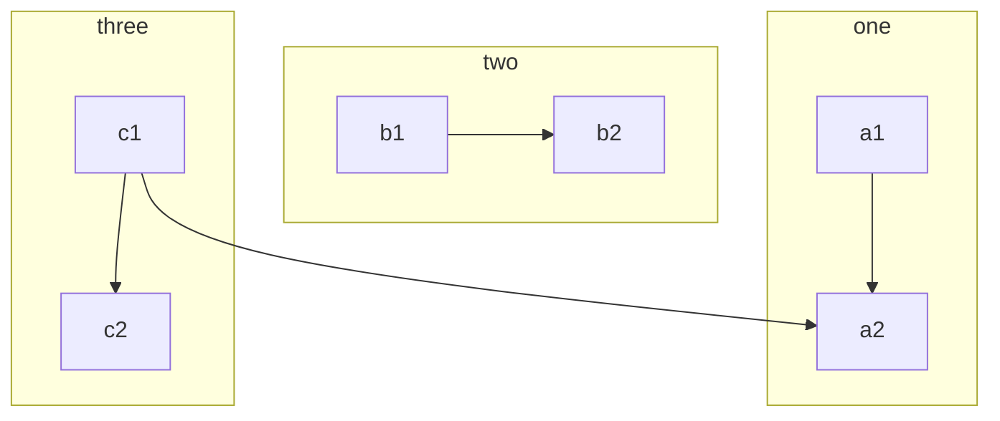

{
  "title":"不使用shortcode渲染mermaid",
  "tags":[
    "blog"
  ],
  "date":"2021-08-21",
  "lastmod":"2021-08-21",
  "draft":"false",
  "author":"kingram"
}

ShortCode语法和很多前端语法冲突，甚至和我的golang Template语法冲突。

我想在我本地的typora中能打开，也能在网页中打开，终于找到了一个可以用的方案，而且效果还好。

## 在Hugo中配置mermaid
在themes/主题名/layouts/partials目录下修改footer.html文件增加以下内容：
```
<script src="https://unpkg.com/mermaid@8.8.1/dist/mermaid.min.js"></script>
  <script>
        Array.from(document.getElementsByClassName('language-mermaid')).forEach(el => {
        el.parentElement.outerHTML = `<div class="mermaid">${el.innerText}</div>`
    })
</script>
```
## 测试用例
测试例子全部来自：[mermaid-js](https://mermaid-js.github.io/mermaid/#/)
```
graph LR
    id1[(Database)]
```


```
classDiagram
Class01 <|-- AveryLongClass : Cool
Class03 *-- Class04
Class05 o-- Class06
Class07 .. Class08
Class09 --> C2 : Where am i?
Class09 --* C3
Class09 --|> Class07
Class07 : equals()
Class07 : Object[] elementData
Class01 : size()
Class01 : int chimp
Class01 : int gorilla
Class08 <--> C2: Cool label
```


```
gitGraph:
options
{
    "nodeSpacing": 150,
    "nodeRadius": 10
}
end
commit
branch newbranch
checkout newbranch
commit
commit
checkout master
commit
commit
merge newbranch
```


```
pie
    title Key elements in Product X
    "Calcium" : 42.96
    "Potassium" : 50.05
    "Magnesium" : 10.01
    "Iron" :  5
```


```
graph TB
    c1-->a2
    subgraph one
    a1-->a2
    end
    subgraph two
    b1-->b2
    end
    subgraph three
    c1-->c2
    end
```




