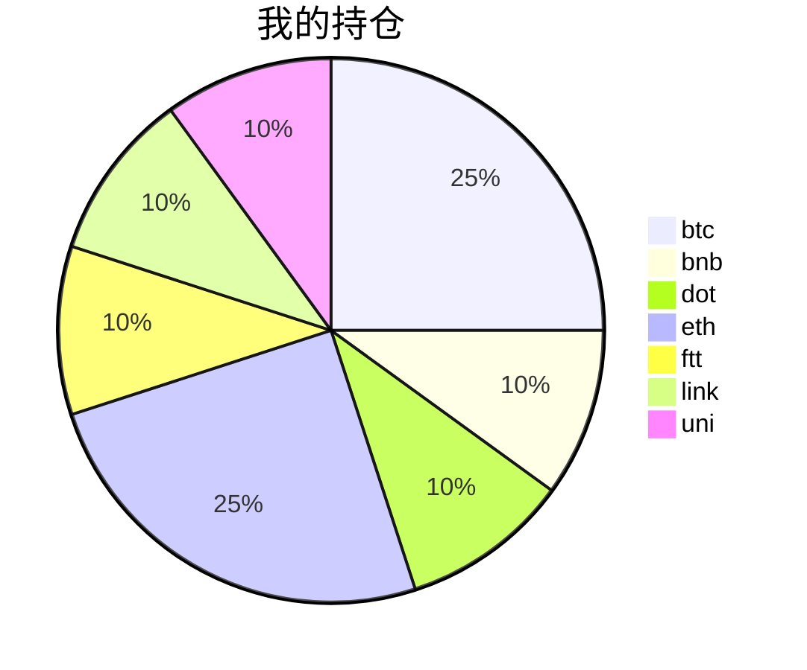

##  📊 今日行情
### 截止 **2021-08-20 22:20:00**
- 🍖 全球加密市场总市值为： **2066492204083** USDT，24h内变化： **6.61%**

- 🍤 24h总交易量为： **111495343610** USDT，24h内变化： **6.61%**

## 🎨 我的持仓占比

---
## 📋 我的定投策略
📎 我的定投策略制定于 **2021-08-19**，今天是我开始定投的第 **1** 天

> 由于我在币圈总是被割韭菜，深知自己XJB投资的策略有很大问题，在这个24小时不停盘的d场，我自认为抵制不住人性的贪婪和恐惧；我摊牌了，不装了，我认怂。
所以我制定了自己的定投策略，看策略就知道我这个定投计划还是非常非常保守的。我将以月为单位，每月定投 **400** USDT(根据行情不同可能有波动，各项波动不超过50%)，一年内暂不考虑卖出。看看一年后会有什么样的市场行情。

- 🥇 当月市值最高的币种 100USDT
- 🥈 当月市值第2高的币种 100USDT
- 🥉 当月市值前20选4个币种，合计 160USDT
- 🏅 (可选，不选这个就投1个第3项的币种)感兴趣(被CX)或者社区治理优秀(SB多)的1～2个币种，合计40USDT
---
## ⏰ 24小时收益情况
📌 过去的24小时我的持仓总收益为：**29.549083790000005** USDT

👉 每个币种的详细数据如下：
<table>
    <thead><tr bgcolor="#d0d0d0" ><th>币种</th><th>排名</th><th>市值(USDT)</th><th>24h交易量(USDT)</th><th>24h%</th><th>7d%</th><th>24h收益</th></tr></thead>
    <tbody>
    <tr>
        <td bgcolor=#F0FFF0>btc</td>
        <td bgcolor=#F0FFF0>1</td>
        <td bgcolor=#F0FFF0>899460713766</td>
        <td bgcolor=#F0FFF0>34675006215</td>
        <td bgcolor=#F0FFF0>5.42%</td>
        <td bgcolor=#F0FFF0>2.94%</td>
        <td bgcolor=#F0FFF0><strong>5.37615842</strong></td>
    </tr>
    <tr>
        <td bgcolor=#F0FFF0>bnb</td>
        <td bgcolor=#F0FFF0>4</td>
        <td bgcolor=#F0FFF0>73941856821</td>
        <td bgcolor=#F0FFF0>2274909340</td>
        <td bgcolor=#F0FFF0>4.19%</td>
        <td bgcolor=#F0FFF0>9.61%</td>
        <td bgcolor=#F0FFF0><strong>1.68742976</strong></td>
    </tr>
    <tr>
        <td bgcolor=#F0FFF0>dot</td>
        <td bgcolor=#F0FFF0>8</td>
        <td bgcolor=#F0FFF0>27723576489</td>
        <td bgcolor=#F0FFF0>2599358997</td>
        <td bgcolor=#F0FFF0>10.60%</td>
        <td bgcolor=#F0FFF0>28.32%</td>
        <td bgcolor=#F0FFF0><strong>4.19324399</strong></td>
    </tr>
    <tr>
        <td bgcolor=#F0FFF0>eth</td>
        <td bgcolor=#F0FFF0>2</td>
        <td bgcolor=#F0FFF0>382492531588</td>
        <td bgcolor=#F0FFF0>18778854865</td>
        <td bgcolor=#F0FFF0>6.94%</td>
        <td bgcolor=#F0FFF0>1.05%</td>
        <td bgcolor=#F0FFF0><strong>6.96038765</strong></td>
    </tr>
    <tr>
        <td bgcolor=#F0FFF0>ftt</td>
        <td bgcolor=#F0FFF0>31</td>
        <td bgcolor=#F0FFF0>4966145153</td>
        <td bgcolor=#F0FFF0>305120987</td>
        <td bgcolor=#F0FFF0>11.53%</td>
        <td bgcolor=#F0FFF0>-2.44%</td>
        <td bgcolor=#F0FFF0><strong>4.57375679</strong></td>
    </tr>
    <tr>
        <td bgcolor=#F0FFF0>link</td>
        <td bgcolor=#F0FFF0>12</td>
        <td bgcolor=#F0FFF0>12635936144</td>
        <td bgcolor=#F0FFF0>1773119179</td>
        <td bgcolor=#F0FFF0>9.98%</td>
        <td bgcolor=#F0FFF0>6.30%</td>
        <td bgcolor=#F0FFF0><strong>3.91682142</strong></td>
    </tr>
    <tr>
        <td bgcolor=#F0FFF0>uni</td>
        <td bgcolor=#F0FFF0>11</td>
        <td bgcolor=#F0FFF0>16729354407</td>
        <td bgcolor=#F0FFF0>471523985</td>
        <td bgcolor=#F0FFF0>7.14%</td>
        <td bgcolor=#F0FFF0>-4.16%</td>
        <td bgcolor=#F0FFF0><strong>2.84128576</strong></td>
    </tr>
    </tbody>
</table>
---
## 🎯 持仓整体收益数据

🔒 我的持仓总成本为：**400** USDT，截止 **2021-08-20 22:20:00**，总价值为：**427.52371215** USDT

💰 利润： **27.52371215** USDT，收益率：**6.88%**

👉 每个币种的详细收益数据如下：

<table>
    <thead><tr bgcolor="#d0d0d0" ><th>币种</th><th>持有数量(个)</th><th>现价(USDT)</th><th>总金额(USDT)</th><th>持仓均价(USDT)</th><th>成本(USDT)</th><th>利润(USDT)</th><th>收益率</th></tr></thead>
    <tbody>
    <tr>
        <td bgcolor=#F0FFF0>btc</td>
        <td bgcolor=#F0FFF0>0.002185</td>
        <td bgcolor=#F0FFF0>47864.27736238</td>
        <td bgcolor=#F0FFF0>104.58344604</td>
        <td bgcolor=#F0FFF0>45766.59038902</td>
        <td bgcolor=#F0FFF0>100</td>
        <td bgcolor=#F0FFF0>4.58344604</td>
        <td bgcolor=#F0FFF0><strong>4.58%</strong></td>
    </tr>
    <tr>
        <td bgcolor=#F0FFF0>bnb</td>
        <td bgcolor=#F0FFF0>0.095403</td>
        <td bgcolor=#F0FFF0>439.7713828</td>
        <td bgcolor=#F0FFF0>41.95550923</td>
        <td bgcolor=#F0FFF0>419.27402702</td>
        <td bgcolor=#F0FFF0>40</td>
        <td bgcolor=#F0FFF0>1.95550923</td>
        <td bgcolor=#F0FFF0><strong>4.89%</strong></td>
    </tr>
    <tr>
        <td bgcolor=#F0FFF0>dot</td>
        <td bgcolor=#F0FFF0>1.559096</td>
        <td bgcolor=#F0FFF0>28.0722531</td>
        <td bgcolor=#F0FFF0>43.76733752</td>
        <td bgcolor=#F0FFF0>25.6558929</td>
        <td bgcolor=#F0FFF0>40</td>
        <td bgcolor=#F0FFF0>3.76733752</td>
        <td bgcolor=#F0FFF0><strong>9.42%</strong></td>
    </tr>
    <tr>
        <td bgcolor=#F0FFF0>eth</td>
        <td bgcolor=#F0FFF0>0.032844</td>
        <td bgcolor=#F0FFF0>3264.04401785</td>
        <td bgcolor=#F0FFF0>107.20426172</td>
        <td bgcolor=#F0FFF0>3044.69613933</td>
        <td bgcolor=#F0FFF0>100</td>
        <td bgcolor=#F0FFF0>7.20426172</td>
        <td bgcolor=#F0FFF0><strong>7.20%</strong></td>
    </tr>
    <tr>
        <td bgcolor=#F0FFF0>ftt</td>
        <td bgcolor=#F0FFF0>0.840243</td>
        <td bgcolor=#F0FFF0>52.63704611</td>
        <td bgcolor=#F0FFF0>44.22790953</td>
        <td bgcolor=#F0FFF0>47.60527609</td>
        <td bgcolor=#F0FFF0>40</td>
        <td bgcolor=#F0FFF0>4.22790953</td>
        <td bgcolor=#F0FFF0><strong>10.57%</strong></td>
    </tr>
    <tr>
        <td bgcolor=#F0FFF0>link</td>
        <td bgcolor=#F0FFF0>1.526624</td>
        <td bgcolor=#F0FFF0>28.26770934</td>
        <td bgcolor=#F0FFF0>43.1541635</td>
        <td bgcolor=#F0FFF0>26.20160563</td>
        <td bgcolor=#F0FFF0>40</td>
        <td bgcolor=#F0FFF0>3.1541635</td>
        <td bgcolor=#F0FFF0><strong>7.89%</strong></td>
    </tr>
    <tr>
        <td bgcolor=#F0FFF0>uni</td>
        <td bgcolor=#F0FFF0>1.497</td>
        <td bgcolor=#F0FFF0>28.47767843</td>
        <td bgcolor=#F0FFF0>42.63108461</td>
        <td bgcolor=#F0FFF0>26.72010688</td>
        <td bgcolor=#F0FFF0>40</td>
        <td bgcolor=#F0FFF0>2.63108461</td>
        <td bgcolor=#F0FFF0><strong>6.58%</strong></td>
    </tr>
    </tbody>
</table>
---
## ⚠️ 风险友情提示
❤️本篇文章仅作为个人投资记录使用，区块链投资风险巨大，请管好你自己的钱袋子呦～❤️