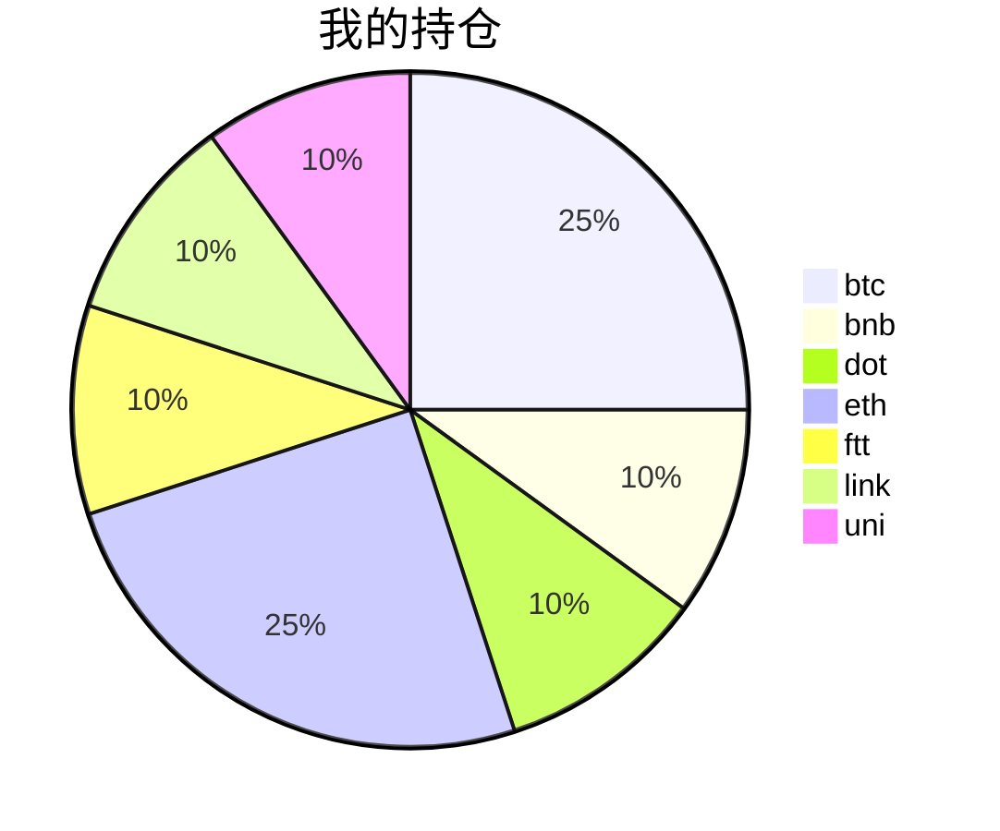

##  📊 今日行情
### 截止 **2021-08-20 22:58:00**
- 🍖 全球加密市场总市值为： **2090566054899** USDT，24h内变化： **7.84%**

- 🍤 24h总交易量为： **113610612786** USDT，24h内变化： **7.84%**

## 🎨 我的持仓占比

## 📋 我的定投策略
📎 我的定投策略制定于 **2021-08-19**，今天是我开始定投的第 **1** 天

> 由于我在币圈总是被割韭菜，深知自己XJB投资的策略有很大问题，在这个24小时不停盘的d场，我自认为抵制不住人性的贪婪和恐惧；我摊牌了，不装了，我认怂。
所以我制定了自己的定投策略，看策略就知道我这个定投计划还是非常非常保守的。我将以月为单位，每月定投 **400** USDT(根据行情不同可能有波动，各项波动不超过50%)，一年内暂不考虑卖出。看看一年后会有什么样的市场行情。

- 🥇 当月市值最高的币种 100USDT
- 🥈 当月市值第2高的币种 100USDT
- 🥉 当月市值前20选4个币种，合计 160USDT
- 🏅 (可选，不选这个就投1个第3项的币种)感兴趣(被CX)或者社区治理优秀(SB多)的1～2个币种，合计40USDT

## ⏰ 24小时收益情况
📌 过去的24小时我的持仓总收益为：**35.51444506** USDT

👉 每个币种的详细数据如下：
<table>
    <thead><tr bgcolor="#d0d0d0" ><th>币种</th><th>排名</th><th>市值(USDT)</th><th>24h交易量(USDT)</th><th>24h%</th><th>7d%</th><th>24h收益</th></tr></thead>
    <tbody>
    <tr>
        <td bgcolor=#F0FFF0>btc</td>
        <td bgcolor=#F0FFF0>1</td>
        <td bgcolor=#F0FFF0>912097002971</td>
        <td bgcolor=#F0FFF0>35617107018</td>
        <td bgcolor=#F0FFF0>7.00%</td>
        <td bgcolor=#F0FFF0>4.40%</td>
        <td bgcolor=#F0FFF0><strong>6.93863747</strong></td>
    </tr>
    <tr>
        <td bgcolor=#F0FFF0>bnb</td>
        <td bgcolor=#F0FFF0>4</td>
        <td bgcolor=#F0FFF0>75314286477</td>
        <td bgcolor=#F0FFF0>2396818536</td>
        <td bgcolor=#F0FFF0>6.57%</td>
        <td bgcolor=#F0FFF0>11.99%</td>
        <td bgcolor=#F0FFF0><strong>2.63481717</strong></td>
    </tr>
    <tr>
        <td bgcolor=#F0FFF0>dot</td>
        <td bgcolor=#F0FFF0>8</td>
        <td bgcolor=#F0FFF0>27918398259</td>
        <td bgcolor=#F0FFF0>2584593718</td>
        <td bgcolor=#F0FFF0>12.53%</td>
        <td bgcolor=#F0FFF0>29.91%</td>
        <td bgcolor=#F0FFF0><strong>4.90638652</strong></td>
    </tr>
    <tr>
        <td bgcolor=#F0FFF0>eth</td>
        <td bgcolor=#F0FFF0>2</td>
        <td bgcolor=#F0FFF0>386300772052</td>
        <td bgcolor=#F0FFF0>19311647546</td>
        <td bgcolor=#F0FFF0>8.39%</td>
        <td bgcolor=#F0FFF0>2.38%</td>
        <td bgcolor=#F0FFF0><strong>8.37779806</strong></td>
    </tr>
    <tr>
        <td bgcolor=#F0FFF0>ftt</td>
        <td bgcolor=#F0FFF0>31</td>
        <td bgcolor=#F0FFF0>5004647431</td>
        <td bgcolor=#F0FFF0>324884733</td>
        <td bgcolor=#F0FFF0>12.26%</td>
        <td bgcolor=#F0FFF0>-1.16%</td>
        <td bgcolor=#F0FFF0><strong>4.86787911</strong></td>
    </tr>
    <tr>
        <td bgcolor=#F0FFF0>link</td>
        <td bgcolor=#F0FFF0>13</td>
        <td bgcolor=#F0FFF0>12745425516</td>
        <td bgcolor=#F0FFF0>1798517337</td>
        <td bgcolor=#F0FFF0>11.13%</td>
        <td bgcolor=#F0FFF0>7.77%</td>
        <td bgcolor=#F0FFF0><strong>4.35820704</strong></td>
    </tr>
    <tr>
        <td bgcolor=#F0FFF0>uni</td>
        <td bgcolor=#F0FFF0>11</td>
        <td bgcolor=#F0FFF0>16925499335</td>
        <td bgcolor=#F0FFF0>477756750</td>
        <td bgcolor=#F0FFF0>8.64%</td>
        <td bgcolor=#F0FFF0>-3.13%</td>
        <td bgcolor=#F0FFF0><strong>3.43071969</strong></td>
    </tr>
    </tbody>
</table>

## 🎯 持仓整体收益数据

🔒 我的持仓总成本为：**400** USDT，截止 **2021-08-20 22:58:00**，总价值为：**432.36329972** USDT

💰 利润： **32.36329972** USDT，收益率：**8.09%**

👉 每个币种的详细收益数据如下：

<table>
    <thead><tr bgcolor="#d0d0d0" ><th>币种</th><th>持有数量(个)</th><th>现价(USDT)</th><th>总金额(USDT)</th><th>持仓均价(USDT)</th><th>成本(USDT)</th><th>利润(USDT)</th><th>收益率</th></tr></thead>
    <tbody>
    <tr>
        <td bgcolor=#F0FFF0>btc</td>
        <td bgcolor=#F0FFF0>0.002185</td>
        <td bgcolor=#F0FFF0>48536.71012356</td>
        <td bgcolor=#F0FFF0>106.05271162</td>
        <td bgcolor=#F0FFF0>45766.59038902</td>
        <td bgcolor=#F0FFF0>100</td>
        <td bgcolor=#F0FFF0>6.05271162</td>
        <td bgcolor=#F0FFF0><strong>6.05%</strong></td>
    </tr>
    <tr>
        <td bgcolor=#F0FFF0>bnb</td>
        <td bgcolor=#F0FFF0>0.095403</td>
        <td bgcolor=#F0FFF0>447.93394881</td>
        <td bgcolor=#F0FFF0>42.73424252</td>
        <td bgcolor=#F0FFF0>419.27402702</td>
        <td bgcolor=#F0FFF0>40</td>
        <td bgcolor=#F0FFF0>2.73424252</td>
        <td bgcolor=#F0FFF0><strong>6.84%</strong></td>
    </tr>
    <tr>
        <td bgcolor=#F0FFF0>dot</td>
        <td bgcolor=#F0FFF0>1.559096</td>
        <td bgcolor=#F0FFF0>28.26952513</td>
        <td bgcolor=#F0FFF0>44.07490355</td>
        <td bgcolor=#F0FFF0>25.6558929</td>
        <td bgcolor=#F0FFF0>40</td>
        <td bgcolor=#F0FFF0>4.07490355</td>
        <td bgcolor=#F0FFF0><strong>10.19%</strong></td>
    </tr>
    <tr>
        <td bgcolor=#F0FFF0>eth</td>
        <td bgcolor=#F0FFF0>0.032844</td>
        <td bgcolor=#F0FFF0>3296.54207592</td>
        <td bgcolor=#F0FFF0>108.27162794</td>
        <td bgcolor=#F0FFF0>3044.69613933</td>
        <td bgcolor=#F0FFF0>100</td>
        <td bgcolor=#F0FFF0>8.27162794</td>
        <td bgcolor=#F0FFF0><strong>8.27%</strong></td>
    </tr>
    <tr>
        <td bgcolor=#F0FFF0>ftt</td>
        <td bgcolor=#F0FFF0>0.840243</td>
        <td bgcolor=#F0FFF0>53.04513852</td>
        <td bgcolor=#F0FFF0>44.57080633</td>
        <td bgcolor=#F0FFF0>47.60527609</td>
        <td bgcolor=#F0FFF0>40</td>
        <td bgcolor=#F0FFF0>4.57080633</td>
        <td bgcolor=#F0FFF0><strong>11.43%</strong></td>
    </tr>
    <tr>
        <td bgcolor=#F0FFF0>link</td>
        <td bgcolor=#F0FFF0>1.526624</td>
        <td bgcolor=#F0FFF0>28.51264678</td>
        <td bgcolor=#F0FFF0>43.52809088</td>
        <td bgcolor=#F0FFF0>26.20160563</td>
        <td bgcolor=#F0FFF0>40</td>
        <td bgcolor=#F0FFF0>3.52809088</td>
        <td bgcolor=#F0FFF0><strong>8.82%</strong></td>
    </tr>
    <tr>
        <td bgcolor=#F0FFF0>uni</td>
        <td bgcolor=#F0FFF0>1.497</td>
        <td bgcolor=#F0FFF0>28.81156772</td>
        <td bgcolor=#F0FFF0>43.13091688</td>
        <td bgcolor=#F0FFF0>26.72010688</td>
        <td bgcolor=#F0FFF0>40</td>
        <td bgcolor=#F0FFF0>3.13091688</td>
        <td bgcolor=#F0FFF0><strong>7.83%</strong></td>
    </tr>
    </tbody>
</table>

## ⚠️ 风险友情提示
❤️本篇文章仅作为个人投资记录使用，区块链投资风险巨大，请管好你自己的钱袋子呦～❤️