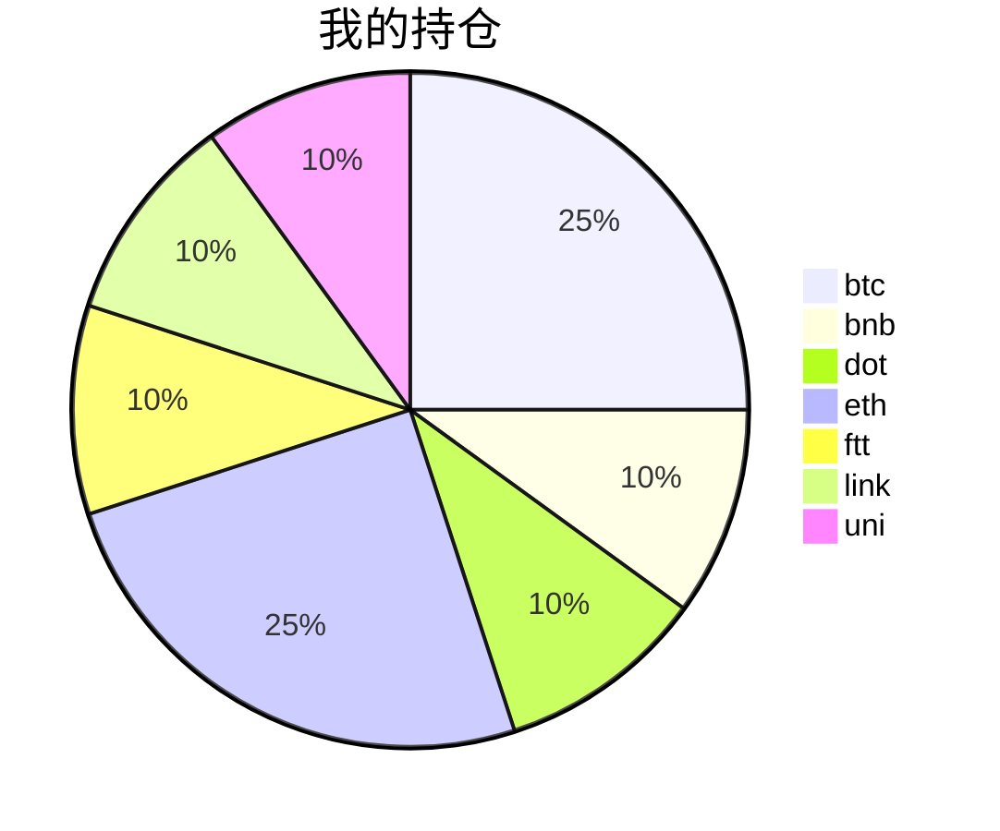

{
  "title":"2021-08-22 数字货币定投日记，收益率：8.10%",
  "tags":[
    "投资",
    "虚拟币"
  ],
  "date":"2021-08-22",
  "lastmod":"2021-08-22",
  "draft":"false",
  "author":"kingram"
}

##  📊 今日行情
### 截止 **2021-08-22 17:45:21**
- 🍖 全球加密市场总市值为： **2107000876351** USDT，24h内变化： **0.52%**

- 🍤 24h总交易量为： **99597322926** USDT，24h内变化： **-11.38%**

## 🎨 我的持仓占比

## 📋 我的定投策略
📎 我的定投策略制定于 **2021-08-19**，今天是我开始定投的第 **3** 天

由于我在币圈总是被割韭菜，深知自己XJB投资的策略有很大问题，在这个24小时不停盘的d场，我自认为抵制不住人性的贪婪和恐惧；我摊牌了，不装了，我认怂。
所以我制定了自己的定投策略，看策略就知道我这个定投计划还是非常非常保守的。我将以月为单位，每月定投 <strong> 400 </strong> USDT(根据行情不同可能有波动，各项波动不超过50%)，一年内暂不考虑卖出。看看一年后会有什么样的市场行情。

- 🥇 当月市值最高的币种 100USDT
- 🥈 当月市值第2高的币种 100USDT
- 🥉 当月市值前20选4个币种，合计 160USDT
- 🏅 (可选，不选这个就投1个第3项的币种)感兴趣(被CX)或者社区治理优秀(SB多)的1～2个币种，合计40USDT

## ⏰ 24小时收益情况
📌 过去的24小时我的持仓总收益为：**-0.9182696000000001** USDT

👉 每个币种的详细数据如下：
<table>
    <thead><tr bgcolor="#d0d0d0" ><th>币种</th><th>排名</th><th>市值(USDT)</th><th>24h交易量(USDT)</th><th>24h%</th><th>7d%</th><th>24h收益</th></tr></thead>
    <tbody>
    <tr>
        <td bgcolor=#F0FFF0>btc</td>
        <td bgcolor=#F0FFF0>1</td>
        <td bgcolor=#F0FFF0>924616314623</td>
        <td bgcolor=#F0FFF0>32300675751</td>
        <td bgcolor=#F0FFF0>0.74%</td>
        <td bgcolor=#F0FFF0>6.90%</td>
        <td bgcolor=#F0FFF0><strong>0.78928957</strong></td>
    </tr>
    <tr>
        <td bgcolor=#F0FFF0>bnb</td>
        <td bgcolor=#F0FFF0>4</td>
        <td bgcolor=#F0FFF0>77014100401</td>
        <td bgcolor=#F0FFF0>1978644221</td>
        <td bgcolor=#F0FFF0>0.69%</td>
        <td bgcolor=#F0FFF0>13.31%</td>
        <td bgcolor=#F0FFF0><strong>0.29795172</strong></td>
    </tr>
    <tr>
        <td bgcolor=#FFECEC>dot</td>
        <td bgcolor=#FFECEC>8</td>
        <td bgcolor=#FFECEC>27675734821</td>
        <td bgcolor=#FFECEC>1820435573</td>
        <td bgcolor=#FFECEC>-2.13%</td>
        <td bgcolor=#FFECEC>25.53%</td>
        <td bgcolor=#FFECEC><strong>-0.94997431</strong></td>
    </tr>
    <tr>
        <td bgcolor=#FFECEC>eth</td>
        <td bgcolor=#FFECEC>2</td>
        <td bgcolor=#FFECEC>382937771809</td>
        <td bgcolor=#FFECEC>16145697920</td>
        <td bgcolor=#FFECEC>-0.39%</td>
        <td bgcolor=#FFECEC>3.17%</td>
        <td bgcolor=#FFECEC><strong>-0.42165468</strong></td>
    </tr>
    <tr>
        <td bgcolor=#F0FFF0>ftt</td>
        <td bgcolor=#F0FFF0>34</td>
        <td bgcolor=#F0FFF0>4826971906</td>
        <td bgcolor=#F0FFF0>302334630</td>
        <td bgcolor=#F0FFF0>0.32%</td>
        <td bgcolor=#F0FFF0>6.09%</td>
        <td bgcolor=#F0FFF0><strong>0.1376645</strong></td>
    </tr>
    <tr>
        <td bgcolor=#FFECEC>link</td>
        <td bgcolor=#FFECEC>13</td>
        <td bgcolor=#FFECEC>12785404104</td>
        <td bgcolor=#FFECEC>1448852780</td>
        <td bgcolor=#FFECEC>-0.74%</td>
        <td bgcolor=#FFECEC>6.89%</td>
        <td bgcolor=#FFECEC><strong>-0.32443155</strong></td>
    </tr>
    <tr>
        <td bgcolor=#FFECEC>uni</td>
        <td bgcolor=#FFECEC>11</td>
        <td bgcolor=#FFECEC>17101888888</td>
        <td bgcolor=#FFECEC>387994203</td>
        <td bgcolor=#FFECEC>-1.02%</td>
        <td bgcolor=#FFECEC>0.12%</td>
        <td bgcolor=#FFECEC><strong>-0.44711485</strong></td>
    </tr>
    </tbody>
</table>

## 🎯 持仓整体收益数据

🔒 我的持仓总成本为：**400** USDT，截止 **2021-08-22 17:45:21**，总价值为：**432.38028461** USDT

💰 利润： **32.38028461** USDT，收益率：**8.10%**

👉 每个币种的详细收益数据如下：

<table>
    <thead><tr bgcolor="#d0d0d0" ><th>币种</th><th>持有数量(个)</th><th>现价(USDT)</th><th>总金额(USDT)</th><th>持仓均价(USDT)</th><th>成本(USDT)</th><th>利润(USDT)</th><th>收益率</th></tr></thead>
    <tbody>
    <tr>
        <td bgcolor=#F0FFF0>btc</td>
        <td bgcolor=#F0FFF0>0.002185</td>
        <td bgcolor=#F0FFF0>49198.32067924</td>
        <td bgcolor=#F0FFF0>107.49833068</td>
        <td bgcolor=#F0FFF0>45766.59038902</td>
        <td bgcolor=#F0FFF0>100</td>
        <td bgcolor=#F0FFF0>7.49833068</td>
        <td bgcolor=#F0FFF0><strong>7.50%</strong></td>
    </tr>
    <tr>
        <td bgcolor=#F0FFF0>bnb</td>
        <td bgcolor=#F0FFF0>0.095403</td>
        <td bgcolor=#F0FFF0>458.04364246</td>
        <td bgcolor=#F0FFF0>43.69873762</td>
        <td bgcolor=#F0FFF0>419.27402702</td>
        <td bgcolor=#F0FFF0>40</td>
        <td bgcolor=#F0FFF0>3.69873762</td>
        <td bgcolor=#F0FFF0><strong>9.25%</strong></td>
    </tr>
    <tr>
        <td bgcolor=#F0FFF0>dot</td>
        <td bgcolor=#F0FFF0>1.559096</td>
        <td bgcolor=#F0FFF0>28.02380974</td>
        <td bgcolor=#F0FFF0>43.69180967</td>
        <td bgcolor=#F0FFF0>25.6558929</td>
        <td bgcolor=#F0FFF0>40</td>
        <td bgcolor=#F0FFF0>3.69180967</td>
        <td bgcolor=#F0FFF0><strong>9.23%</strong></td>
    </tr>
    <tr>
        <td bgcolor=#F0FFF0>eth</td>
        <td bgcolor=#F0FFF0>0.032844</td>
        <td bgcolor=#F0FFF0>3267.18546051</td>
        <td bgcolor=#F0FFF0>107.30743926</td>
        <td bgcolor=#F0FFF0>3044.69613933</td>
        <td bgcolor=#F0FFF0>100</td>
        <td bgcolor=#F0FFF0>7.30743926</td>
        <td bgcolor=#F0FFF0><strong>7.31%</strong></td>
    </tr>
    <tr>
        <td bgcolor=#F0FFF0>ftt</td>
        <td bgcolor=#F0FFF0>0.840243</td>
        <td bgcolor=#F0FFF0>51.16192437</td>
        <td bgcolor=#F0FFF0>42.98844882</td>
        <td bgcolor=#F0FFF0>47.60527609</td>
        <td bgcolor=#F0FFF0>40</td>
        <td bgcolor=#F0FFF0>2.98844882</td>
        <td bgcolor=#F0FFF0><strong>7.47%</strong></td>
    </tr>
    <tr>
        <td bgcolor=#F0FFF0>link</td>
        <td bgcolor=#F0FFF0>1.526624</td>
        <td bgcolor=#F0FFF0>28.57012547</td>
        <td bgcolor=#F0FFF0>43.61583923</td>
        <td bgcolor=#F0FFF0>26.20160563</td>
        <td bgcolor=#F0FFF0>40</td>
        <td bgcolor=#F0FFF0>3.61583923</td>
        <td bgcolor=#F0FFF0><strong>9.04%</strong></td>
    </tr>
    <tr>
        <td bgcolor=#F0FFF0>uni</td>
        <td bgcolor=#F0FFF0>1.497</td>
        <td bgcolor=#F0FFF0>29.11134224</td>
        <td bgcolor=#F0FFF0>43.57967933</td>
        <td bgcolor=#F0FFF0>26.72010688</td>
        <td bgcolor=#F0FFF0>40</td>
        <td bgcolor=#F0FFF0>3.57967933</td>
        <td bgcolor=#F0FFF0><strong>8.95%</strong></td>
    </tr>
    </tbody>
</table>

## ⚠️ 风险友情提示
❤️ 本篇文章仅作为个人投资记录使用，区块链投资风险巨大，请管好你自己的钱袋子呦～ ❤️