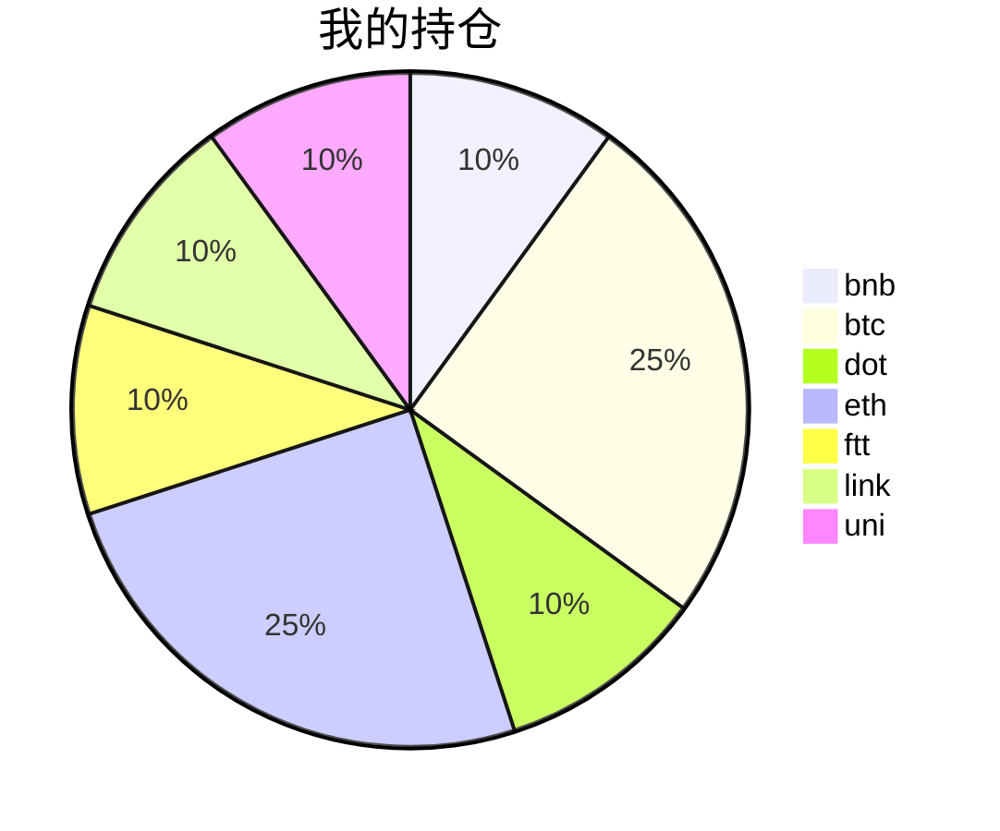

{
  "title":"2021-08-23 数字货币定投日记，收益率：9.93%",
  "tags":[
    "invest",
    "cryptocurrency"
  ],
  "date":"2021-08-23",
  "lastmod":"2021-08-23",
  "draft":"false",
  "author":"kingram"
}

##  📊 今日行情
### 截止 **2021-08-23 16:19:28**
- 🍖 全球加密市场总市值为： **2158728710168** USDT，24h内变化： **2.24%**

- 🍤 24h总交易量为： **107025803205** USDT，24h内变化： **5.19%**

## 🎨 我的持仓占比

## 📋 我的定投策略
📎 我的定投策略制定于 **2021-08-19**，今天是我开始定投的第 **4** 天

由于我在币圈总是被割韭菜，深知自己XJB投资的策略有很大问题，在这个24小时不停盘的d场，我自认为抵制不住人性的贪婪和恐惧；我摊牌了，不装了，我认怂。
所以我制定了自己的定投策略，看策略就知道我这个定投计划还是非常非常保守的。我将以月为单位，每月定投 <strong> 400 </strong> USDT(根据行情不同可能有波动，各项波动不超过50%)，一年内暂不考虑卖出。看看一年后会有什么样的市场行情。

- 🥇 当月市值最高的币种 100USDT
- 🥈 当月市值第2高的币种 100USDT
- 🥉 当月市值前20选4个币种，合计 160USDT
- 🏅 (可选，不选这个就投1个第3项的币种)感兴趣(被CX)或者社区治理优秀(SB多)的1～2个币种，合计40USDT

## ⏰ 24小时收益情况
📌 过去的24小时我的持仓总收益为：**8.68520953** USDT

👉 每个币种的详细数据如下：
<table>
    <thead><tr bgcolor="#d0d0d0" ><th>币种</th><th>排名</th><th>市值(USDT)</th><th>24h交易量(USDT)</th><th>24h%</th><th>7d%</th><th>24h收益</th></tr></thead>
    <tbody>
    <tr>
        <td bgcolor=#F0FFF0>bnb</td>
        <td bgcolor=#F0FFF0>4</td>
        <td bgcolor=#F0FFF0>81720160145</td>
        <td bgcolor=#F0FFF0>2672973655</td>
        <td bgcolor=#F0FFF0>6.75%</td>
        <td bgcolor=#F0FFF0>14.51%</td>
        <td bgcolor=#F0FFF0><strong>2.93387256</strong></td>
    </tr>
    <tr>
        <td bgcolor=#F0FFF0>btc</td>
        <td bgcolor=#F0FFF0>1</td>
        <td bgcolor=#F0FFF0>944186440536</td>
        <td bgcolor=#F0FFF0>30866102994</td>
        <td bgcolor=#F0FFF0>2.23%</td>
        <td bgcolor=#F0FFF0>6.44%</td>
        <td bgcolor=#F0FFF0><strong>2.39655062</strong></td>
    </tr>
    <tr>
        <td bgcolor=#FFECEC>dot</td>
        <td bgcolor=#FFECEC>8</td>
        <td bgcolor=#FFECEC>27690910334</td>
        <td bgcolor=#FFECEC>1881250694</td>
        <td bgcolor=#FFECEC>-0.04%</td>
        <td bgcolor=#FFECEC>16.31%</td>
        <td bgcolor=#FFECEC><strong>-0.01649539</strong></td>
    </tr>
    <tr>
        <td bgcolor=#F0FFF0>eth</td>
        <td bgcolor=#F0FFF0>2</td>
        <td bgcolor=#F0FFF0>390591614638</td>
        <td bgcolor=#F0FFF0>19508447614</td>
        <td bgcolor=#F0FFF0>2.25%</td>
        <td bgcolor=#F0FFF0>1.85%</td>
        <td bgcolor=#F0FFF0><strong>2.40841666</strong></td>
    </tr>
    <tr>
        <td bgcolor=#FFECEC>ftt</td>
        <td bgcolor=#FFECEC>34</td>
        <td bgcolor=#FFECEC>4783999049</td>
        <td bgcolor=#FFECEC>216618053</td>
        <td bgcolor=#FFECEC>-0.68%</td>
        <td bgcolor=#FFECEC>-3.10%</td>
        <td bgcolor=#FFECEC><strong>-0.29131958</strong></td>
    </tr>
    <tr>
        <td bgcolor=#F0FFF0>link</td>
        <td bgcolor=#F0FFF0>13</td>
        <td bgcolor=#F0FFF0>12836042389</td>
        <td bgcolor=#F0FFF0>1444612175</td>
        <td bgcolor=#F0FFF0>1.27%</td>
        <td bgcolor=#F0FFF0>-1.88%</td>
        <td bgcolor=#F0FFF0><strong>0.55076686</strong></td>
    </tr>
    <tr>
        <td bgcolor=#F0FFF0>uni</td>
        <td bgcolor=#F0FFF0>11</td>
        <td bgcolor=#F0FFF0>17277566006</td>
        <td bgcolor=#F0FFF0>432216341</td>
        <td bgcolor=#F0FFF0>1.62%</td>
        <td bgcolor=#F0FFF0>-3.47%</td>
        <td bgcolor=#F0FFF0><strong>0.7034178</strong></td>
    </tr>
    </tbody>
</table>

## 🎯 持仓整体收益数据

🔒 我的持仓总成本为：**400** USDT，截止 **2021-08-23 16:19:28**，总价值为：**439.71326532** USDT

💰 利润： **39.71326532** USDT，收益率：**9.93%**

👉 每个币种的详细收益数据如下：

<table>
    <thead><tr bgcolor="#d0d0d0" ><th>币种</th><th>持有数量(个)</th><th>现价(USDT)</th><th>总金额(USDT)</th><th>持仓均价(USDT)</th><th>成本(USDT)</th><th>利润(USDT)</th><th>收益率</th></tr></thead>
    <tbody>
    <tr>
        <td bgcolor=#F0FFF0>bnb</td>
        <td bgcolor=#F0FFF0>0.095403</td>
        <td bgcolor=#F0FFF0>486.03307212</td>
        <td bgcolor=#F0FFF0>46.36901318</td>
        <td bgcolor=#F0FFF0>419.27402702</td>
        <td bgcolor=#F0FFF0>40</td>
        <td bgcolor=#F0FFF0>6.36901318</td>
        <td bgcolor=#F0FFF0><strong>15.92%</strong></td>
    </tr>
    <tr>
        <td bgcolor=#F0FFF0>btc</td>
        <td bgcolor=#F0FFF0>0.002185</td>
        <td bgcolor=#F0FFF0>50236.94709362</td>
        <td bgcolor=#F0FFF0>109.7677294</td>
        <td bgcolor=#F0FFF0>45766.59038902</td>
        <td bgcolor=#F0FFF0>100</td>
        <td bgcolor=#F0FFF0>9.7677294</td>
        <td bgcolor=#F0FFF0><strong>9.77%</strong></td>
    </tr>
    <tr>
        <td bgcolor=#F0FFF0>dot</td>
        <td bgcolor=#F0FFF0>1.559096</td>
        <td bgcolor=#F0FFF0>28.03917611</td>
        <td bgcolor=#F0FFF0>43.71576732</td>
        <td bgcolor=#F0FFF0>25.6558929</td>
        <td bgcolor=#F0FFF0>40</td>
        <td bgcolor=#F0FFF0>3.71576732</td>
        <td bgcolor=#F0FFF0><strong>9.29%</strong></td>
    </tr>
    <tr>
        <td bgcolor=#F0FFF0>eth</td>
        <td bgcolor=#F0FFF0>0.032844</td>
        <td bgcolor=#F0FFF0>3332.10317792</td>
        <td bgcolor=#F0FFF0>109.43959678</td>
        <td bgcolor=#F0FFF0>3044.69613933</td>
        <td bgcolor=#F0FFF0>100</td>
        <td bgcolor=#F0FFF0>9.43959678</td>
        <td bgcolor=#F0FFF0><strong>9.44%</strong></td>
    </tr>
    <tr>
        <td bgcolor=#F0FFF0>ftt</td>
        <td bgcolor=#F0FFF0>0.840243</td>
        <td bgcolor=#F0FFF0>50.70644751</td>
        <td bgcolor=#F0FFF0>42.60573758</td>
        <td bgcolor=#F0FFF0>47.60527609</td>
        <td bgcolor=#F0FFF0>40</td>
        <td bgcolor=#F0FFF0>2.60573758</td>
        <td bgcolor=#F0FFF0><strong>6.51%</strong></td>
    </tr>
    <tr>
        <td bgcolor=#F0FFF0>link</td>
        <td bgcolor=#F0FFF0>1.526624</td>
        <td bgcolor=#F0FFF0>28.68328123</td>
        <td bgcolor=#F0FFF0>43.78858552</td>
        <td bgcolor=#F0FFF0>26.20160563</td>
        <td bgcolor=#F0FFF0>40</td>
        <td bgcolor=#F0FFF0>3.78858552</td>
        <td bgcolor=#F0FFF0><strong>9.47%</strong></td>
    </tr>
    <tr>
        <td bgcolor=#F0FFF0>uni</td>
        <td bgcolor=#F0FFF0>1.497</td>
        <td bgcolor=#F0FFF0>29.41004378</td>
        <td bgcolor=#F0FFF0>44.02683554</td>
        <td bgcolor=#F0FFF0>26.72010688</td>
        <td bgcolor=#F0FFF0>40</td>
        <td bgcolor=#F0FFF0>4.02683554</td>
        <td bgcolor=#F0FFF0><strong>10.07%</strong></td>
    </tr>
    </tbody>
</table>

## ⚠️ 风险友情提示
❤️ 本篇文章仅作为个人投资记录使用，区块链投资风险巨大，请管好你自己的钱袋子呦～ ❤️