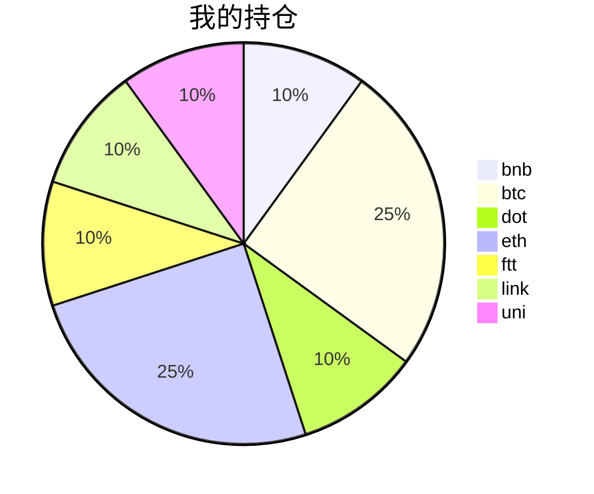

{
  "title":"2021-09-02 数字货币定投日记，收益率：18.31%",
  "tags":[
    "invest",
    "cryptocurrency"
  ],
  "date":"2021-09-02",
  "lastmod":"2021-09-02",
  "draft":"false",
  "author":"kingram"
}

##  📊 今日行情
### 截止 **2021-09-02 17:31:05**
- 🍖 全球加密市场总市值为： **2226653849618** USDT，24h内变化： **4.73%**

- 🍤 24h总交易量为： **127765559543** USDT，24h内变化： **-1.56%**

## 🎨 我的持仓占比

## 📋 我的定投策略
📎 我的定投策略制定于 **2021-08-19**，今天是我开始定投的第 **14** 天

由于我在币圈总是被割韭菜，深知自己XJB投资的策略有很大问题，在这个24小时不停盘的d场，我自认为抵制不住人性的贪婪和恐惧；我摊牌了，不装了，我认怂。
所以我制定了自己的定投策略，看策略就知道我这个定投计划还是非常非常保守的。我将以月为单位，每月定投 <strong> 400 </strong> USDT(根据行情不同可能有波动，各项波动不超过50%)，一年内暂不考虑卖出。看看一年后会有什么样的市场行情。

- 🥇 当月市值最高的币种 100USDT
- 🥈 当月市值第2高的币种 100USDT
- 🥉 当月市值前20选4个币种，合计 160USDT
- 🏅 (可选，不选这个就投1个第3项的币种)感兴趣(被CX)或者社区治理优秀(SB多)的1～2个币种，合计40USDT

## ⏰ 24小时收益情况
📌 过去的24小时我的持仓总收益为：**28.925808509999996** USDT

👉 每个币种的详细数据如下：
<table>
    <thead><tr bgcolor="#d0d0d0" ><th>币种</th><th>排名</th><th>市值(USDT)</th><th>24h交易量(USDT)</th><th>24h%</th><th>7d%</th><th>24h收益</th></tr></thead>
    <tbody>
    <tr>
        <td bgcolor=#F0FFF0>bnb</td>
        <td bgcolor=#F0FFF0>4</td>
        <td bgcolor=#F0FFF0>82436720738</td>
        <td bgcolor=#F0FFF0>2642916316</td>
        <td bgcolor=#F0FFF0>3.46%</td>
        <td bgcolor=#F0FFF0>1.19%</td>
        <td bgcolor=#F0FFF0><strong>1.56587658</strong></td>
    </tr>
    <tr>
        <td bgcolor=#F0FFF0>btc</td>
        <td bgcolor=#F0FFF0>1</td>
        <td bgcolor=#F0FFF0>936600953828</td>
        <td bgcolor=#F0FFF0>39896957206</td>
        <td bgcolor=#F0FFF0>4.57%</td>
        <td bgcolor=#F0FFF0>5.98%</td>
        <td bgcolor=#F0FFF0><strong>4.7595353</strong></td>
    </tr>
    <tr>
        <td bgcolor=#F0FFF0>dot</td>
        <td bgcolor=#F0FFF0>9</td>
        <td bgcolor=#F0FFF0>31648309483</td>
        <td bgcolor=#F0FFF0>3010851529</td>
        <td bgcolor=#F0FFF0>4.85%</td>
        <td bgcolor=#F0FFF0>29.56%</td>
        <td bgcolor=#F0FFF0><strong>2.31285644</strong></td>
    </tr>
    <tr>
        <td bgcolor=#F0FFF0>eth</td>
        <td bgcolor=#F0FFF0>2</td>
        <td bgcolor=#F0FFF0>437668268481</td>
        <td bgcolor=#F0FFF0>28661358645</td>
        <td bgcolor=#F0FFF0>5.03%</td>
        <td bgcolor=#F0FFF0>19.99%</td>
        <td bgcolor=#F0FFF0><strong>5.86087962</strong></td>
    </tr>
    <tr>
        <td bgcolor=#F0FFF0>ftt</td>
        <td bgcolor=#F0FFF0>27</td>
        <td bgcolor=#F0FFF0>6214760688</td>
        <td bgcolor=#F0FFF0>2081547416</td>
        <td bgcolor=#F0FFF0>26.79%</td>
        <td bgcolor=#F0FFF0>44.26%</td>
        <td bgcolor=#F0FFF0><strong>11.69631542</strong></td>
    </tr>
    <tr>
        <td bgcolor=#F0FFF0>link</td>
        <td bgcolor=#F0FFF0>12</td>
        <td bgcolor=#F0FFF0>13049054102</td>
        <td bgcolor=#F0FFF0>1770037247</td>
        <td bgcolor=#F0FFF0>5.72%</td>
        <td bgcolor=#F0FFF0>15.68%</td>
        <td bgcolor=#F0FFF0><strong>2.39865742</strong></td>
    </tr>
    <tr>
        <td bgcolor=#F0FFF0>uni</td>
        <td bgcolor=#F0FFF0>11</td>
        <td bgcolor=#F0FFF0>18581073631</td>
        <td bgcolor=#F0FFF0>695744742</td>
        <td bgcolor=#F0FFF0>0.73%</td>
        <td bgcolor=#F0FFF0>16.87%</td>
        <td bgcolor=#F0FFF0><strong>0.33168773</strong></td>
    </tr>
    </tbody>
</table>

## 🎯 持仓整体收益数据

🔒 我的持仓总成本为：**400** USDT，截止 **2021-09-02 17:31:05**，总价值为：**473.25068114** USDT

💰 利润： **73.25068114** USDT，收益率：**18.31%**

👉 每个币种的详细收益数据如下：

<table>
    <thead><tr bgcolor="#d0d0d0" ><th>币种</th><th>持有数量(个)</th><th>现价(USDT)</th><th>总金额(USDT)</th><th>持仓均价(USDT)</th><th>成本(USDT)</th><th>利润(USDT)</th><th>收益率</th></tr></thead>
    <tbody>
    <tr>
        <td bgcolor=#F0FFF0>bnb</td>
        <td bgcolor=#F0FFF0>0.095403</td>
        <td bgcolor=#F0FFF0>490.29483747</td>
        <td bgcolor=#F0FFF0>46.77559838</td>
        <td bgcolor=#F0FFF0>419.27402702</td>
        <td bgcolor=#F0FFF0>40</td>
        <td bgcolor=#F0FFF0>6.77559838</td>
        <td bgcolor=#F0FFF0><strong>16.94%</strong></td>
    </tr>
    <tr>
        <td bgcolor=#F0FFF0>btc</td>
        <td bgcolor=#F0FFF0>0.002185</td>
        <td bgcolor=#F0FFF0>49808.33721518</td>
        <td bgcolor=#F0FFF0>108.83121682</td>
        <td bgcolor=#F0FFF0>45766.59038902</td>
        <td bgcolor=#F0FFF0>100</td>
        <td bgcolor=#F0FFF0>8.83121682</td>
        <td bgcolor=#F0FFF0><strong>8.83%</strong></td>
    </tr>
    <tr>
        <td bgcolor=#F0FFF0>dot</td>
        <td bgcolor=#F0FFF0>1.559096</td>
        <td bgcolor=#F0FFF0>32.04634707</td>
        <td bgcolor=#F0FFF0>49.96333153</td>
        <td bgcolor=#F0FFF0>25.6558929</td>
        <td bgcolor=#F0FFF0>40</td>
        <td bgcolor=#F0FFF0>9.96333153</td>
        <td bgcolor=#F0FFF0><strong>24.91%</strong></td>
    </tr>
    <tr>
        <td bgcolor=#F0FFF0>eth</td>
        <td bgcolor=#F0FFF0>0.032844</td>
        <td bgcolor=#F0FFF0>3729.41252896</td>
        <td bgcolor=#F0FFF0>122.4888251</td>
        <td bgcolor=#F0FFF0>3044.69613933</td>
        <td bgcolor=#F0FFF0>100</td>
        <td bgcolor=#F0FFF0>22.4888251</td>
        <td bgcolor=#F0FFF0><strong>22.49%</strong></td>
    </tr>
    <tr>
        <td bgcolor=#F0FFF0>ftt</td>
        <td bgcolor=#F0FFF0>0.840243</td>
        <td bgcolor=#F0FFF0>65.87134182</td>
        <td bgcolor=#F0FFF0>55.34793386</td>
        <td bgcolor=#F0FFF0>47.60527609</td>
        <td bgcolor=#F0FFF0>40</td>
        <td bgcolor=#F0FFF0>15.34793386</td>
        <td bgcolor=#F0FFF0><strong>38.37%</strong></td>
    </tr>
    <tr>
        <td bgcolor=#F0FFF0>link</td>
        <td bgcolor=#F0FFF0>1.526624</td>
        <td bgcolor=#F0FFF0>29.06186291</td>
        <td bgcolor=#F0FFF0>44.3665374</td>
        <td bgcolor=#F0FFF0>26.20160563</td>
        <td bgcolor=#F0FFF0>40</td>
        <td bgcolor=#F0FFF0>4.3665374</td>
        <td bgcolor=#F0FFF0><strong>10.92%</strong></td>
    </tr>
    <tr>
        <td bgcolor=#F0FFF0>uni</td>
        <td bgcolor=#F0FFF0>1.497</td>
        <td bgcolor=#F0FFF0>30.37891653</td>
        <td bgcolor=#F0FFF0>45.47723805</td>
        <td bgcolor=#F0FFF0>26.72010688</td>
        <td bgcolor=#F0FFF0>40</td>
        <td bgcolor=#F0FFF0>5.47723805</td>
        <td bgcolor=#F0FFF0><strong>13.69%</strong></td>
    </tr>
    </tbody>
</table>

## ⚠️ 风险友情提示
❤️ 本篇文章仅作为个人投资记录使用，区块链投资风险巨大，请管好你自己的钱袋子呦～ ❤️