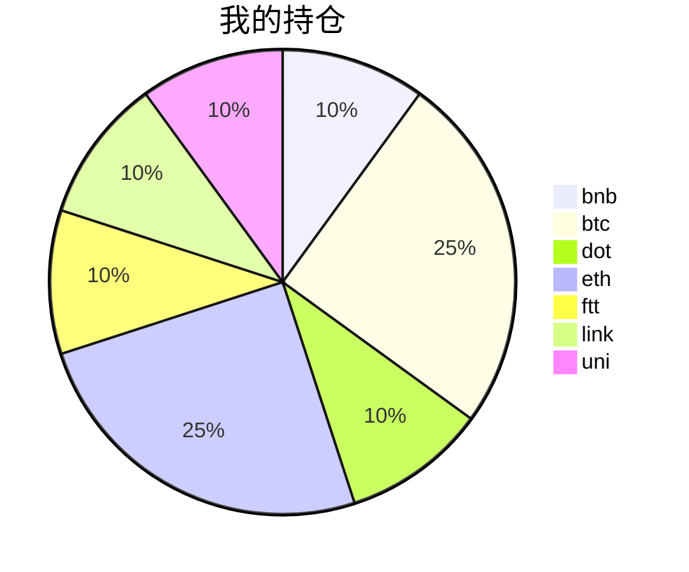

{
  "title":"2021-09-03 数字货币定投日记，收益率：21.38%",
  "tags":[
    "invest",
    "cryptocurrency"
  ],
  "date":"2021-09-03",
  "lastmod":"2021-09-03",
  "draft":"false",
  "author":"kingram"
}

##  📊 今日行情
### 截止 **2021-09-03 22:26:57**
- 🍖 全球加密市场总市值为： **2295458080701** USDT，24h内变化： **2.31%**

- 🍤 24h总交易量为： **141723876333** USDT，24h内变化： **12.07%**

## 🎨 我的持仓占比

## 📋 我的定投策略
📎 我的定投策略制定于 **2021-08-19**，今天是我开始定投的第 **15** 天

由于我在币圈总是被割韭菜，深知自己XJB投资的策略有很大问题，在这个24小时不停盘的d场，我自认为抵制不住人性的贪婪和恐惧；我摊牌了，不装了，我认怂。
所以我制定了自己的定投策略，看策略就知道我这个定投计划还是非常非常保守的。我将以月为单位，每月定投 <strong> 400 </strong> USDT(根据行情不同可能有波动，各项波动不超过50%)，一年内暂不考虑卖出。看看一年后会有什么样的市场行情。

- 🥇 当月市值最高的币种 100USDT
- 🥈 当月市值第2高的币种 100USDT
- 🥉 当月市值前20选4个币种，合计 160USDT
- 🏅 (可选，不选这个就投1个第3项的币种)感兴趣(被CX)或者社区治理优秀(SB多)的1～2个币种，合计40USDT

## ⏰ 24小时收益情况
📌 过去的24小时我的持仓总收益为：**3.755764739999999** USDT

👉 每个币种的详细数据如下：
<table>
    <thead><tr bgcolor="#d0d0d0" ><th>币种</th><th>排名</th><th>市值(USDT)</th><th>24h交易量(USDT)</th><th>24h%</th><th>7d%</th><th>24h收益</th></tr></thead>
    <tbody>
    <tr>
        <td bgcolor=#F0FFF0>bnb</td>
        <td bgcolor=#F0FFF0>4</td>
        <td bgcolor=#F0FFF0>83029775347</td>
        <td bgcolor=#F0FFF0>2198313282</td>
        <td bgcolor=#F0FFF0>0.37%</td>
        <td bgcolor=#F0FFF0>0.56%</td>
        <td bgcolor=#F0FFF0><strong>0.17564958</strong></td>
    </tr>
    <tr>
        <td bgcolor=#F0FFF0>btc</td>
        <td bgcolor=#F0FFF0>1</td>
        <td bgcolor=#F0FFF0>956639791983</td>
        <td bgcolor=#F0FFF0>45118898452</td>
        <td bgcolor=#F0FFF0>1.71%</td>
        <td bgcolor=#F0FFF0>6.16%</td>
        <td bgcolor=#F0FFF0><strong>1.86417869</strong></td>
    </tr>
    <tr>
        <td bgcolor=#F0FFF0>dot</td>
        <td bgcolor=#F0FFF0>9</td>
        <td bgcolor=#F0FFF0>32555244503</td>
        <td bgcolor=#F0FFF0>2428105784</td>
        <td bgcolor=#F0FFF0>1.44%</td>
        <td bgcolor=#F0FFF0>27.74%</td>
        <td bgcolor=#F0FFF0><strong>0.72937308</strong></td>
    </tr>
    <tr>
        <td bgcolor=#F0FFF0>eth</td>
        <td bgcolor=#F0FFF0>2</td>
        <td bgcolor=#F0FFF0>467876939374</td>
        <td bgcolor=#F0FFF0>27612321320</td>
        <td bgcolor=#F0FFF0>4.81%</td>
        <td bgcolor=#F0FFF0>23.60%</td>
        <td bgcolor=#F0FFF0><strong>6.01077749</strong></td>
    </tr>
    <tr>
        <td bgcolor=#FFECEC>ftt</td>
        <td bgcolor=#FFECEC>28</td>
        <td bgcolor=#FFECEC>6042292729</td>
        <td bgcolor=#FFECEC>2265717092</td>
        <td bgcolor=#FFECEC>-6.89%</td>
        <td bgcolor=#FFECEC>32.68%</td>
        <td bgcolor=#FFECEC><strong>-3.98266888</strong></td>
    </tr>
    <tr>
        <td bgcolor=#F0FFF0>link</td>
        <td bgcolor=#F0FFF0>12</td>
        <td bgcolor=#F0FFF0>14042289957</td>
        <td bgcolor=#F0FFF0>1778232769</td>
        <td bgcolor=#F0FFF0>2.56%</td>
        <td bgcolor=#F0FFF0>21.65%</td>
        <td bgcolor=#F0FFF0><strong>1.19072692</strong></td>
    </tr>
    <tr>
        <td bgcolor=#FFECEC>uni</td>
        <td bgcolor=#FFECEC>11</td>
        <td bgcolor=#FFECEC>17765019407</td>
        <td bgcolor=#FFECEC>899023812</td>
        <td bgcolor=#FFECEC>-4.88%</td>
        <td bgcolor=#FFECEC>7.53%</td>
        <td bgcolor=#FFECEC><strong>-2.23227214</strong></td>
    </tr>
    </tbody>
</table>

## 🎯 持仓整体收益数据

🔒 我的持仓总成本为：**400** USDT，截止 **2021-09-03 22:26:57**，总价值为：**485.51347698** USDT

💰 利润： **85.51347698** USDT，收益率：**21.38%**

👉 每个币种的详细收益数据如下：

<table>
    <thead><tr bgcolor="#d0d0d0" ><th>币种</th><th>持有数量(个)</th><th>现价(USDT)</th><th>总金额(USDT)</th><th>持仓均价(USDT)</th><th>成本(USDT)</th><th>利润(USDT)</th><th>收益率</th></tr></thead>
    <tbody>
    <tr>
        <td bgcolor=#F0FFF0>bnb</td>
        <td bgcolor=#F0FFF0>0.095403</td>
        <td bgcolor=#F0FFF0>493.82204731</td>
        <td bgcolor=#F0FFF0>47.11210478</td>
        <td bgcolor=#F0FFF0>419.27402702</td>
        <td bgcolor=#F0FFF0>40</td>
        <td bgcolor=#F0FFF0>7.11210478</td>
        <td bgcolor=#F0FFF0><strong>17.78%</strong></td>
    </tr>
    <tr>
        <td bgcolor=#F0FFF0>btc</td>
        <td bgcolor=#F0FFF0>0.002185</td>
        <td bgcolor=#F0FFF0>50870.72163348</td>
        <td bgcolor=#F0FFF0>111.15252677</td>
        <td bgcolor=#F0FFF0>45766.59038902</td>
        <td bgcolor=#F0FFF0>100</td>
        <td bgcolor=#F0FFF0>11.15252677</td>
        <td bgcolor=#F0FFF0><strong>11.15%</strong></td>
    </tr>
    <tr>
        <td bgcolor=#F0FFF0>dot</td>
        <td bgcolor=#F0FFF0>1.559096</td>
        <td bgcolor=#F0FFF0>32.96468852</td>
        <td bgcolor=#F0FFF0>51.39511401</td>
        <td bgcolor=#F0FFF0>25.6558929</td>
        <td bgcolor=#F0FFF0>40</td>
        <td bgcolor=#F0FFF0>11.39511401</td>
        <td bgcolor=#F0FFF0><strong>28.49%</strong></td>
    </tr>
    <tr>
        <td bgcolor=#F0FFF0>eth</td>
        <td bgcolor=#F0FFF0>0.032844</td>
        <td bgcolor=#F0FFF0>3986.25040586</td>
        <td bgcolor=#F0FFF0>130.92440833</td>
        <td bgcolor=#F0FFF0>3044.69613933</td>
        <td bgcolor=#F0FFF0>100</td>
        <td bgcolor=#F0FFF0>30.92440833</td>
        <td bgcolor=#F0FFF0><strong>30.92%</strong></td>
    </tr>
    <tr>
        <td bgcolor=#F0FFF0>ftt</td>
        <td bgcolor=#F0FFF0>0.840243</td>
        <td bgcolor=#F0FFF0>64.04332357</td>
        <td bgcolor=#F0FFF0>53.81195433</td>
        <td bgcolor=#F0FFF0>47.60527609</td>
        <td bgcolor=#F0FFF0>40</td>
        <td bgcolor=#F0FFF0>13.81195433</td>
        <td bgcolor=#F0FFF0><strong>34.53%</strong></td>
    </tr>
    <tr>
        <td bgcolor=#F0FFF0>link</td>
        <td bgcolor=#F0FFF0>1.526624</td>
        <td bgcolor=#F0FFF0>31.20442629</td>
        <td bgcolor=#F0FFF0>47.63742608</td>
        <td bgcolor=#F0FFF0>26.20160563</td>
        <td bgcolor=#F0FFF0>40</td>
        <td bgcolor=#F0FFF0>7.63742608</td>
        <td bgcolor=#F0FFF0><strong>19.09%</strong></td>
    </tr>
    <tr>
        <td bgcolor=#F0FFF0>uni</td>
        <td bgcolor=#F0FFF0>1.497</td>
        <td bgcolor=#F0FFF0>29.04471789</td>
        <td bgcolor=#F0FFF0>43.47994268</td>
        <td bgcolor=#F0FFF0>26.72010688</td>
        <td bgcolor=#F0FFF0>40</td>
        <td bgcolor=#F0FFF0>3.47994268</td>
        <td bgcolor=#F0FFF0><strong>8.70%</strong></td>
    </tr>
    </tbody>
</table>

## ⚠️ 风险友情提示
❤️ 本篇文章仅作为个人投资记录使用，区块链投资风险巨大，请管好你自己的钱袋子呦～ ❤️