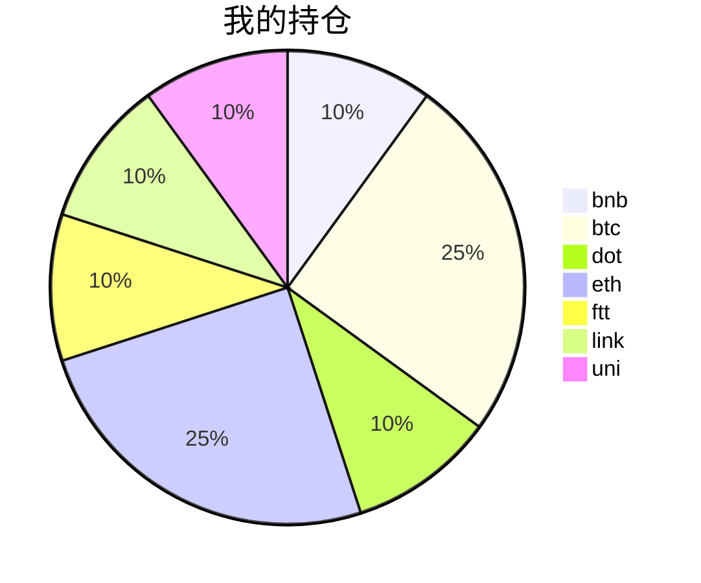

{
  "title":"2021-09-04 数字货币定投日记，收益率：20.50%",
  "tags":[
    "invest",
    "cryptocurrency"
  ],
  "date":"2021-09-04",
  "lastmod":"2021-09-04",
  "draft":"false",
  "author":"kingram"
}

##  📊 今日行情
### 截止 **2021-09-04 20:31:54**
- 🍖 全球加密市场总市值为： **2280212626615** USDT，24h内变化： **0.39%**

- 🍤 24h总交易量为： **131641350208** USDT，24h内变化： **-4.77%**

## 🎨 我的持仓占比

## 📋 我的定投策略
📎 我的定投策略制定于 **2021-08-19**，今天是我开始定投的第 **16** 天

由于我在币圈总是被割韭菜，深知自己XJB投资的策略有很大问题，在这个24小时不停盘的d场，我自认为抵制不住人性的贪婪和恐惧；我摊牌了，不装了，我认怂。
所以我制定了自己的定投策略，看策略就知道我这个定投计划还是非常非常保守的。我将以月为单位，每月定投 <strong> 400 </strong> USDT(根据行情不同可能有波动，各项波动不超过50%)，一年内暂不考虑卖出。看看一年后会有什么样的市场行情。

- 🥇 当月市值最高的币种 100USDT
- 🥈 当月市值第2高的币种 100USDT
- 🥉 当月市值前20选4个币种，合计 160USDT
- 🏅 (可选，不选这个就投1个第3项的币种)感兴趣(被CX)或者社区治理优秀(SB多)的1～2个币种，合计40USDT

## ⏰ 24小时收益情况
📌 过去的24小时我的持仓总收益为：**-1.7407192700000003** USDT

👉 每个币种的详细数据如下：
<table>
    <thead><tr bgcolor="#d0d0d0" ><th>币种</th><th>排名</th><th>市值(USDT)</th><th>24h交易量(USDT)</th><th>24h%</th><th>7d%</th><th>24h收益</th></tr></thead>
    <tbody>
    <tr>
        <td bgcolor=#F0FFF0>bnb</td>
        <td bgcolor=#F0FFF0>4</td>
        <td bgcolor=#F0FFF0>84202375093</td>
        <td bgcolor=#F0FFF0>1973118914</td>
        <td bgcolor=#F0FFF0>1.94%</td>
        <td bgcolor=#F0FFF0>2.78%</td>
        <td bgcolor=#F0FFF0><strong>0.91088414</strong></td>
    </tr>
    <tr>
        <td bgcolor=#FFECEC>btc</td>
        <td bgcolor=#FFECEC>1</td>
        <td bgcolor=#FFECEC>943459822708</td>
        <td bgcolor=#FFECEC>39872531438</td>
        <td bgcolor=#FFECEC>-0.24%</td>
        <td bgcolor=#FFECEC>2.87%</td>
        <td bgcolor=#FFECEC><strong>-0.2672281</strong></td>
    </tr>
    <tr>
        <td bgcolor=#F0FFF0>dot</td>
        <td bgcolor=#F0FFF0>9</td>
        <td bgcolor=#F0FFF0>32789087331</td>
        <td bgcolor=#F0FFF0>1767547436</td>
        <td bgcolor=#F0FFF0>1.40%</td>
        <td bgcolor=#F0FFF0>27.44%</td>
        <td bgcolor=#F0FFF0><strong>0.71649274</strong></td>
    </tr>
    <tr>
        <td bgcolor=#FFECEC>eth</td>
        <td bgcolor=#FFECEC>2</td>
        <td bgcolor=#FFECEC>459772159413</td>
        <td bgcolor=#FFECEC>22598094825</td>
        <td bgcolor=#FFECEC>-0.87%</td>
        <td bgcolor=#FFECEC>21.31%</td>
        <td bgcolor=#FFECEC><strong>-1.13556212</strong></td>
    </tr>
    <tr>
        <td bgcolor=#FFECEC>ftt</td>
        <td bgcolor=#FFECEC>28</td>
        <td bgcolor=#FFECEC>6013000131</td>
        <td bgcolor=#FFECEC>1388927826</td>
        <td bgcolor=#FFECEC>-1.64%</td>
        <td bgcolor=#FFECEC>29.98%</td>
        <td bgcolor=#FFECEC><strong>-0.89122025</strong></td>
    </tr>
    <tr>
        <td bgcolor=#FFECEC>link</td>
        <td bgcolor=#FFECEC>13</td>
        <td bgcolor=#FFECEC>13854767868</td>
        <td bgcolor=#FFECEC>1279797456</td>
        <td bgcolor=#FFECEC>-1.49%</td>
        <td bgcolor=#FFECEC>19.77%</td>
        <td bgcolor=#FFECEC><strong>-0.71029641</strong></td>
    </tr>
    <tr>
        <td bgcolor=#FFECEC>uni</td>
        <td bgcolor=#FFECEC>11</td>
        <td bgcolor=#FFECEC>17862497689</td>
        <td bgcolor=#FFECEC>720478346</td>
        <td bgcolor=#FFECEC>-0.83%</td>
        <td bgcolor=#FFECEC>8.22%</td>
        <td bgcolor=#FFECEC><strong>-0.36378927</strong></td>
    </tr>
    </tbody>
</table>

## 🎯 持仓整体收益数据

🔒 我的持仓总成本为：**400** USDT，截止 **2021-09-04 20:31:54**，总价值为：**482.01945471** USDT

💰 利润： **82.01945471** USDT，收益率：**20.50%**

👉 每个币种的详细收益数据如下：

<table>
    <thead><tr bgcolor="#d0d0d0" ><th>币种</th><th>持有数量(个)</th><th>现价(USDT)</th><th>总金额(USDT)</th><th>持仓均价(USDT)</th><th>成本(USDT)</th><th>利润(USDT)</th><th>收益率</th></tr></thead>
    <tbody>
    <tr>
        <td bgcolor=#F0FFF0>bnb</td>
        <td bgcolor=#F0FFF0>0.095403</td>
        <td bgcolor=#F0FFF0>500.79611902</td>
        <td bgcolor=#F0FFF0>47.77745214</td>
        <td bgcolor=#F0FFF0>419.27402702</td>
        <td bgcolor=#F0FFF0>40</td>
        <td bgcolor=#F0FFF0>7.77745214</td>
        <td bgcolor=#F0FFF0><strong>19.44%</strong></td>
    </tr>
    <tr>
        <td bgcolor=#F0FFF0>btc</td>
        <td bgcolor=#F0FFF0>0.002185</td>
        <td bgcolor=#F0FFF0>50167.52320434</td>
        <td bgcolor=#F0FFF0>109.6160382</td>
        <td bgcolor=#F0FFF0>45766.59038902</td>
        <td bgcolor=#F0FFF0>100</td>
        <td bgcolor=#F0FFF0>9.6160382</td>
        <td bgcolor=#F0FFF0><strong>9.62%</strong></td>
    </tr>
    <tr>
        <td bgcolor=#F0FFF0>dot</td>
        <td bgcolor=#F0FFF0>1.559096</td>
        <td bgcolor=#F0FFF0>33.20147236</td>
        <td bgcolor=#F0FFF0>51.76428275</td>
        <td bgcolor=#F0FFF0>25.6558929</td>
        <td bgcolor=#F0FFF0>40</td>
        <td bgcolor=#F0FFF0>11.76428275</td>
        <td bgcolor=#F0FFF0><strong>29.41%</strong></td>
    </tr>
    <tr>
        <td bgcolor=#F0FFF0>eth</td>
        <td bgcolor=#F0FFF0>0.032844</td>
        <td bgcolor=#F0FFF0>3916.78772086</td>
        <td bgcolor=#F0FFF0>128.6429759</td>
        <td bgcolor=#F0FFF0>3044.69613933</td>
        <td bgcolor=#F0FFF0>100</td>
        <td bgcolor=#F0FFF0>28.6429759</td>
        <td bgcolor=#F0FFF0><strong>28.64%</strong></td>
    </tr>
    <tr>
        <td bgcolor=#F0FFF0>ftt</td>
        <td bgcolor=#F0FFF0>0.840243</td>
        <td bgcolor=#F0FFF0>63.73284618</td>
        <td bgcolor=#F0FFF0>53.55107787</td>
        <td bgcolor=#F0FFF0>47.60527609</td>
        <td bgcolor=#F0FFF0>40</td>
        <td bgcolor=#F0FFF0>13.55107787</td>
        <td bgcolor=#F0FFF0><strong>33.88%</strong></td>
    </tr>
    <tr>
        <td bgcolor=#F0FFF0>link</td>
        <td bgcolor=#F0FFF0>1.526624</td>
        <td bgcolor=#F0FFF0>30.7535495</td>
        <td bgcolor=#F0FFF0>46.94910675</td>
        <td bgcolor=#F0FFF0>26.20160563</td>
        <td bgcolor=#F0FFF0>40</td>
        <td bgcolor=#F0FFF0>6.94910675</td>
        <td bgcolor=#F0FFF0><strong>17.37%</strong></td>
    </tr>
    <tr>
        <td bgcolor=#F0FFF0>uni</td>
        <td bgcolor=#F0FFF0>1.497</td>
        <td bgcolor=#F0FFF0>29.20408891</td>
        <td bgcolor=#F0FFF0>43.7185211</td>
        <td bgcolor=#F0FFF0>26.72010688</td>
        <td bgcolor=#F0FFF0>40</td>
        <td bgcolor=#F0FFF0>3.7185211</td>
        <td bgcolor=#F0FFF0><strong>9.30%</strong></td>
    </tr>
    </tbody>
</table>

## ⚠️ 风险友情提示
❤️ 本篇文章仅作为个人投资记录使用，区块链投资风险巨大，请管好你自己的钱袋子呦～ ❤️