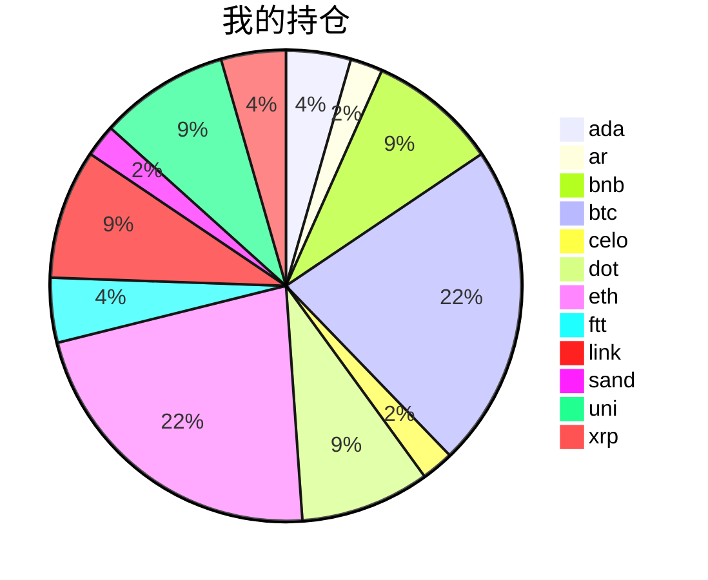

{
  "title":"2021-09-09 数字货币定投日记，收益率：-0.00%",
  "tags":[
    "invest",
    "cryptocurrency"
  ],
  "date":"2021-09-09",
  "lastmod":"2021-09-09",
  "draft":"false",
  "author":"kingram"
}

##  📊 今日行情
### 截止 **2021-09-09 23:02:52**
- 🍖 全球加密市场总市值为： **2148472257844** USDT，24h内变化： **5.44%**

- 🍤 24h总交易量为： **164844125801** USDT，24h内变化： **-30.12%**

## 🎨 我的持仓占比

## 📋 我的定投策略
📎 我的定投策略制定于 **2021-08-19**，今天是我开始定投的第 **21** 天

由于我在币圈总是被割韭菜，深知自己XJB投资的策略有很大问题，在这个24小时不停盘的d场，我自认为抵制不住人性的贪婪和恐惧；我摊牌了，不装了，我认怂。
所以我制定了自己的定投策略，看策略就知道我这个定投计划还是非常非常保守的。我将以月为单位，每月定投 <strong> 400 </strong> USDT(根据行情不同可能有波动，各项波动不超过50%)，一年内暂不考虑卖出。看看一年后会有什么样的市场行情。

- 🥇 当月市值最高的币种 100USDT
- 🥈 当月市值第2高的币种 100USDT
- 🥉 当月市值前20选4个币种，合计 160USDT
- 🏅 (可选，不选这个就投1个第3项的币种)感兴趣(被CX)或者社区治理优秀(SB多)的1～2个币种，合计40USDT

## ⏰ 24小时收益情况
📌 过去的24小时我的持仓总收益为：**55.80233939** USDT

👉 每个币种的详细数据如下：
<table>
    <thead><tr bgcolor="#d0d0d0" ><th>币种</th><th>排名</th><th>市值(USDT)</th><th>24h交易量(USDT)</th><th>24h%</th><th>7d%</th><th>24h收益</th></tr></thead>
    <tbody>
    <tr>
        <td bgcolor=#F0FFF0>ada</td>
        <td bgcolor=#F0FFF0>3</td>
        <td bgcolor=#F0FFF0>83037941143</td>
        <td bgcolor=#F0FFF0>7292097797</td>
        <td bgcolor=#F0FFF0>9.18%</td>
        <td bgcolor=#F0FFF0>-12.11%</td>
        <td bgcolor=#F0FFF0><strong>3.07305026</strong></td>
    </tr>
    <tr>
        <td bgcolor=#F0FFF0>ar</td>
        <td bgcolor=#F0FFF0>63</td>
        <td bgcolor=#F0FFF0>2111464658</td>
        <td bgcolor=#F0FFF0>306578163</td>
        <td bgcolor=#F0FFF0>27.15%</td>
        <td bgcolor=#F0FFF0>9.86%</td>
        <td bgcolor=#F0FFF0><strong>4.86042033</strong></td>
    </tr>
    <tr>
        <td bgcolor=#F0FFF0>bnb</td>
        <td bgcolor=#F0FFF0>4</td>
        <td bgcolor=#F0FFF0>70927010756</td>
        <td bgcolor=#F0FFF0>2407742217</td>
        <td bgcolor=#F0FFF0>2.44%</td>
        <td bgcolor=#F0FFF0>-12.89%</td>
        <td bgcolor=#F0FFF0><strong>1.7507001</strong></td>
    </tr>
    <tr>
        <td bgcolor=#F0FFF0>btc</td>
        <td bgcolor=#F0FFF0>1</td>
        <td bgcolor=#F0FFF0>884830678869</td>
        <td bgcolor=#F0FFF0>44848223663</td>
        <td bgcolor=#F0FFF0>2.11%</td>
        <td bgcolor=#F0FFF0>-5.24%</td>
        <td bgcolor=#F0FFF0><strong>3.96950596</strong></td>
    </tr>
    <tr>
        <td bgcolor=#F0FFF0>celo</td>
        <td bgcolor=#F0FFF0>72</td>
        <td bgcolor=#F0FFF0>1723015358</td>
        <td bgcolor=#F0FFF0>325272008</td>
        <td bgcolor=#F0FFF0>34.23%</td>
        <td bgcolor=#F0FFF0>-1.13%</td>
        <td bgcolor=#F0FFF0><strong>5.5848281</strong></td>
    </tr>
    <tr>
        <td bgcolor=#F0FFF0>dot</td>
        <td bgcolor=#F0FFF0>9</td>
        <td bgcolor=#F0FFF0>29439357760</td>
        <td bgcolor=#F0FFF0>2760634407</td>
        <td bgcolor=#F0FFF0>7.09%</td>
        <td bgcolor=#F0FFF0>-6.36%</td>
        <td bgcolor=#F0FFF0><strong>5.38700127</strong></td>
    </tr>
    <tr>
        <td bgcolor=#F0FFF0>eth</td>
        <td bgcolor=#F0FFF0>2</td>
        <td bgcolor=#F0FFF0>415614141671</td>
        <td bgcolor=#F0FFF0>28678913352</td>
        <td bgcolor=#F0FFF0>4.25%</td>
        <td bgcolor=#F0FFF0>-6.23%</td>
        <td bgcolor=#F0FFF0><strong>8.39832652</strong></td>
    </tr>
    <tr>
        <td bgcolor=#F0FFF0>ftt</td>
        <td bgcolor=#F0FFF0>18</td>
        <td bgcolor=#F0FFF0>10041300984</td>
        <td bgcolor=#F0FFF0>3486234384</td>
        <td bgcolor=#F0FFF0>18.97%</td>
        <td bgcolor=#F0FFF0>20.41%</td>
        <td bgcolor=#F0FFF0><strong>11.12874372</strong></td>
    </tr>
    <tr>
        <td bgcolor=#F0FFF0>link</td>
        <td bgcolor=#F0FFF0>12</td>
        <td bgcolor=#F0FFF0>12918659833</td>
        <td bgcolor=#F0FFF0>2125495395</td>
        <td bgcolor=#F0FFF0>7.13%</td>
        <td bgcolor=#F0FFF0>-4.02%</td>
        <td bgcolor=#F0FFF0><strong>5.09043731</strong></td>
    </tr>
    <tr>
        <td bgcolor=#F0FFF0>sand</td>
        <td bgcolor=#F0FFF0>112</td>
        <td bgcolor=#F0FFF0>736403552</td>
        <td bgcolor=#F0FFF0>394860068</td>
        <td bgcolor=#F0FFF0>7.80%</td>
        <td bgcolor=#F0FFF0>-15.51%</td>
        <td bgcolor=#F0FFF0><strong>1.26329377</strong></td>
    </tr>
    <tr>
        <td bgcolor=#F0FFF0>uni</td>
        <td bgcolor=#F0FFF0>11</td>
        <td bgcolor=#F0FFF0>14878143211</td>
        <td bgcolor=#F0FFF0>657427758</td>
        <td bgcolor=#F0FFF0>6.83%</td>
        <td bgcolor=#F0FFF0>-18.68%</td>
        <td bgcolor=#F0FFF0><strong>4.46165637</strong></td>
    </tr>
    <tr>
        <td bgcolor=#F0FFF0>xrp</td>
        <td bgcolor=#F0FFF0>7</td>
        <td bgcolor=#F0FFF0>52308010238</td>
        <td bgcolor=#F0FFF0>5483485813</td>
        <td bgcolor=#F0FFF0>2.63%</td>
        <td bgcolor=#F0FFF0>-10.66%</td>
        <td bgcolor=#F0FFF0><strong>0.83437568</strong></td>
    </tr>
    </tbody>
</table>

## 🎯 持仓整体收益数据

🔒 我的持仓总成本为：**900** USDT，截止 **2021-09-09 23:02:52**，总价值为：**899.96079208** USDT

💰 利润： **-0.03920792** USDT，收益率：**-0.00%**

👉 每个币种的详细收益数据如下：

<table>
    <thead><tr bgcolor="#d0d0d0" ><th>币种</th><th>持有数量(个)</th><th>现价(USDT)</th><th>总金额(USDT)</th><th>持仓均价(USDT)</th><th>成本(USDT)</th><th>利润(USDT)</th><th>收益率</th></tr></thead>
    <tbody>
    <tr>
        <td bgcolor=#FFECEC>ada</td>
        <td bgcolor=#FFECEC>14.1</td>
        <td bgcolor=#FFECEC>2.59284217</td>
        <td bgcolor=#FFECEC>36.5590746</td>
        <td bgcolor=#FFECEC>2.83687943</td>
        <td bgcolor=#FFECEC>40</td>
        <td bgcolor=#FFECEC>-3.4409254</td>
        <td bgcolor=#FFECEC><strong>-8.60%</strong></td>
    </tr>
    <tr>
        <td bgcolor=#F0FFF0>ar</td>
        <td bgcolor=#F0FFF0>0.36</td>
        <td bgcolor=#F0FFF0>63.22753594</td>
        <td bgcolor=#F0FFF0>22.76191294</td>
        <td bgcolor=#F0FFF0>55.55555556</td>
        <td bgcolor=#F0FFF0>20</td>
        <td bgcolor=#F0FFF0>2.76191294</td>
        <td bgcolor=#F0FFF0><strong>13.81%</strong></td>
    </tr>
    <tr>
        <td bgcolor=#FFECEC>bnb</td>
        <td bgcolor=#FFECEC>0.174403</td>
        <td bgcolor=#FFECEC>421.84049656</td>
        <td bgcolor=#FFECEC>73.57024812</td>
        <td bgcolor=#FFECEC>458.70770572</td>
        <td bgcolor=#FFECEC>80</td>
        <td bgcolor=#FFECEC>-6.42975188</td>
        <td bgcolor=#FFECEC><strong>-8.04%</strong></td>
    </tr>
    <tr>
        <td bgcolor=#FFECEC>btc</td>
        <td bgcolor=#FFECEC>0.004075</td>
        <td bgcolor=#FFECEC>47037.70689289</td>
        <td bgcolor=#FFECEC>191.67865559</td>
        <td bgcolor=#FFECEC>49079.75460123</td>
        <td bgcolor=#FFECEC>200</td>
        <td bgcolor=#FFECEC>-8.32134441</td>
        <td bgcolor=#FFECEC><strong>-4.16%</strong></td>
    </tr>
    <tr>
        <td bgcolor=#F0FFF0>celo</td>
        <td bgcolor=#F0FFF0>3.9</td>
        <td bgcolor=#F0FFF0>5.61573304</td>
        <td bgcolor=#F0FFF0>21.90135886</td>
        <td bgcolor=#F0FFF0>5.12820513</td>
        <td bgcolor=#F0FFF0>20</td>
        <td bgcolor=#F0FFF0>1.90135886</td>
        <td bgcolor=#F0FFF0><strong>9.51%</strong></td>
    </tr>
    <tr>
        <td bgcolor=#F0FFF0>dot</td>
        <td bgcolor=#F0FFF0>2.729096</td>
        <td bgcolor=#F0FFF0>29.80961358</td>
        <td bgcolor=#F0FFF0>81.35329718</td>
        <td bgcolor=#F0FFF0>29.31373612</td>
        <td bgcolor=#F0FFF0>80</td>
        <td bgcolor=#F0FFF0>1.35329718</td>
        <td bgcolor=#F0FFF0><strong>1.69%</strong></td>
    </tr>
    <tr>
        <td bgcolor=#F0FFF0>eth</td>
        <td bgcolor=#F0FFF0>0.058244</td>
        <td bgcolor=#F0FFF0>3538.53606858</td>
        <td bgcolor=#F0FFF0>206.09849478</td>
        <td bgcolor=#F0FFF0>3433.83009409</td>
        <td bgcolor=#F0FFF0>200</td>
        <td bgcolor=#F0FFF0>6.09849478</td>
        <td bgcolor=#F0FFF0><strong>3.05%</strong></td>
    </tr>
    <tr>
        <td bgcolor=#F0FFF0>ftt</td>
        <td bgcolor=#F0FFF0>0.840243</td>
        <td bgcolor=#F0FFF0>83.07526423</td>
        <td bgcolor=#F0FFF0>69.80340924</td>
        <td bgcolor=#F0FFF0>47.60527609</td>
        <td bgcolor=#F0FFF0>40</td>
        <td bgcolor=#F0FFF0>29.80340924</td>
        <td bgcolor=#F0FFF0><strong>74.51%</strong></td>
    </tr>
    <tr>
        <td bgcolor=#FFECEC>link</td>
        <td bgcolor=#FFECEC>2.666624</td>
        <td bgcolor=#FFECEC>28.6756623</td>
        <td bgcolor=#FFECEC>76.46720931</td>
        <td bgcolor=#FFECEC>30.00048001</td>
        <td bgcolor=#FFECEC>80</td>
        <td bgcolor=#FFECEC>-3.53279069</td>
        <td bgcolor=#FFECEC><strong>-4.42%</strong></td>
    </tr>
    <tr>
        <td bgcolor=#FFECEC>sand</td>
        <td bgcolor=#FFECEC>21</td>
        <td bgcolor=#FFECEC>0.83168098</td>
        <td bgcolor=#FFECEC>17.46530058</td>
        <td bgcolor=#FFECEC>0.95238095</td>
        <td bgcolor=#FFECEC>20</td>
        <td bgcolor=#FFECEC>-2.53469942</td>
        <td bgcolor=#FFECEC><strong>-12.67%</strong></td>
    </tr>
    <tr>
        <td bgcolor=#FFECEC>uni</td>
        <td bgcolor=#FFECEC>2.867</td>
        <td bgcolor=#FFECEC>24.32485225</td>
        <td bgcolor=#FFECEC>69.7393514</td>
        <td bgcolor=#FFECEC>27.90373212</td>
        <td bgcolor=#FFECEC>80</td>
        <td bgcolor=#FFECEC>-10.2606486</td>
        <td bgcolor=#FFECEC><strong>-12.83%</strong></td>
    </tr>
    <tr>
        <td bgcolor=#FFECEC>xrp</td>
        <td bgcolor=#FFECEC>29</td>
        <td bgcolor=#FFECEC>1.12284412</td>
        <td bgcolor=#FFECEC>32.56247948</td>
        <td bgcolor=#FFECEC>1.37931034</td>
        <td bgcolor=#FFECEC>40</td>
        <td bgcolor=#FFECEC>-7.43752052</td>
        <td bgcolor=#FFECEC><strong>-18.59%</strong></td>
    </tr>
    </tbody>
</table>

## ⚠️ 风险友情提示
❤️ 本篇文章仅作为个人投资记录使用，区块链投资风险巨大，请管好你自己的钱袋子呦～ ❤️