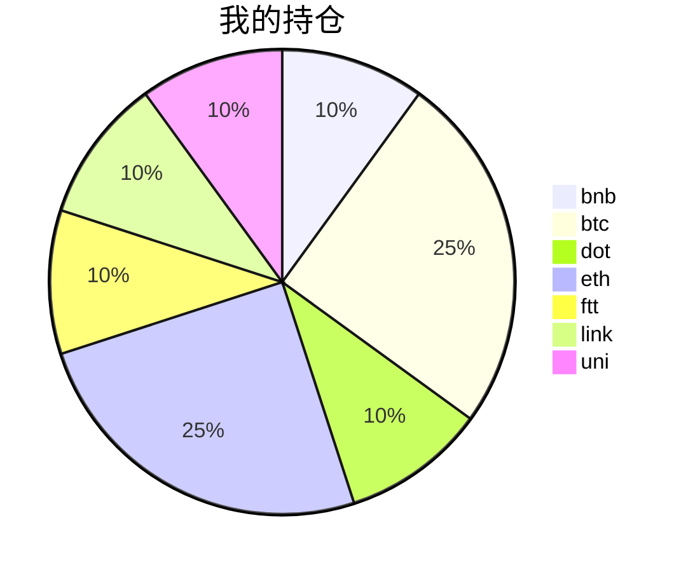

{
  "title":"2021-08-24 数字货币定投日记，收益率：8.77%",
  "tags":[
    "invest",
    "cryptocurrency"
  ],
  "date":"2021-08-24",
  "lastmod":"2021-08-24",
  "draft":"false",
  "author":"kingram"
}

##  📊 今日行情
### 截止 **2021-08-24 18:38:01**
- 🍖 全球加密市场总市值为： **2140661301154** USDT，24h内变化： **-0.94%**

- 🍤 24h总交易量为： **110699547227** USDT，24h内变化： **0.18%**

## 🎨 我的持仓占比

## 📋 我的定投策略
📎 我的定投策略制定于 **2021-08-19**，今天是我开始定投的第 **5** 天

由于我在币圈总是被割韭菜，深知自己XJB投资的策略有很大问题，在这个24小时不停盘的d场，我自认为抵制不住人性的贪婪和恐惧；我摊牌了，不装了，我认怂。
所以我制定了自己的定投策略，看策略就知道我这个定投计划还是非常非常保守的。我将以月为单位，每月定投 <strong> 400 </strong> USDT(根据行情不同可能有波动，各项波动不超过50%)，一年内暂不考虑卖出。看看一年后会有什么样的市场行情。

- 🥇 当月市值最高的币种 100USDT
- 🥈 当月市值第2高的币种 100USDT
- 🥉 当月市值前20选4个币种，合计 160USDT
- 🏅 (可选，不选这个就投1个第3项的币种)感兴趣(被CX)或者社区治理优秀(SB多)的1～2个币种，合计40USDT

## ⏰ 24小时收益情况
📌 过去的24小时我的持仓总收益为：**-5.21285178** USDT

👉 每个币种的详细数据如下：
<table>
    <thead><tr bgcolor="#d0d0d0" ><th>币种</th><th>排名</th><th>市值(USDT)</th><th>24h交易量(USDT)</th><th>24h%</th><th>7d%</th><th>24h收益</th></tr></thead>
    <tbody>
    <tr>
        <td bgcolor=#FFECEC>bnb</td>
        <td bgcolor=#FFECEC>4</td>
        <td bgcolor=#FFECEC>82637358268</td>
        <td bgcolor=#FFECEC>2933469310</td>
        <td bgcolor=#FFECEC>-0.88%</td>
        <td bgcolor=#FFECEC>13.68%</td>
        <td bgcolor=#FFECEC><strong>-0.41547812</strong></td>
    </tr>
    <tr>
        <td bgcolor=#FFECEC>btc</td>
        <td bgcolor=#FFECEC>1</td>
        <td bgcolor=#FFECEC>929017419155</td>
        <td bgcolor=#FFECEC>35052094253</td>
        <td bgcolor=#FFECEC>-1.53%</td>
        <td bgcolor=#FFECEC>5.28%</td>
        <td bgcolor=#FFECEC><strong>-1.68319809</strong></td>
    </tr>
    <tr>
        <td bgcolor=#FFECEC>dot</td>
        <td bgcolor=#FFECEC>8</td>
        <td bgcolor=#FFECEC>27118904508</td>
        <td bgcolor=#FFECEC>1451062639</td>
        <td bgcolor=#FFECEC>-1.40%</td>
        <td bgcolor=#FFECEC>3.80%</td>
        <td bgcolor=#FFECEC><strong>-0.60888094</strong></td>
    </tr>
    <tr>
        <td bgcolor=#FFECEC>eth</td>
        <td bgcolor=#FFECEC>2</td>
        <td bgcolor=#FFECEC>389315595937</td>
        <td bgcolor=#FFECEC>19374115210</td>
        <td bgcolor=#FFECEC>-0.24%</td>
        <td bgcolor=#FFECEC>2.20%</td>
        <td bgcolor=#FFECEC><strong>-0.26044326</strong></td>
    </tr>
    <tr>
        <td bgcolor=#FFECEC>ftt</td>
        <td bgcolor=#FFECEC>32</td>
        <td bgcolor=#FFECEC>4724413831</td>
        <td bgcolor=#FFECEC>217874499</td>
        <td bgcolor=#FFECEC>-2.42%</td>
        <td bgcolor=#FFECEC>4.57%</td>
        <td bgcolor=#FFECEC><strong>-1.04416514</strong></td>
    </tr>
    <tr>
        <td bgcolor=#FFECEC>link</td>
        <td bgcolor=#FFECEC>13</td>
        <td bgcolor=#FFECEC>12767420783</td>
        <td bgcolor=#FFECEC>1641763977</td>
        <td bgcolor=#FFECEC>-0.51%</td>
        <td bgcolor=#FFECEC>-3.86%</td>
        <td bgcolor=#FFECEC><strong>-0.22127231</strong></td>
    </tr>
    <tr>
        <td bgcolor=#FFECEC>uni</td>
        <td bgcolor=#FFECEC>11</td>
        <td bgcolor=#FFECEC>17437184876</td>
        <td bgcolor=#FFECEC>391084969</td>
        <td bgcolor=#FFECEC>-2.24%</td>
        <td bgcolor=#FFECEC>-5.96%</td>
        <td bgcolor=#FFECEC><strong>-0.97941392</strong></td>
    </tr>
    </tbody>
</table>

## 🎯 持仓整体收益数据

🔒 我的持仓总成本为：**400** USDT，截止 **2021-08-24 18:38:01**，总价值为：**435.07755934** USDT

💰 利润： **35.07755934** USDT，收益率：**8.77%**

👉 每个币种的详细收益数据如下：

<table>
    <thead><tr bgcolor="#d0d0d0" ><th>币种</th><th>持有数量(个)</th><th>现价(USDT)</th><th>总金额(USDT)</th><th>持仓均价(USDT)</th><th>成本(USDT)</th><th>利润(USDT)</th><th>收益率</th></tr></thead>
    <tbody>
    <tr>
        <td bgcolor=#F0FFF0>bnb</td>
        <td bgcolor=#F0FFF0>0.095403</td>
        <td bgcolor=#F0FFF0>491.48813512</td>
        <td bgcolor=#F0FFF0>46.88944255</td>
        <td bgcolor=#F0FFF0>419.27402702</td>
        <td bgcolor=#F0FFF0>40</td>
        <td bgcolor=#F0FFF0>6.88944255</td>
        <td bgcolor=#F0FFF0><strong>17.22%</strong></td>
    </tr>
    <tr>
        <td bgcolor=#F0FFF0>btc</td>
        <td bgcolor=#F0FFF0>0.002185</td>
        <td bgcolor=#F0FFF0>49426.42055761</td>
        <td bgcolor=#F0FFF0>107.99672892</td>
        <td bgcolor=#F0FFF0>45766.59038902</td>
        <td bgcolor=#F0FFF0>100</td>
        <td bgcolor=#F0FFF0>7.99672892</td>
        <td bgcolor=#F0FFF0><strong>8.00%</strong></td>
    </tr>
    <tr>
        <td bgcolor=#F0FFF0>dot</td>
        <td bgcolor=#F0FFF0>1.559096</td>
        <td bgcolor=#F0FFF0>27.45997622</td>
        <td bgcolor=#F0FFF0>42.81273908</td>
        <td bgcolor=#F0FFF0>25.6558929</td>
        <td bgcolor=#F0FFF0>40</td>
        <td bgcolor=#F0FFF0>2.81273908</td>
        <td bgcolor=#F0FFF0><strong>7.03%</strong></td>
    </tr>
    <tr>
        <td bgcolor=#F0FFF0>eth</td>
        <td bgcolor=#F0FFF0>0.032844</td>
        <td bgcolor=#F0FFF0>3320.80298881</td>
        <td bgcolor=#F0FFF0>109.06845336</td>
        <td bgcolor=#F0FFF0>3044.69613933</td>
        <td bgcolor=#F0FFF0>100</td>
        <td bgcolor=#F0FFF0>9.06845336</td>
        <td bgcolor=#F0FFF0><strong>9.07%</strong></td>
    </tr>
    <tr>
        <td bgcolor=#F0FFF0>ftt</td>
        <td bgcolor=#F0FFF0>0.840243</td>
        <td bgcolor=#F0FFF0>50.0748933</td>
        <td bgcolor=#F0FFF0>42.07507857</td>
        <td bgcolor=#F0FFF0>47.60527609</td>
        <td bgcolor=#F0FFF0>40</td>
        <td bgcolor=#F0FFF0>2.07507857</td>
        <td bgcolor=#F0FFF0><strong>5.19%</strong></td>
    </tr>
    <tr>
        <td bgcolor=#F0FFF0>link</td>
        <td bgcolor=#F0FFF0>1.526624</td>
        <td bgcolor=#F0FFF0>28.52994014</td>
        <td bgcolor=#F0FFF0>43.55449134</td>
        <td bgcolor=#F0FFF0>26.20160563</td>
        <td bgcolor=#F0FFF0>40</td>
        <td bgcolor=#F0FFF0>3.55449134</td>
        <td bgcolor=#F0FFF0><strong>8.89%</strong></td>
    </tr>
    <tr>
        <td bgcolor=#F0FFF0>uni</td>
        <td bgcolor=#F0FFF0>1.497</td>
        <td bgcolor=#F0FFF0>28.51077189</td>
        <td bgcolor=#F0FFF0>42.68062552</td>
        <td bgcolor=#F0FFF0>26.72010688</td>
        <td bgcolor=#F0FFF0>40</td>
        <td bgcolor=#F0FFF0>2.68062552</td>
        <td bgcolor=#F0FFF0><strong>6.70%</strong></td>
    </tr>
    </tbody>
</table>

## ⚠️ 风险友情提示
❤️ 本篇文章仅作为个人投资记录使用，区块链投资风险巨大，请管好你自己的钱袋子呦～ ❤️