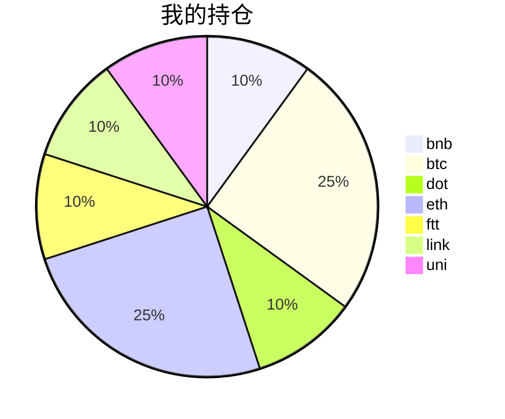

{
  "title":"2021-08-25 数字货币定投日记，收益率：1.99%",
  "tags":[
    "invest",
    "cryptocurrency"
  ],
  "date":"2021-08-25",
  "lastmod":"2021-08-25",
  "draft":"false",
  "author":"kingram"
}

##  📊 今日行情
### 截止 **2021-08-25 18:23:01**
- 🍖 全球加密市场总市值为： **2024459257739** USDT，24h内变化： **-6.07%**

- 🍤 24h总交易量为： **120333231798** USDT，24h内变化： **8.21%**

## 🎨 我的持仓占比

## 📋 我的定投策略
📎 我的定投策略制定于 **2021-08-19**，今天是我开始定投的第 **6** 天

由于我在币圈总是被割韭菜，深知自己XJB投资的策略有很大问题，在这个24小时不停盘的d场，我自认为抵制不住人性的贪婪和恐惧；我摊牌了，不装了，我认怂。
所以我制定了自己的定投策略，看策略就知道我这个定投计划还是非常非常保守的。我将以月为单位，每月定投 <strong> 400 </strong> USDT(根据行情不同可能有波动，各项波动不超过50%)，一年内暂不考虑卖出。看看一年后会有什么样的市场行情。

- 🥇 当月市值最高的币种 100USDT
- 🥈 当月市值第2高的币种 100USDT
- 🥉 当月市值前20选4个币种，合计 160USDT
- 🏅 (可选，不选这个就投1个第3项的币种)感兴趣(被CX)或者社区治理优秀(SB多)的1～2个币种，合计40USDT

## ⏰ 24小时收益情况
📌 过去的24小时我的持仓总收益为：**-29.615460989999995** USDT

👉 每个币种的详细数据如下：
<table>
    <thead><tr bgcolor="#d0d0d0" ><th>币种</th><th>排名</th><th>市值(USDT)</th><th>24h交易量(USDT)</th><th>24h%</th><th>7d%</th><th>24h收益</th></tr></thead>
    <tbody>
    <tr>
        <td bgcolor=#FFECEC>bnb</td>
        <td bgcolor=#FFECEC>4</td>
        <td bgcolor=#FFECEC>80167180738</td>
        <td bgcolor=#FFECEC>3323605506</td>
        <td bgcolor=#FFECEC>-3.52%</td>
        <td bgcolor=#FFECEC>19.70%</td>
        <td bgcolor=#FFECEC><strong>-1.66174854</strong></td>
    </tr>
    <tr>
        <td bgcolor=#FFECEC>btc</td>
        <td bgcolor=#FFECEC>1</td>
        <td bgcolor=#FFECEC>891649200546</td>
        <td bgcolor=#FFECEC>32352614231</td>
        <td bgcolor=#FFECEC>-4.59%</td>
        <td bgcolor=#FFECEC>4.88%</td>
        <td bgcolor=#FFECEC><strong>-4.98877132</strong></td>
    </tr>
    <tr>
        <td bgcolor=#FFECEC>dot</td>
        <td bgcolor=#FFECEC>9</td>
        <td bgcolor=#FFECEC>24673432520</td>
        <td bgcolor=#FFECEC>2320412018</td>
        <td bgcolor=#FFECEC>-9.60%</td>
        <td bgcolor=#FFECEC>4.90%</td>
        <td bgcolor=#FFECEC><strong>-4.13520809</strong></td>
    </tr>
    <tr>
        <td bgcolor=#FFECEC>eth</td>
        <td bgcolor=#FFECEC>2</td>
        <td bgcolor=#FFECEC>365397055033</td>
        <td bgcolor=#FFECEC>19696365377</td>
        <td bgcolor=#FFECEC>-6.63%</td>
        <td bgcolor=#FFECEC>2.59%</td>
        <td bgcolor=#FFECEC><strong>-7.2639622</strong></td>
    </tr>
    <tr>
        <td bgcolor=#FFECEC>ftt</td>
        <td bgcolor=#FFECEC>32</td>
        <td bgcolor=#FFECEC>4425047654</td>
        <td bgcolor=#FFECEC>250779399</td>
        <td bgcolor=#FFECEC>-7.03%</td>
        <td bgcolor=#FFECEC>3.47%</td>
        <td bgcolor=#FFECEC><strong>-2.98036319</strong></td>
    </tr>
    <tr>
        <td bgcolor=#FFECEC>link</td>
        <td bgcolor=#FFECEC>15</td>
        <td bgcolor=#FFECEC>11472248159</td>
        <td bgcolor=#FFECEC>1530373850</td>
        <td bgcolor=#FFECEC>-10.67%</td>
        <td bgcolor=#FFECEC>-2.03%</td>
        <td bgcolor=#FFECEC><strong>-4.67586841</strong></td>
    </tr>
    <tr>
        <td bgcolor=#FFECEC>uni</td>
        <td bgcolor=#FFECEC>11</td>
        <td bgcolor=#FFECEC>15930368913</td>
        <td bgcolor=#FFECEC>420569546</td>
        <td bgcolor=#FFECEC>-9.11%</td>
        <td bgcolor=#FFECEC>-2.06%</td>
        <td bgcolor=#FFECEC><strong>-3.90953924</strong></td>
    </tr>
    </tbody>
</table>

## 🎯 持仓整体收益数据

🔒 我的持仓总成本为：**400** USDT，截止 **2021-08-25 18:23:01**，总价值为：**407.9798749** USDT

💰 利润： **7.9798749** USDT，收益率：**1.99%**

👉 每个币种的详细收益数据如下：

<table>
    <thead><tr bgcolor="#d0d0d0" ><th>币种</th><th>持有数量(个)</th><th>现价(USDT)</th><th>总金额(USDT)</th><th>持仓均价(USDT)</th><th>成本(USDT)</th><th>利润(USDT)</th><th>收益率</th></tr></thead>
    <tbody>
    <tr>
        <td bgcolor=#F0FFF0>bnb</td>
        <td bgcolor=#F0FFF0>0.095403</td>
        <td bgcolor=#F0FFF0>476.79668112</td>
        <td bgcolor=#F0FFF0>45.48783377</td>
        <td bgcolor=#F0FFF0>419.27402702</td>
        <td bgcolor=#F0FFF0>40</td>
        <td bgcolor=#F0FFF0>5.48783377</td>
        <td bgcolor=#F0FFF0><strong>13.72%</strong></td>
    </tr>
    <tr>
        <td bgcolor=#F0FFF0>btc</td>
        <td bgcolor=#F0FFF0>0.002185</td>
        <td bgcolor=#F0FFF0>47435.86233919</td>
        <td bgcolor=#F0FFF0>103.64735921</td>
        <td bgcolor=#F0FFF0>45766.59038902</td>
        <td bgcolor=#F0FFF0>100</td>
        <td bgcolor=#F0FFF0>3.64735921</td>
        <td bgcolor=#F0FFF0><strong>3.65%</strong></td>
    </tr>
    <tr>
        <td bgcolor=#FFECEC>dot</td>
        <td bgcolor=#FFECEC>1.559096</td>
        <td bgcolor=#FFECEC>24.98374778</td>
        <td bgcolor=#FFECEC>38.95206123</td>
        <td bgcolor=#FFECEC>25.6558929</td>
        <td bgcolor=#FFECEC>40</td>
        <td bgcolor=#FFECEC>-1.04793877</td>
        <td bgcolor=#FFECEC><strong>-2.62%</strong></td>
    </tr>
    <tr>
        <td bgcolor=#F0FFF0>eth</td>
        <td bgcolor=#F0FFF0>0.032844</td>
        <td bgcolor=#F0FFF0>3116.41793414</td>
        <td bgcolor=#F0FFF0>102.35563063</td>
        <td bgcolor=#F0FFF0>3044.69613933</td>
        <td bgcolor=#F0FFF0>100</td>
        <td bgcolor=#F0FFF0>2.35563063</td>
        <td bgcolor=#F0FFF0><strong>2.36%</strong></td>
    </tr>
    <tr>
        <td bgcolor=#FFECEC>ftt</td>
        <td bgcolor=#FFECEC>0.840243</td>
        <td bgcolor=#FFECEC>46.90185853</td>
        <td bgcolor=#FFECEC>39.40895832</td>
        <td bgcolor=#FFECEC>47.60527609</td>
        <td bgcolor=#FFECEC>40</td>
        <td bgcolor=#FFECEC>-0.59104168</td>
        <td bgcolor=#FFECEC><strong>-1.48%</strong></td>
    </tr>
    <tr>
        <td bgcolor=#FFECEC>link</td>
        <td bgcolor=#FFECEC>1.526624</td>
        <td bgcolor=#FFECEC>25.63576142</td>
        <td bgcolor=#FFECEC>39.13616864</td>
        <td bgcolor=#FFECEC>26.20160563</td>
        <td bgcolor=#FFECEC>40</td>
        <td bgcolor=#FFECEC>-0.86383136</td>
        <td bgcolor=#FFECEC><strong>-2.16%</strong></td>
    </tr>
    <tr>
        <td bgcolor=#FFECEC>uni</td>
        <td bgcolor=#FFECEC>1.497</td>
        <td bgcolor=#FFECEC>26.04666874</td>
        <td bgcolor=#FFECEC>38.9918631</td>
        <td bgcolor=#FFECEC>26.72010688</td>
        <td bgcolor=#FFECEC>40</td>
        <td bgcolor=#FFECEC>-1.0081369</td>
        <td bgcolor=#FFECEC><strong>-2.52%</strong></td>
    </tr>
    </tbody>
</table>

## ⚠️ 风险友情提示
❤️ 本篇文章仅作为个人投资记录使用，区块链投资风险巨大，请管好你自己的钱袋子呦～ ❤️