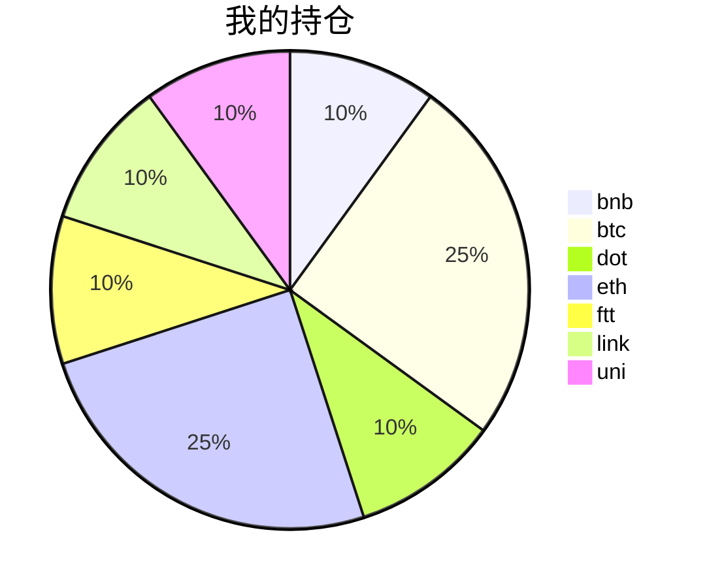

{
  "title":"2021-08-26 数字货币定投日记，收益率：1.41%",
  "tags":[
    "invest",
    "cryptocurrency"
  ],
  "date":"2021-08-26",
  "lastmod":"2021-08-26",
  "draft":"false",
  "author":"kingram"
}

##  📊 今日行情
### 截止 **2021-08-26 20:47:39**
- 🍖 全球加密市场总市值为： **2013394481504** USDT，24h内变化： **-1.33%**

- 🍤 24h总交易量为： **118176636026** USDT，24h内变化： **-3.01%**

## 🎨 我的持仓占比

## 📋 我的定投策略
📎 我的定投策略制定于 **2021-08-19**，今天是我开始定投的第 **7** 天

由于我在币圈总是被割韭菜，深知自己XJB投资的策略有很大问题，在这个24小时不停盘的d场，我自认为抵制不住人性的贪婪和恐惧；我摊牌了，不装了，我认怂。
所以我制定了自己的定投策略，看策略就知道我这个定投计划还是非常非常保守的。我将以月为单位，每月定投 <strong> 400 </strong> USDT(根据行情不同可能有波动，各项波动不超过50%)，一年内暂不考虑卖出。看看一年后会有什么样的市场行情。

- 🥇 当月市值最高的币种 100USDT
- 🥈 当月市值第2高的币种 100USDT
- 🥉 当月市值前20选4个币种，合计 160USDT
- 🏅 (可选，不选这个就投1个第3项的币种)感兴趣(被CX)或者社区治理优秀(SB多)的1～2个币种，合计40USDT

## ⏰ 24小时收益情况
📌 过去的24小时我的持仓总收益为：**-6.43252882** USDT

👉 每个币种的详细数据如下：
<table>
    <thead><tr bgcolor="#d0d0d0" ><th>币种</th><th>排名</th><th>市值(USDT)</th><th>24h交易量(USDT)</th><th>24h%</th><th>7d%</th><th>24h收益</th></tr></thead>
    <tbody>
    <tr>
        <td bgcolor=#F0FFF0>bnb</td>
        <td bgcolor=#F0FFF0>4</td>
        <td bgcolor=#F0FFF0>82008302189</td>
        <td bgcolor=#F0FFF0>3748519311</td>
        <td bgcolor=#F0FFF0>0.70%</td>
        <td bgcolor=#F0FFF0>19.78%</td>
        <td bgcolor=#F0FFF0><strong>0.32222513</strong></td>
    </tr>
    <tr>
        <td bgcolor=#FFECEC>btc</td>
        <td bgcolor=#FFECEC>1</td>
        <td bgcolor=#FFECEC>886203704955</td>
        <td bgcolor=#FFECEC>36513187281</td>
        <td bgcolor=#FFECEC>-1.13%</td>
        <td bgcolor=#FFECEC>5.89%</td>
        <td bgcolor=#FFECEC><strong>-1.17216723</strong></td>
    </tr>
    <tr>
        <td bgcolor=#FFECEC>dot</td>
        <td bgcolor=#FFECEC>9</td>
        <td bgcolor=#FFECEC>24124202975</td>
        <td bgcolor=#FFECEC>1780905196</td>
        <td bgcolor=#FFECEC>-3.39%</td>
        <td bgcolor=#FFECEC>2.35%</td>
        <td bgcolor=#FFECEC><strong>-1.33635657</strong></td>
    </tr>
    <tr>
        <td bgcolor=#FFECEC>eth</td>
        <td bgcolor=#FFECEC>2</td>
        <td bgcolor=#FFECEC>364797545254</td>
        <td bgcolor=#FFECEC>19287537674</td>
        <td bgcolor=#FFECEC>-0.95%</td>
        <td bgcolor=#FFECEC>3.93%</td>
        <td bgcolor=#FFECEC><strong>-0.97961817</strong></td>
    </tr>
    <tr>
        <td bgcolor=#FFECEC>ftt</td>
        <td bgcolor=#FFECEC>32</td>
        <td bgcolor=#FFECEC>4367369257</td>
        <td bgcolor=#FFECEC>260594089</td>
        <td bgcolor=#FFECEC>-2.90%</td>
        <td bgcolor=#FFECEC>1.23%</td>
        <td bgcolor=#FFECEC><strong>-1.16172831</strong></td>
    </tr>
    <tr>
        <td bgcolor=#FFECEC>link</td>
        <td bgcolor=#FFECEC>15</td>
        <td bgcolor=#FFECEC>11187463930</td>
        <td bgcolor=#FFECEC>1449579565</td>
        <td bgcolor=#FFECEC>-3.70%</td>
        <td bgcolor=#FFECEC>0.26%</td>
        <td bgcolor=#FFECEC><strong>-1.46521682</strong></td>
    </tr>
    <tr>
        <td bgcolor=#FFECEC>uni</td>
        <td bgcolor=#FFECEC>11</td>
        <td bgcolor=#FFECEC>15844859006</td>
        <td bgcolor=#FFECEC>369864283</td>
        <td bgcolor=#FFECEC>-1.62%</td>
        <td bgcolor=#FFECEC>-0.23%</td>
        <td bgcolor=#FFECEC><strong>-0.63966685</strong></td>
    </tr>
    </tbody>
</table>

## 🎯 持仓整体收益数据

🔒 我的持仓总成本为：**400** USDT，截止 **2021-08-26 20:47:39**，总价值为：**405.64332422** USDT

💰 利润： **5.64332422** USDT，收益率：**1.41%**

👉 每个币种的详细收益数据如下：

<table>
    <thead><tr bgcolor="#d0d0d0" ><th>币种</th><th>持有数量(个)</th><th>现价(USDT)</th><th>总金额(USDT)</th><th>持仓均价(USDT)</th><th>成本(USDT)</th><th>利润(USDT)</th><th>收益率</th></tr></thead>
    <tbody>
    <tr>
        <td bgcolor=#F0FFF0>bnb</td>
        <td bgcolor=#F0FFF0>0.095403</td>
        <td bgcolor=#F0FFF0>487.74680547</td>
        <td bgcolor=#F0FFF0>46.53250848</td>
        <td bgcolor=#F0FFF0>419.27402702</td>
        <td bgcolor=#F0FFF0>40</td>
        <td bgcolor=#F0FFF0>6.53250848</td>
        <td bgcolor=#F0FFF0><strong>16.33%</strong></td>
    </tr>
    <tr>
        <td bgcolor=#F0FFF0>btc</td>
        <td bgcolor=#F0FFF0>0.002185</td>
        <td bgcolor=#F0FFF0>47143.59046441</td>
        <td bgcolor=#F0FFF0>103.00874516</td>
        <td bgcolor=#F0FFF0>45766.59038902</td>
        <td bgcolor=#F0FFF0>100</td>
        <td bgcolor=#F0FFF0>3.00874516</td>
        <td bgcolor=#F0FFF0><strong>3.01%</strong></td>
    </tr>
    <tr>
        <td bgcolor=#FFECEC>dot</td>
        <td bgcolor=#FFECEC>1.559096</td>
        <td bgcolor=#FFECEC>24.42761063</td>
        <td bgcolor=#FFECEC>38.08499002</td>
        <td bgcolor=#FFECEC>25.6558929</td>
        <td bgcolor=#FFECEC>40</td>
        <td bgcolor=#FFECEC>-1.91500998</td>
        <td bgcolor=#FFECEC><strong>-4.79%</strong></td>
    </tr>
    <tr>
        <td bgcolor=#F0FFF0>eth</td>
        <td bgcolor=#F0FFF0>0.032844</td>
        <td bgcolor=#F0FFF0>3110.9191455</td>
        <td bgcolor=#F0FFF0>102.17502841</td>
        <td bgcolor=#F0FFF0>3044.69613933</td>
        <td bgcolor=#F0FFF0>100</td>
        <td bgcolor=#F0FFF0>2.17502841</td>
        <td bgcolor=#F0FFF0><strong>2.18%</strong></td>
    </tr>
    <tr>
        <td bgcolor=#FFECEC>ftt</td>
        <td bgcolor=#FFECEC>0.840243</td>
        <td bgcolor=#FFECEC>46.29051505</td>
        <td bgcolor=#FFECEC>38.89528124</td>
        <td bgcolor=#FFECEC>47.60527609</td>
        <td bgcolor=#FFECEC>40</td>
        <td bgcolor=#FFECEC>-1.10471876</td>
        <td bgcolor=#FFECEC><strong>-2.76%</strong></td>
    </tr>
    <tr>
        <td bgcolor=#FFECEC>link</td>
        <td bgcolor=#FFECEC>1.526624</td>
        <td bgcolor=#FFECEC>24.99938567</td>
        <td bgcolor=#FFECEC>38.16466215</td>
        <td bgcolor=#FFECEC>26.20160563</td>
        <td bgcolor=#FFECEC>40</td>
        <td bgcolor=#FFECEC>-1.83533785</td>
        <td bgcolor=#FFECEC><strong>-4.59%</strong></td>
    </tr>
    <tr>
        <td bgcolor=#FFECEC>uni</td>
        <td bgcolor=#FFECEC>1.497</td>
        <td bgcolor=#FFECEC>25.90655228</td>
        <td bgcolor=#FFECEC>38.78210876</td>
        <td bgcolor=#FFECEC>26.72010688</td>
        <td bgcolor=#FFECEC>40</td>
        <td bgcolor=#FFECEC>-1.21789124</td>
        <td bgcolor=#FFECEC><strong>-3.04%</strong></td>
    </tr>
    </tbody>
</table>

## ⚠️ 风险友情提示
❤️ 本篇文章仅作为个人投资记录使用，区块链投资风险巨大，请管好你自己的钱袋子呦～ ❤️