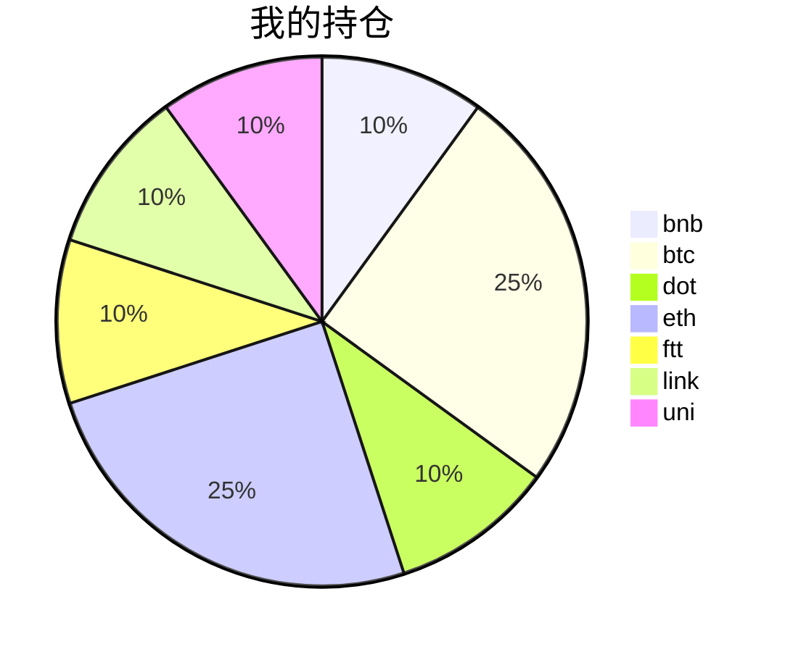

{
  "title":"2021-08-27 数字货币定投日记，收益率：2.57%",
  "tags":[
    "invest",
    "cryptocurrency"
  ],
  "date":"2021-08-27",
  "lastmod":"2021-08-27",
  "draft":"false",
  "author":"kingram"
}

##  📊 今日行情
### 截止 **2021-08-27 19:55:11**
- 🍖 全球加密市场总市值为： **2044929374932** USDT，24h内变化： **1.56%**

- 🍤 24h总交易量为： **106022046285** USDT，24h内变化： **-8.47%**

## 🎨 我的持仓占比

## 📋 我的定投策略
📎 我的定投策略制定于 **2021-08-19**，今天是我开始定投的第 **8** 天

由于我在币圈总是被割韭菜，深知自己XJB投资的策略有很大问题，在这个24小时不停盘的d场，我自认为抵制不住人性的贪婪和恐惧；我摊牌了，不装了，我认怂。
所以我制定了自己的定投策略，看策略就知道我这个定投计划还是非常非常保守的。我将以月为单位，每月定投 <strong> 400 </strong> USDT(根据行情不同可能有波动，各项波动不超过50%)，一年内暂不考虑卖出。看看一年后会有什么样的市场行情。

- 🥇 当月市值最高的币种 100USDT
- 🥈 当月市值第2高的币种 100USDT
- 🥉 当月市值前20选4个币种，合计 160USDT
- 🏅 (可选，不选这个就投1个第3项的币种)感兴趣(被CX)或者社区治理优秀(SB多)的1～2个币种，合计40USDT

## ⏰ 24小时收益情况
📌 过去的24小时我的持仓总收益为：**5.9214767** USDT

👉 每个币种的详细数据如下：
<table>
    <thead><tr bgcolor="#d0d0d0" ><th>币种</th><th>排名</th><th>市值(USDT)</th><th>24h交易量(USDT)</th><th>24h%</th><th>7d%</th><th>24h收益</th></tr></thead>
    <tbody>
    <tr>
        <td bgcolor=#FFECEC>bnb</td>
        <td bgcolor=#FFECEC>4</td>
        <td bgcolor=#FFECEC>81268345477</td>
        <td bgcolor=#FFECEC>2740980453</td>
        <td bgcolor=#FFECEC>-0.39%</td>
        <td bgcolor=#FFECEC>13.11%</td>
        <td bgcolor=#FFECEC><strong>-0.18007456</strong></td>
    </tr>
    <tr>
        <td bgcolor=#F0FFF0>btc</td>
        <td bgcolor=#F0FFF0>1</td>
        <td bgcolor=#F0FFF0>891856923447</td>
        <td bgcolor=#F0FFF0>30827911978</td>
        <td bgcolor=#F0FFF0>1.08%</td>
        <td bgcolor=#F0FFF0>1.12%</td>
        <td bgcolor=#F0FFF0><strong>1.1091455</strong></td>
    </tr>
    <tr>
        <td bgcolor=#F0FFF0>dot</td>
        <td bgcolor=#F0FFF0>9</td>
        <td bgcolor=#F0FFF0>24848935200</td>
        <td bgcolor=#F0FFF0>1783847406</td>
        <td bgcolor=#F0FFF0>2.61%</td>
        <td bgcolor=#F0FFF0>-8.54%</td>
        <td bgcolor=#F0FFF0><strong>0.99643691</strong></td>
    </tr>
    <tr>
        <td bgcolor=#F0FFF0>eth</td>
        <td bgcolor=#F0FFF0>2</td>
        <td bgcolor=#F0FFF0>370023638676</td>
        <td bgcolor=#F0FFF0>16760388862</td>
        <td bgcolor=#F0FFF0>1.86%</td>
        <td bgcolor=#F0FFF0>-1.51%</td>
        <td bgcolor=#F0FFF0><strong>1.89281906</strong></td>
    </tr>
    <tr>
        <td bgcolor=#F0FFF0>ftt</td>
        <td bgcolor=#F0FFF0>32</td>
        <td bgcolor=#F0FFF0>4479696366</td>
        <td bgcolor=#F0FFF0>207424173</td>
        <td bgcolor=#F0FFF0>3.37%</td>
        <td bgcolor=#F0FFF0>-7.72%</td>
        <td bgcolor=#F0FFF0><strong>1.30211201</strong></td>
    </tr>
    <tr>
        <td bgcolor=#F0FFF0>link</td>
        <td bgcolor=#F0FFF0>16</td>
        <td bgcolor=#F0FFF0>11250514033</td>
        <td bgcolor=#F0FFF0>1267015151</td>
        <td bgcolor=#F0FFF0>0.23%</td>
        <td bgcolor=#F0FFF0>-8.55%</td>
        <td bgcolor=#F0FFF0><strong>0.08894783</strong></td>
    </tr>
    <tr>
        <td bgcolor=#F0FFF0>uni</td>
        <td bgcolor=#F0FFF0>11</td>
        <td bgcolor=#F0FFF0>16109574768</td>
        <td bgcolor=#F0FFF0>392335444</td>
        <td bgcolor=#F0FFF0>1.84%</td>
        <td bgcolor=#F0FFF0>-5.65%</td>
        <td bgcolor=#F0FFF0><strong>0.71208995</strong></td>
    </tr>
    </tbody>
</table>

## 🎯 持仓整体收益数据

🔒 我的持仓总成本为：**400** USDT，截止 **2021-08-27 19:55:11**，总价值为：**410.29286354** USDT

💰 利润： **10.29286354** USDT，收益率：**2.57%**

👉 每个币种的详细收益数据如下：

<table>
    <thead><tr bgcolor="#d0d0d0" ><th>币种</th><th>持有数量(个)</th><th>现价(USDT)</th><th>总金额(USDT)</th><th>持仓均价(USDT)</th><th>成本(USDT)</th><th>利润(USDT)</th><th>收益率</th></tr></thead>
    <tbody>
    <tr>
        <td bgcolor=#F0FFF0>bnb</td>
        <td bgcolor=#F0FFF0>0.095403</td>
        <td bgcolor=#F0FFF0>483.34589101</td>
        <td bgcolor=#F0FFF0>46.11264804</td>
        <td bgcolor=#F0FFF0>419.27402702</td>
        <td bgcolor=#F0FFF0>40</td>
        <td bgcolor=#F0FFF0>6.11264804</td>
        <td bgcolor=#F0FFF0><strong>15.28%</strong></td>
    </tr>
    <tr>
        <td bgcolor=#F0FFF0>btc</td>
        <td bgcolor=#F0FFF0>0.002185</td>
        <td bgcolor=#F0FFF0>47442.06981502</td>
        <td bgcolor=#F0FFF0>103.66092255</td>
        <td bgcolor=#F0FFF0>45766.59038902</td>
        <td bgcolor=#F0FFF0>100</td>
        <td bgcolor=#F0FFF0>3.66092255</td>
        <td bgcolor=#F0FFF0><strong>3.66%</strong></td>
    </tr>
    <tr>
        <td bgcolor=#FFECEC>dot</td>
        <td bgcolor=#FFECEC>1.559096</td>
        <td bgcolor=#FFECEC>25.16145774</td>
        <td bgcolor=#FFECEC>39.22912812</td>
        <td bgcolor=#FFECEC>25.6558929</td>
        <td bgcolor=#FFECEC>40</td>
        <td bgcolor=#FFECEC>-0.77087188</td>
        <td bgcolor=#FFECEC><strong>-1.93%</strong></td>
    </tr>
    <tr>
        <td bgcolor=#F0FFF0>eth</td>
        <td bgcolor=#F0FFF0>0.032844</td>
        <td bgcolor=#F0FFF0>3155.15073042</td>
        <td bgcolor=#F0FFF0>103.62777059</td>
        <td bgcolor=#F0FFF0>3044.69613933</td>
        <td bgcolor=#F0FFF0>100</td>
        <td bgcolor=#F0FFF0>3.62777059</td>
        <td bgcolor=#F0FFF0><strong>3.63%</strong></td>
    </tr>
    <tr>
        <td bgcolor=#FFECEC>ftt</td>
        <td bgcolor=#FFECEC>0.840243</td>
        <td bgcolor=#FFECEC>47.48108984</td>
        <td bgcolor=#FFECEC>39.89565337</td>
        <td bgcolor=#FFECEC>47.60527609</td>
        <td bgcolor=#FFECEC>40</td>
        <td bgcolor=#FFECEC>-0.10434663</td>
        <td bgcolor=#FFECEC><strong>-0.26%</strong></td>
    </tr>
    <tr>
        <td bgcolor=#FFECEC>link</td>
        <td bgcolor=#FFECEC>1.526624</td>
        <td bgcolor=#FFECEC>25.112219</td>
        <td bgcolor=#FFECEC>38.33691622</td>
        <td bgcolor=#FFECEC>26.20160563</td>
        <td bgcolor=#FFECEC>40</td>
        <td bgcolor=#FFECEC>-1.66308378</td>
        <td bgcolor=#FFECEC><strong>-4.16%</strong></td>
    </tr>
    <tr>
        <td bgcolor=#FFECEC>uni</td>
        <td bgcolor=#FFECEC>1.497</td>
        <td bgcolor=#FFECEC>26.33922822</td>
        <td bgcolor=#FFECEC>39.42982465</td>
        <td bgcolor=#FFECEC>26.72010688</td>
        <td bgcolor=#FFECEC>40</td>
        <td bgcolor=#FFECEC>-0.57017535</td>
        <td bgcolor=#FFECEC><strong>-1.43%</strong></td>
    </tr>
    </tbody>
</table>

## ⚠️ 风险友情提示
❤️ 本篇文章仅作为个人投资记录使用，区块链投资风险巨大，请管好你自己的钱袋子呦～ ❤️