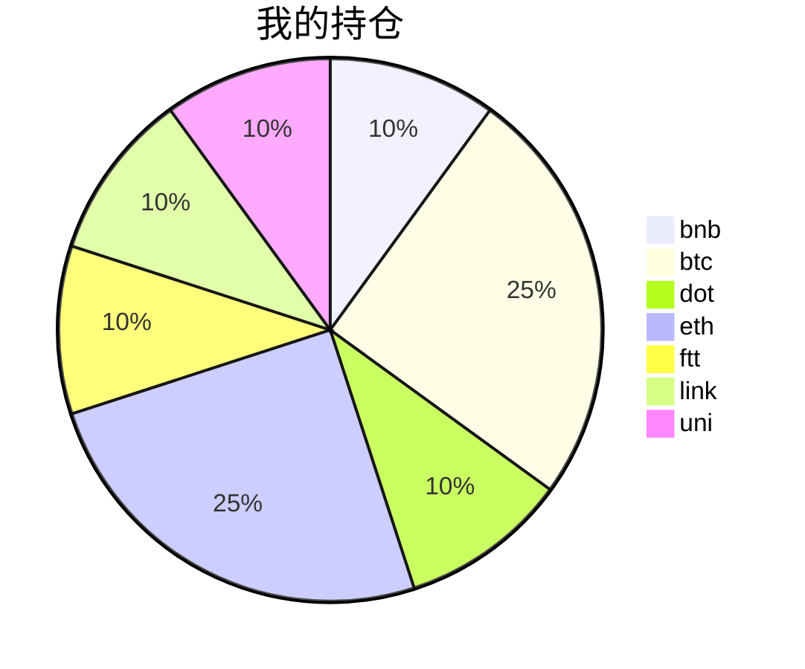

{
  "title":"2021-08-28 数字货币定投日记，收益率：5.55%",
  "tags":[
    "invest",
    "cryptocurrency"
  ],
  "date":"2021-08-28",
  "lastmod":"2021-08-28",
  "draft":"false",
  "author":"kingram"
}

##  📊 今日行情
### 截止 **2021-08-28 17:35:33**
- 🍖 全球加密市场总市值为： **2102442423337** USDT，24h内变化： **4.53%**

- 🍤 24h总交易量为： **102207789764** USDT，24h内变化： **-1.85%**

## 🎨 我的持仓占比

## 📋 我的定投策略
📎 我的定投策略制定于 **2021-08-19**，今天是我开始定投的第 **9** 天

由于我在币圈总是被割韭菜，深知自己XJB投资的策略有很大问题，在这个24小时不停盘的d场，我自认为抵制不住人性的贪婪和恐惧；我摊牌了，不装了，我认怂。
所以我制定了自己的定投策略，看策略就知道我这个定投计划还是非常非常保守的。我将以月为单位，每月定投 <strong> 400 </strong> USDT(根据行情不同可能有波动，各项波动不超过50%)，一年内暂不考虑卖出。看看一年后会有什么样的市场行情。

- 🥇 当月市值最高的币种 100USDT
- 🥈 当月市值第2高的币种 100USDT
- 🥉 当月市值前20选4个币种，合计 160USDT
- 🏅 (可选，不选这个就投1个第3项的币种)感兴趣(被CX)或者社区治理优秀(SB多)的1～2个币种，合计40USDT

## ⏰ 24小时收益情况
📌 过去的24小时我的持仓总收益为：**17.30237558** USDT

👉 每个币种的详细数据如下：
<table>
    <thead><tr bgcolor="#d0d0d0" ><th>币种</th><th>排名</th><th>市值(USDT)</th><th>24h交易量(USDT)</th><th>24h%</th><th>7d%</th><th>24h收益</th></tr></thead>
    <tbody>
    <tr>
        <td bgcolor=#F0FFF0>bnb</td>
        <td bgcolor=#F0FFF0>4</td>
        <td bgcolor=#F0FFF0>81903929577</td>
        <td bgcolor=#F0FFF0>2101958586</td>
        <td bgcolor=#F0FFF0>2.42%</td>
        <td bgcolor=#F0FFF0>7.05%</td>
        <td bgcolor=#F0FFF0><strong>1.09927775</strong></td>
    </tr>
    <tr>
        <td bgcolor=#F0FFF0>btc</td>
        <td bgcolor=#F0FFF0>1</td>
        <td bgcolor=#F0FFF0>920590741261</td>
        <td bgcolor=#F0FFF0>31904308755</td>
        <td bgcolor=#F0FFF0>3.93%</td>
        <td bgcolor=#F0FFF0>0.30%</td>
        <td bgcolor=#F0FFF0><strong>4.04175092</strong></td>
    </tr>
    <tr>
        <td bgcolor=#F0FFF0>dot</td>
        <td bgcolor=#F0FFF0>9</td>
        <td bgcolor=#F0FFF0>25779993600</td>
        <td bgcolor=#F0FFF0>1378456634</td>
        <td bgcolor=#F0FFF0>6.00%</td>
        <td bgcolor=#F0FFF0>-8.66%</td>
        <td bgcolor=#F0FFF0><strong>2.30311911</strong></td>
    </tr>
    <tr>
        <td bgcolor=#F0FFF0>eth</td>
        <td bgcolor=#F0FFF0>2</td>
        <td bgcolor=#F0FFF0>380711219713</td>
        <td bgcolor=#F0FFF0>16722260079</td>
        <td bgcolor=#F0FFF0>4.37%</td>
        <td bgcolor=#F0FFF0>-0.98%</td>
        <td bgcolor=#F0FFF0><strong>4.45925728</strong></td>
    </tr>
    <tr>
        <td bgcolor=#F0FFF0>ftt</td>
        <td bgcolor=#F0FFF0>32</td>
        <td bgcolor=#F0FFF0>4623557309</td>
        <td bgcolor=#F0FFF0>166711627</td>
        <td bgcolor=#F0FFF0>4.45%</td>
        <td bgcolor=#F0FFF0>-3.81%</td>
        <td bgcolor=#F0FFF0><strong>1.75603044</strong></td>
    </tr>
    <tr>
        <td bgcolor=#F0FFF0>link</td>
        <td bgcolor=#F0FFF0>16</td>
        <td bgcolor=#F0FFF0>11597272612</td>
        <td bgcolor=#F0FFF0>983359428</td>
        <td bgcolor=#F0FFF0>5.29%</td>
        <td bgcolor=#F0FFF0>-10.29%</td>
        <td bgcolor=#F0FFF0><strong>1.98401179</strong></td>
    </tr>
    <tr>
        <td bgcolor=#F0FFF0>uni</td>
        <td bgcolor=#F0FFF0>11</td>
        <td bgcolor=#F0FFF0>16633372967</td>
        <td bgcolor=#F0FFF0>295086899</td>
        <td bgcolor=#F0FFF0>4.25%</td>
        <td bgcolor=#F0FFF0>-7.57%</td>
        <td bgcolor=#F0FFF0><strong>1.65892829</strong></td>
    </tr>
    </tbody>
</table>

## 🎯 持仓整体收益数据

🔒 我的持仓总成本为：**400** USDT，截止 **2021-08-28 17:35:33**，总价值为：**422.18519147** USDT

💰 利润： **22.18519147** USDT，收益率：**5.55%**

👉 每个币种的详细收益数据如下：

<table>
    <thead><tr bgcolor="#d0d0d0" ><th>币种</th><th>持有数量(个)</th><th>现价(USDT)</th><th>总金额(USDT)</th><th>持仓均价(USDT)</th><th>成本(USDT)</th><th>利润(USDT)</th><th>收益率</th></tr></thead>
    <tbody>
    <tr>
        <td bgcolor=#F0FFF0>bnb</td>
        <td bgcolor=#F0FFF0>0.095403</td>
        <td bgcolor=#F0FFF0>487.12604627</td>
        <td bgcolor=#F0FFF0>46.47328619</td>
        <td bgcolor=#F0FFF0>419.27402702</td>
        <td bgcolor=#F0FFF0>40</td>
        <td bgcolor=#F0FFF0>6.47328619</td>
        <td bgcolor=#F0FFF0><strong>16.18%</strong></td>
    </tr>
    <tr>
        <td bgcolor=#F0FFF0>btc</td>
        <td bgcolor=#F0FFF0>0.002185</td>
        <td bgcolor=#F0FFF0>48968.40789217</td>
        <td bgcolor=#F0FFF0>106.99597124</td>
        <td bgcolor=#F0FFF0>45766.59038902</td>
        <td bgcolor=#F0FFF0>100</td>
        <td bgcolor=#F0FFF0>6.99597124</td>
        <td bgcolor=#F0FFF0><strong>7.00%</strong></td>
    </tr>
    <tr>
        <td bgcolor=#F0FFF0>dot</td>
        <td bgcolor=#F0FFF0>1.559096</td>
        <td bgcolor=#F0FFF0>26.10422597</td>
        <td bgcolor=#F0FFF0>40.69899429</td>
        <td bgcolor=#F0FFF0>25.6558929</td>
        <td bgcolor=#F0FFF0>40</td>
        <td bgcolor=#F0FFF0>0.69899429</td>
        <td bgcolor=#F0FFF0><strong>1.75%</strong></td>
    </tr>
    <tr>
        <td bgcolor=#F0FFF0>eth</td>
        <td bgcolor=#F0FFF0>0.032844</td>
        <td bgcolor=#F0FFF0>3245.94495946</td>
        <td bgcolor=#F0FFF0>106.60981625</td>
        <td bgcolor=#F0FFF0>3044.69613933</td>
        <td bgcolor=#F0FFF0>100</td>
        <td bgcolor=#F0FFF0>6.60981625</td>
        <td bgcolor=#F0FFF0><strong>6.61%</strong></td>
    </tr>
    <tr>
        <td bgcolor=#F0FFF0>ftt</td>
        <td bgcolor=#F0FFF0>0.840243</td>
        <td bgcolor=#F0FFF0>49.00589727</td>
        <td bgcolor=#F0FFF0>41.17686214</td>
        <td bgcolor=#F0FFF0>47.60527609</td>
        <td bgcolor=#F0FFF0>40</td>
        <td bgcolor=#F0FFF0>1.17686214</td>
        <td bgcolor=#F0FFF0><strong>2.94%</strong></td>
    </tr>
    <tr>
        <td bgcolor=#FFECEC>link</td>
        <td bgcolor=#FFECEC>1.526624</td>
        <td bgcolor=#FFECEC>25.88621718</td>
        <td bgcolor=#FFECEC>39.51852042</td>
        <td bgcolor=#FFECEC>26.20160563</td>
        <td bgcolor=#FFECEC>40</td>
        <td bgcolor=#FFECEC>-0.48147958</td>
        <td bgcolor=#FFECEC><strong>-1.20%</strong></td>
    </tr>
    <tr>
        <td bgcolor=#F0FFF0>uni</td>
        <td bgcolor=#F0FFF0>1.497</td>
        <td bgcolor=#F0FFF0>27.19555173</td>
        <td bgcolor=#F0FFF0>40.71174094</td>
        <td bgcolor=#F0FFF0>26.72010688</td>
        <td bgcolor=#F0FFF0>40</td>
        <td bgcolor=#F0FFF0>0.71174094</td>
        <td bgcolor=#F0FFF0><strong>1.78%</strong></td>
    </tr>
    </tbody>
</table>

## ⚠️ 风险友情提示
❤️ 本篇文章仅作为个人投资记录使用，区块链投资风险巨大，请管好你自己的钱袋子呦～ ❤️