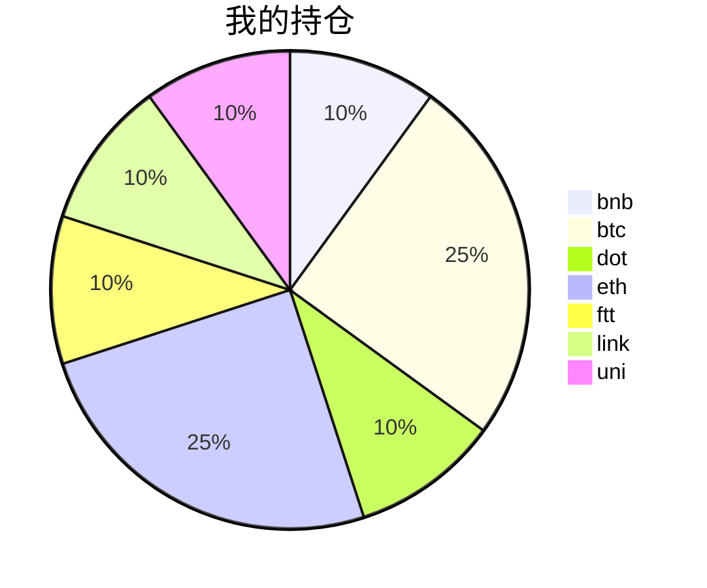

{
  "title":"2021-08-29 数字货币定投日记，收益率：4.59%",
  "tags":[
    "invest",
    "cryptocurrency"
  ],
  "date":"2021-08-29",
  "lastmod":"2021-08-29",
  "draft":"false",
  "author":"kingram"
}

##  📊 今日行情
### 截止 **2021-08-29 19:31:17**
- 🍖 全球加密市场总市值为： **2090824711977** USDT，24h内变化： **-0.25%**

- 🍤 24h总交易量为： **97663712440** USDT，24h内变化： **-3.59%**

## 🎨 我的持仓占比

## 📋 我的定投策略
📎 我的定投策略制定于 **2021-08-19**，今天是我开始定投的第 **10** 天

由于我在币圈总是被割韭菜，深知自己XJB投资的策略有很大问题，在这个24小时不停盘的d场，我自认为抵制不住人性的贪婪和恐惧；我摊牌了，不装了，我认怂。
所以我制定了自己的定投策略，看策略就知道我这个定投计划还是非常非常保守的。我将以月为单位，每月定投 <strong> 400 </strong> USDT(根据行情不同可能有波动，各项波动不超过50%)，一年内暂不考虑卖出。看看一年后会有什么样的市场行情。

- 🥇 当月市值最高的币种 100USDT
- 🥈 当月市值第2高的币种 100USDT
- 🥉 当月市值前20选4个币种，合计 160USDT
- 🏅 (可选，不选这个就投1个第3项的币种)感兴趣(被CX)或者社区治理优秀(SB多)的1～2个币种，合计40USDT

## ⏰ 24小时收益情况
📌 过去的24小时我的持仓总收益为：**-1.9965774** USDT

👉 每个币种的详细数据如下：
<table>
    <thead><tr bgcolor="#d0d0d0" ><th>币种</th><th>排名</th><th>市值(USDT)</th><th>24h交易量(USDT)</th><th>24h%</th><th>7d%</th><th>24h收益</th></tr></thead>
    <tbody>
    <tr>
        <td bgcolor=#F0FFF0>bnb</td>
        <td bgcolor=#F0FFF0>4</td>
        <td bgcolor=#F0FFF0>81954294298</td>
        <td bgcolor=#F0FFF0>1824820927</td>
        <td bgcolor=#F0FFF0>0.29%</td>
        <td bgcolor=#F0FFF0>6.85%</td>
        <td bgcolor=#F0FFF0><strong>0.13225417</strong></td>
    </tr>
    <tr>
        <td bgcolor=#FFECEC>btc</td>
        <td bgcolor=#FFECEC>1</td>
        <td bgcolor=#FFECEC>911925051432</td>
        <td bgcolor=#FFECEC>28545349392</td>
        <td bgcolor=#FFECEC>-0.56%</td>
        <td bgcolor=#FFECEC>-1.41%</td>
        <td bgcolor=#FFECEC><strong>-0.59796436</strong></td>
    </tr>
    <tr>
        <td bgcolor=#F0FFF0>dot</td>
        <td bgcolor=#F0FFF0>10</td>
        <td bgcolor=#F0FFF0>25650595074</td>
        <td bgcolor=#F0FFF0>1154428311</td>
        <td bgcolor=#F0FFF0>0.09%</td>
        <td bgcolor=#F0FFF0>-7.00%</td>
        <td bgcolor=#F0FFF0><strong>0.03496026</strong></td>
    </tr>
    <tr>
        <td bgcolor=#FFECEC>eth</td>
        <td bgcolor=#FFECEC>2</td>
        <td bgcolor=#FFECEC>375716321642</td>
        <td bgcolor=#FFECEC>14938822546</td>
        <td bgcolor=#FFECEC>-1.06%</td>
        <td bgcolor=#FFECEC>-1.71%</td>
        <td bgcolor=#FFECEC><strong>-1.12789887</strong></td>
    </tr>
    <tr>
        <td bgcolor=#FFECEC>ftt</td>
        <td bgcolor=#FFECEC>34</td>
        <td bgcolor=#FFECEC>4588327856</td>
        <td bgcolor=#FFECEC>881109566</td>
        <td bgcolor=#FFECEC>-0.28%</td>
        <td bgcolor=#FFECEC>-5.04%</td>
        <td bgcolor=#FFECEC><strong>-0.11290896</strong></td>
    </tr>
    <tr>
        <td bgcolor=#F0FFF0>link</td>
        <td bgcolor=#F0FFF0>16</td>
        <td bgcolor=#F0FFF0>11575463081</td>
        <td bgcolor=#F0FFF0>829515518</td>
        <td bgcolor=#F0FFF0>0.41%</td>
        <td bgcolor=#F0FFF0>-9.14%</td>
        <td bgcolor=#F0FFF0><strong>0.16015255</strong></td>
    </tr>
    <tr>
        <td bgcolor=#FFECEC>uni</td>
        <td bgcolor=#FFECEC>11</td>
        <td bgcolor=#FFECEC>16284775145</td>
        <td bgcolor=#FFECEC>287182104</td>
        <td bgcolor=#FFECEC>-1.20%</td>
        <td bgcolor=#FFECEC>-7.82%</td>
        <td bgcolor=#FFECEC><strong>-0.48517219</strong></td>
    </tr>
    </tbody>
</table>

## 🎯 持仓整体收益数据

🔒 我的持仓总成本为：**400** USDT，截止 **2021-08-29 19:31:17**，总价值为：**418.34338102** USDT

💰 利润： **18.34338102** USDT，收益率：**4.59%**

👉 每个币种的详细收益数据如下：

<table>
    <thead><tr bgcolor="#d0d0d0" ><th>币种</th><th>持有数量(个)</th><th>现价(USDT)</th><th>总金额(USDT)</th><th>持仓均价(USDT)</th><th>成本(USDT)</th><th>利润(USDT)</th><th>收益率</th></tr></thead>
    <tbody>
    <tr>
        <td bgcolor=#F0FFF0>bnb</td>
        <td bgcolor=#F0FFF0>0.095403</td>
        <td bgcolor=#F0FFF0>487.42559193</td>
        <td bgcolor=#F0FFF0>46.50186375</td>
        <td bgcolor=#F0FFF0>419.27402702</td>
        <td bgcolor=#F0FFF0>40</td>
        <td bgcolor=#F0FFF0>6.50186375</td>
        <td bgcolor=#F0FFF0><strong>16.25%</strong></td>
    </tr>
    <tr>
        <td bgcolor=#F0FFF0>btc</td>
        <td bgcolor=#F0FFF0>0.002185</td>
        <td bgcolor=#F0FFF0>48504.7992014</td>
        <td bgcolor=#F0FFF0>105.98298626</td>
        <td bgcolor=#F0FFF0>45766.59038902</td>
        <td bgcolor=#F0FFF0>100</td>
        <td bgcolor=#F0FFF0>5.98298626</td>
        <td bgcolor=#F0FFF0><strong>5.98%</strong></td>
    </tr>
    <tr>
        <td bgcolor=#F0FFF0>dot</td>
        <td bgcolor=#F0FFF0>1.559096</td>
        <td bgcolor=#F0FFF0>25.97320001</td>
        <td bgcolor=#F0FFF0>40.49471224</td>
        <td bgcolor=#F0FFF0>25.6558929</td>
        <td bgcolor=#F0FFF0>40</td>
        <td bgcolor=#F0FFF0>0.49471224</td>
        <td bgcolor=#F0FFF0><strong>1.24%</strong></td>
    </tr>
    <tr>
        <td bgcolor=#F0FFF0>eth</td>
        <td bgcolor=#F0FFF0>0.032844</td>
        <td bgcolor=#F0FFF0>3202.95908036</td>
        <td bgcolor=#F0FFF0>105.19798804</td>
        <td bgcolor=#F0FFF0>3044.69613933</td>
        <td bgcolor=#F0FFF0>100</td>
        <td bgcolor=#F0FFF0>5.19798804</td>
        <td bgcolor=#F0FFF0><strong>5.20%</strong></td>
    </tr>
    <tr>
        <td bgcolor=#F0FFF0>ftt</td>
        <td bgcolor=#F0FFF0>0.840243</td>
        <td bgcolor=#F0FFF0>48.63249411</td>
        <td bgcolor=#F0FFF0>40.86311275</td>
        <td bgcolor=#F0FFF0>47.60527609</td>
        <td bgcolor=#F0FFF0>40</td>
        <td bgcolor=#F0FFF0>0.86311275</td>
        <td bgcolor=#F0FFF0><strong>2.16%</strong></td>
    </tr>
    <tr>
        <td bgcolor=#FFECEC>link</td>
        <td bgcolor=#FFECEC>1.526624</td>
        <td bgcolor=#FFECEC>25.83753623</td>
        <td bgcolor=#FFECEC>39.44420291</td>
        <td bgcolor=#FFECEC>26.20160563</td>
        <td bgcolor=#FFECEC>40</td>
        <td bgcolor=#FFECEC>-0.55579709</td>
        <td bgcolor=#FFECEC><strong>-1.39%</strong></td>
    </tr>
    <tr>
        <td bgcolor=#FFECEC>uni</td>
        <td bgcolor=#FFECEC>1.497</td>
        <td bgcolor=#FFECEC>26.62559457</td>
        <td bgcolor=#FFECEC>39.85851507</td>
        <td bgcolor=#FFECEC>26.72010688</td>
        <td bgcolor=#FFECEC>40</td>
        <td bgcolor=#FFECEC>-0.14148493</td>
        <td bgcolor=#FFECEC><strong>-0.35%</strong></td>
    </tr>
    </tbody>
</table>

## ⚠️ 风险友情提示
❤️ 本篇文章仅作为个人投资记录使用，区块链投资风险巨大，请管好你自己的钱袋子呦～ ❤️