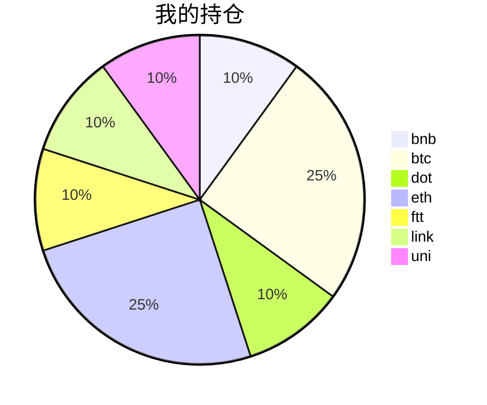

{
  "title":"2021-08-30 数字货币定投日记，收益率：1.51%",
  "tags":[
    "invest",
    "cryptocurrency"
  ],
  "date":"2021-08-30",
  "lastmod":"2021-08-30",
  "draft":"false",
  "author":"kingram"
}

##  📊 今日行情
### 截止 **2021-08-30 21:46:48**
- 🍖 全球加密市场总市值为： **2035869130901** USDT，24h内变化： **-2.62%**

- 🍤 24h总交易量为： **91444006709** USDT，24h内变化： **-5.23%**

## 🎨 我的持仓占比

## 📋 我的定投策略
📎 我的定投策略制定于 **2021-08-19**，今天是我开始定投的第 **11** 天

由于我在币圈总是被割韭菜，深知自己XJB投资的策略有很大问题，在这个24小时不停盘的d场，我自认为抵制不住人性的贪婪和恐惧；我摊牌了，不装了，我认怂。
所以我制定了自己的定投策略，看策略就知道我这个定投计划还是非常非常保守的。我将以月为单位，每月定投 <strong> 400 </strong> USDT(根据行情不同可能有波动，各项波动不超过50%)，一年内暂不考虑卖出。看看一年后会有什么样的市场行情。

- 🥇 当月市值最高的币种 100USDT
- 🥈 当月市值第2高的币种 100USDT
- 🥉 当月市值前20选4个币种，合计 160USDT
- 🏅 (可选，不选这个就投1个第3项的币种)感兴趣(被CX)或者社区治理优秀(SB多)的1～2个币种，合计40USDT

## ⏰ 24小时收益情况
📌 过去的24小时我的持仓总收益为：**-11.75586646** USDT

👉 每个币种的详细数据如下：
<table>
    <thead><tr bgcolor="#d0d0d0" ><th>币种</th><th>排名</th><th>市值(USDT)</th><th>24h交易量(USDT)</th><th>24h%</th><th>7d%</th><th>24h收益</th></tr></thead>
    <tbody>
    <tr>
        <td bgcolor=#FFECEC>bnb</td>
        <td bgcolor=#FFECEC>4</td>
        <td bgcolor=#FFECEC>78581473819</td>
        <td bgcolor=#FFECEC>1794496023</td>
        <td bgcolor=#FFECEC>-3.87%</td>
        <td bgcolor=#FFECEC>-7.07%</td>
        <td bgcolor=#FFECEC><strong>-1.79631684</strong></td>
    </tr>
    <tr>
        <td bgcolor=#FFECEC>btc</td>
        <td bgcolor=#FFECEC>1</td>
        <td bgcolor=#FFECEC>896948288962</td>
        <td bgcolor=#FFECEC>28163875568</td>
        <td bgcolor=#FFECEC>-1.66%</td>
        <td bgcolor=#FFECEC>-5.06%</td>
        <td bgcolor=#FFECEC><strong>-1.76054147</strong></td>
    </tr>
    <tr>
        <td bgcolor=#FFECEC>dot</td>
        <td bgcolor=#FFECEC>10</td>
        <td bgcolor=#FFECEC>24246144083</td>
        <td bgcolor=#FFECEC>1006326399</td>
        <td bgcolor=#FFECEC>-5.23%</td>
        <td bgcolor=#FFECEC>-12.35%</td>
        <td bgcolor=#FFECEC><strong>-2.1132635</strong></td>
    </tr>
    <tr>
        <td bgcolor=#FFECEC>eth</td>
        <td bgcolor=#FFECEC>2</td>
        <td bgcolor=#FFECEC>371721342790</td>
        <td bgcolor=#FFECEC>13196362995</td>
        <td bgcolor=#FFECEC>-0.93%</td>
        <td bgcolor=#FFECEC>-5.35%</td>
        <td bgcolor=#FFECEC><strong>-0.97328748</strong></td>
    </tr>
    <tr>
        <td bgcolor=#FFECEC>ftt</td>
        <td bgcolor=#FFECEC>35</td>
        <td bgcolor=#FFECEC>4344347026</td>
        <td bgcolor=#FFECEC>538443577</td>
        <td bgcolor=#FFECEC>-5.53%</td>
        <td bgcolor=#FFECEC>-11.14%</td>
        <td bgcolor=#FFECEC><strong>-2.26335564</strong></td>
    </tr>
    <tr>
        <td bgcolor=#FFECEC>link</td>
        <td bgcolor=#FFECEC>16</td>
        <td bgcolor=#FFECEC>11046512848</td>
        <td bgcolor=#FFECEC>743714487</td>
        <td bgcolor=#FFECEC>-4.34%</td>
        <td bgcolor=#FFECEC>-15.16%</td>
        <td bgcolor=#FFECEC><strong>-1.70601478</strong></td>
    </tr>
    <tr>
        <td bgcolor=#FFECEC>uni</td>
        <td bgcolor=#FFECEC>11</td>
        <td bgcolor=#FFECEC>15787927430</td>
        <td bgcolor=#FFECEC>247430361</td>
        <td bgcolor=#FFECEC>-2.87%</td>
        <td bgcolor=#FFECEC>-11.56%</td>
        <td bgcolor=#FFECEC><strong>-1.14308675</strong></td>
    </tr>
    </tbody>
</table>

## 🎯 持仓整体收益数据

🔒 我的持仓总成本为：**400** USDT，截止 **2021-08-30 21:46:48**，总价值为：**406.05897941** USDT

💰 利润： **6.05897941** USDT，收益率：**1.51%**

👉 每个币种的详细收益数据如下：

<table>
    <thead><tr bgcolor="#d0d0d0" ><th>币种</th><th>持有数量(个)</th><th>现价(USDT)</th><th>总金额(USDT)</th><th>持仓均价(USDT)</th><th>成本(USDT)</th><th>利润(USDT)</th><th>收益率</th></tr></thead>
    <tbody>
    <tr>
        <td bgcolor=#F0FFF0>bnb</td>
        <td bgcolor=#F0FFF0>0.095403</td>
        <td bgcolor=#F0FFF0>467.36564227</td>
        <td bgcolor=#F0FFF0>44.58808437</td>
        <td bgcolor=#F0FFF0>419.27402702</td>
        <td bgcolor=#F0FFF0>40</td>
        <td bgcolor=#F0FFF0>4.58808437</td>
        <td bgcolor=#F0FFF0><strong>11.47%</strong></td>
    </tr>
    <tr>
        <td bgcolor=#F0FFF0>btc</td>
        <td bgcolor=#F0FFF0>0.002185</td>
        <td bgcolor=#F0FFF0>47705.8131987</td>
        <td bgcolor=#F0FFF0>104.23720184</td>
        <td bgcolor=#F0FFF0>45766.59038902</td>
        <td bgcolor=#F0FFF0>100</td>
        <td bgcolor=#F0FFF0>4.23720184</td>
        <td bgcolor=#F0FFF0><strong>4.24%</strong></td>
    </tr>
    <tr>
        <td bgcolor=#FFECEC>dot</td>
        <td bgcolor=#FFECEC>1.559096</td>
        <td bgcolor=#FFECEC>24.55108538</td>
        <td bgcolor=#FFECEC>38.27749901</td>
        <td bgcolor=#FFECEC>25.6558929</td>
        <td bgcolor=#FFECEC>40</td>
        <td bgcolor=#FFECEC>-1.72250099</td>
        <td bgcolor=#FFECEC><strong>-4.31%</strong></td>
    </tr>
    <tr>
        <td bgcolor=#F0FFF0>eth</td>
        <td bgcolor=#F0FFF0>0.032844</td>
        <td bgcolor=#F0FFF0>3168.50550483</td>
        <td bgcolor=#F0FFF0>104.0663948</td>
        <td bgcolor=#F0FFF0>3044.69613933</td>
        <td bgcolor=#F0FFF0>100</td>
        <td bgcolor=#F0FFF0>4.0663948</td>
        <td bgcolor=#F0FFF0><strong>4.07%</strong></td>
    </tr>
    <tr>
        <td bgcolor=#FFECEC>ftt</td>
        <td bgcolor=#FFECEC>0.840243</td>
        <td bgcolor=#FFECEC>46.04649837</td>
        <td bgcolor=#FFECEC>38.69024793</td>
        <td bgcolor=#FFECEC>47.60527609</td>
        <td bgcolor=#FFECEC>40</td>
        <td bgcolor=#FFECEC>-1.30975207</td>
        <td bgcolor=#FFECEC><strong>-3.27%</strong></td>
    </tr>
    <tr>
        <td bgcolor=#FFECEC>link</td>
        <td bgcolor=#FFECEC>1.526624</td>
        <td bgcolor=#FFECEC>24.60195502</td>
        <td bgcolor=#FFECEC>37.55793498</td>
        <td bgcolor=#FFECEC>26.20160563</td>
        <td bgcolor=#FFECEC>40</td>
        <td bgcolor=#FFECEC>-2.44206502</td>
        <td bgcolor=#FFECEC><strong>-6.11%</strong></td>
    </tr>
    <tr>
        <td bgcolor=#FFECEC>uni</td>
        <td bgcolor=#FFECEC>1.497</td>
        <td bgcolor=#FFECEC>25.81270306</td>
        <td bgcolor=#FFECEC>38.64161648</td>
        <td bgcolor=#FFECEC>26.72010688</td>
        <td bgcolor=#FFECEC>40</td>
        <td bgcolor=#FFECEC>-1.35838352</td>
        <td bgcolor=#FFECEC><strong>-3.40%</strong></td>
    </tr>
    </tbody>
</table>

## ⚠️ 风险友情提示
❤️ 本篇文章仅作为个人投资记录使用，区块链投资风险巨大，请管好你自己的钱袋子呦～ ❤️