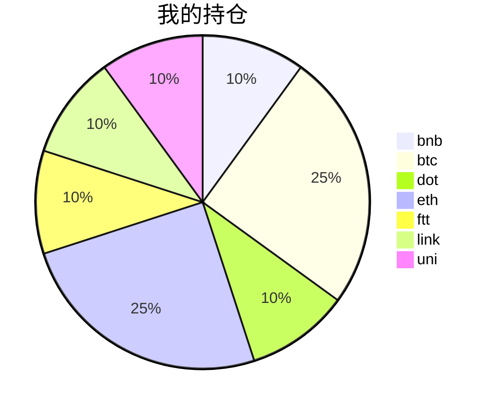

{
  "title":"2021-08-31 数字货币定投日记，收益率：8.09%",
  "tags":[
    "invest",
    "cryptocurrency"
  ],
  "date":"2021-08-31",
  "lastmod":"2021-08-31",
  "draft":"false",
  "author":"kingram"
}

##  📊 今日行情
### 截止 **2021-08-31 19:47:12**
- 🍖 全球加密市场总市值为： **2122438644873** USDT，24h内变化： **2.92%**

- 🍤 24h总交易量为： **117027596873** USDT，24h内变化： **27.83%**

## 🎨 我的持仓占比

## 📋 我的定投策略
📎 我的定投策略制定于 **2021-08-19**，今天是我开始定投的第 **12** 天

由于我在币圈总是被割韭菜，深知自己XJB投资的策略有很大问题，在这个24小时不停盘的d场，我自认为抵制不住人性的贪婪和恐惧；我摊牌了，不装了，我认怂。
所以我制定了自己的定投策略，看策略就知道我这个定投计划还是非常非常保守的。我将以月为单位，每月定投 <strong> 400 </strong> USDT(根据行情不同可能有波动，各项波动不超过50%)，一年内暂不考虑卖出。看看一年后会有什么样的市场行情。

- 🥇 当月市值最高的币种 100USDT
- 🥈 当月市值第2高的币种 100USDT
- 🥉 当月市值前20选4个币种，合计 160USDT
- 🏅 (可选，不选这个就投1个第3项的币种)感兴趣(被CX)或者社区治理优秀(SB多)的1～2个币种，合计40USDT

## ⏰ 24小时收益情况
📌 过去的24小时我的持仓总收益为：**22.425693149999997** USDT

👉 每个币种的详细数据如下：
<table>
    <thead><tr bgcolor="#d0d0d0" ><th>币种</th><th>排名</th><th>市值(USDT)</th><th>24h交易量(USDT)</th><th>24h%</th><th>7d%</th><th>24h收益</th></tr></thead>
    <tbody>
    <tr>
        <td bgcolor=#FFECEC>bnb</td>
        <td bgcolor=#FFECEC>4</td>
        <td bgcolor=#FFECEC>79378818947</td>
        <td bgcolor=#FFECEC>2423217907</td>
        <td bgcolor=#FFECEC>-0.57%</td>
        <td bgcolor=#FFECEC>-4.13%</td>
        <td bgcolor=#FFECEC><strong>-0.25809045</strong></td>
    </tr>
    <tr>
        <td bgcolor=#F0FFF0>btc</td>
        <td bgcolor=#F0FFF0>1</td>
        <td bgcolor=#F0FFF0>903294890254</td>
        <td bgcolor=#F0FFF0>32399057928</td>
        <td bgcolor=#F0FFF0>0.29%</td>
        <td bgcolor=#F0FFF0>-2.69%</td>
        <td bgcolor=#F0FFF0><strong>0.30080873</strong></td>
    </tr>
    <tr>
        <td bgcolor=#F0FFF0>dot</td>
        <td bgcolor=#F0FFF0>9</td>
        <td bgcolor=#F0FFF0>28514330008</td>
        <td bgcolor=#F0FFF0>3114940319</td>
        <td bgcolor=#F0FFF0>16.08%</td>
        <td bgcolor=#F0FFF0>5.11%</td>
        <td bgcolor=#F0FFF0><strong>6.23553802</strong></td>
    </tr>
    <tr>
        <td bgcolor=#F0FFF0>eth</td>
        <td bgcolor=#F0FFF0>2</td>
        <td bgcolor=#F0FFF0>403378114185</td>
        <td bgcolor=#F0FFF0>24448753134</td>
        <td bgcolor=#F0FFF0>7.93%</td>
        <td bgcolor=#F0FFF0>3.62%</td>
        <td bgcolor=#F0FFF0><strong>8.2953395</strong></td>
    </tr>
    <tr>
        <td bgcolor=#F0FFF0>ftt</td>
        <td bgcolor=#F0FFF0>34</td>
        <td bgcolor=#F0FFF0>4518946911</td>
        <td bgcolor=#F0FFF0>368166931</td>
        <td bgcolor=#F0FFF0>2.32%</td>
        <td bgcolor=#F0FFF0>-4.03%</td>
        <td bgcolor=#F0FFF0><strong>0.91413915</strong></td>
    </tr>
    <tr>
        <td bgcolor=#F0FFF0>link</td>
        <td bgcolor=#F0FFF0>15</td>
        <td bgcolor=#F0FFF0>12072855168</td>
        <td bgcolor=#F0FFF0>1296008514</td>
        <td bgcolor=#F0FFF0>7.79%</td>
        <td bgcolor=#F0FFF0>-5.35%</td>
        <td bgcolor=#F0FFF0><strong>2.96787005</strong></td>
    </tr>
    <tr>
        <td bgcolor=#F0FFF0>uni</td>
        <td bgcolor=#F0FFF0>11</td>
        <td bgcolor=#F0FFF0>17613295800</td>
        <td bgcolor=#F0FFF0>618506435</td>
        <td bgcolor=#F0FFF0>10.14%</td>
        <td bgcolor=#F0FFF0>1.02%</td>
        <td bgcolor=#F0FFF0><strong>3.97008815</strong></td>
    </tr>
    </tbody>
</table>

## 🎯 持仓整体收益数据

🔒 我的持仓总成本为：**400** USDT，截止 **2021-08-31 19:47:12**，总价值为：**432.34509134** USDT

💰 利润： **32.34509134** USDT，收益率：**8.09%**

👉 每个币种的详细收益数据如下：

<table>
    <thead><tr bgcolor="#d0d0d0" ><th>币种</th><th>持有数量(个)</th><th>现价(USDT)</th><th>总金额(USDT)</th><th>持仓均价(USDT)</th><th>成本(USDT)</th><th>利润(USDT)</th><th>收益率</th></tr></thead>
    <tbody>
    <tr>
        <td bgcolor=#F0FFF0>bnb</td>
        <td bgcolor=#F0FFF0>0.095403</td>
        <td bgcolor=#F0FFF0>472.10787603</td>
        <td bgcolor=#F0FFF0>45.0405077</td>
        <td bgcolor=#F0FFF0>419.27402702</td>
        <td bgcolor=#F0FFF0>40</td>
        <td bgcolor=#F0FFF0>5.0405077</td>
        <td bgcolor=#F0FFF0><strong>12.60%</strong></td>
    </tr>
    <tr>
        <td bgcolor=#F0FFF0>btc</td>
        <td bgcolor=#F0FFF0>0.002185</td>
        <td bgcolor=#F0FFF0>48041.22997167</td>
        <td bgcolor=#F0FFF0>104.97008749</td>
        <td bgcolor=#F0FFF0>45766.59038902</td>
        <td bgcolor=#F0FFF0>100</td>
        <td bgcolor=#F0FFF0>4.97008749</td>
        <td bgcolor=#F0FFF0><strong>4.97%</strong></td>
    </tr>
    <tr>
        <td bgcolor=#F0FFF0>dot</td>
        <td bgcolor=#F0FFF0>1.559096</td>
        <td bgcolor=#F0FFF0>28.87295185</td>
        <td bgcolor=#F0FFF0>45.01570374</td>
        <td bgcolor=#F0FFF0>25.6558929</td>
        <td bgcolor=#F0FFF0>40</td>
        <td bgcolor=#F0FFF0>5.01570374</td>
        <td bgcolor=#F0FFF0><strong>12.54%</strong></td>
    </tr>
    <tr>
        <td bgcolor=#F0FFF0>eth</td>
        <td bgcolor=#F0FFF0>0.032844</td>
        <td bgcolor=#F0FFF0>3437.98167636</td>
        <td bgcolor=#F0FFF0>112.91707018</td>
        <td bgcolor=#F0FFF0>3044.69613933</td>
        <td bgcolor=#F0FFF0>100</td>
        <td bgcolor=#F0FFF0>12.91707018</td>
        <td bgcolor=#F0FFF0><strong>12.92%</strong></td>
    </tr>
    <tr>
        <td bgcolor=#F0FFF0>ftt</td>
        <td bgcolor=#F0FFF0>0.840243</td>
        <td bgcolor=#F0FFF0>47.89711326</td>
        <td bgcolor=#F0FFF0>40.24521414</td>
        <td bgcolor=#F0FFF0>47.60527609</td>
        <td bgcolor=#F0FFF0>40</td>
        <td bgcolor=#F0FFF0>0.24521414</td>
        <td bgcolor=#F0FFF0><strong>0.61%</strong></td>
    </tr>
    <tr>
        <td bgcolor=#F0FFF0>link</td>
        <td bgcolor=#F0FFF0>1.526624</td>
        <td bgcolor=#F0FFF0>26.88774674</td>
        <td bgcolor=#F0FFF0>41.04747948</td>
        <td bgcolor=#F0FFF0>26.20160563</td>
        <td bgcolor=#F0FFF0>40</td>
        <td bgcolor=#F0FFF0>1.04747948</td>
        <td bgcolor=#F0FFF0><strong>2.62%</strong></td>
    </tr>
    <tr>
        <td bgcolor=#F0FFF0>uni</td>
        <td bgcolor=#F0FFF0>1.497</td>
        <td bgcolor=#F0FFF0>28.7969463</td>
        <td bgcolor=#F0FFF0>43.10902861</td>
        <td bgcolor=#F0FFF0>26.72010688</td>
        <td bgcolor=#F0FFF0>40</td>
        <td bgcolor=#F0FFF0>3.10902861</td>
        <td bgcolor=#F0FFF0><strong>7.77%</strong></td>
    </tr>
    </tbody>
</table>

## ⚠️ 风险友情提示
❤️ 本篇文章仅作为个人投资记录使用，区块链投资风险巨大，请管好你自己的钱袋子呦～ ❤️