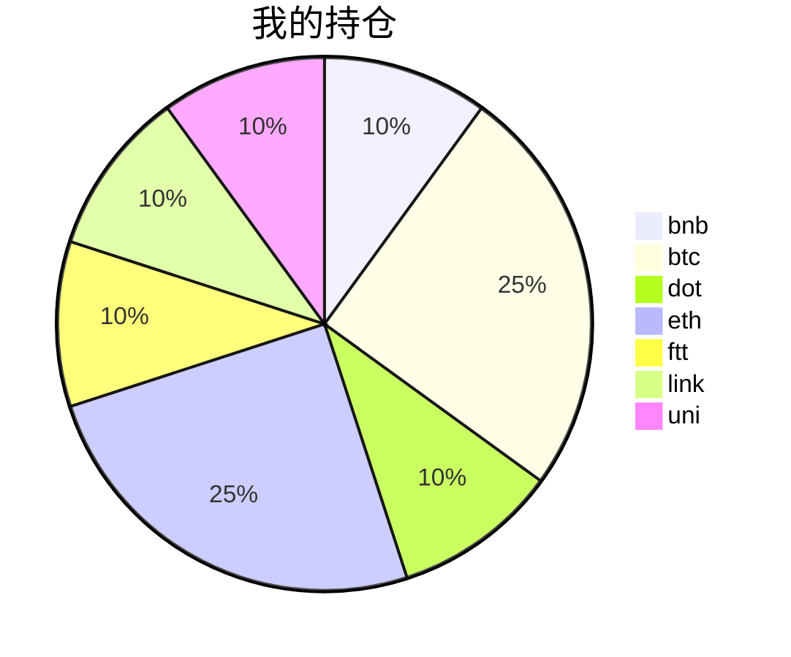

{
  "title":"2021-09-01 数字货币定投日记，收益率：12.18%",
  "tags":[
    "invest",
    "cryptocurrency"
  ],
  "date":"2021-09-01",
  "lastmod":"2021-09-01",
  "draft":"false",
  "author":"kingram"
}

##  📊 今日行情
### 截止 **2021-09-01 20:18:48**
- 🍖 全球加密市场总市值为： **2105444126618** USDT，24h内变化： **-0.53%**

- 🍤 24h总交易量为： **128658114339** USDT，24h内变化： **8.04%**

## 🎨 我的持仓占比

## 📋 我的定投策略
📎 我的定投策略制定于 **2021-08-19**，今天是我开始定投的第 **13** 天

由于我在币圈总是被割韭菜，深知自己XJB投资的策略有很大问题，在这个24小时不停盘的d场，我自认为抵制不住人性的贪婪和恐惧；我摊牌了，不装了，我认怂。
所以我制定了自己的定投策略，看策略就知道我这个定投计划还是非常非常保守的。我将以月为单位，每月定投 <strong> 400 </strong> USDT(根据行情不同可能有波动，各项波动不超过50%)，一年内暂不考虑卖出。看看一年后会有什么样的市场行情。

- 🥇 当月市值最高的币种 100USDT
- 🥈 当月市值第2高的币种 100USDT
- 🥉 当月市值前20选4个币种，合计 160USDT
- 🏅 (可选，不选这个就投1个第3项的币种)感兴趣(被CX)或者社区治理优秀(SB多)的1～2个币种，合计40USDT

## ⏰ 24小时收益情况
📌 过去的24小时我的持仓总收益为：**17.25692368** USDT

👉 每个币种的详细数据如下：
<table>
    <thead><tr bgcolor="#d0d0d0" ><th>币种</th><th>排名</th><th>市值(USDT)</th><th>24h交易量(USDT)</th><th>24h%</th><th>7d%</th><th>24h收益</th></tr></thead>
    <tbody>
    <tr>
        <td bgcolor=#F0FFF0>bnb</td>
        <td bgcolor=#F0FFF0>4</td>
        <td bgcolor=#F0FFF0>80844379026</td>
        <td bgcolor=#F0FFF0>2316385800</td>
        <td bgcolor=#F0FFF0>2.20%</td>
        <td bgcolor=#F0FFF0>-0.46%</td>
        <td bgcolor=#F0FFF0><strong>0.98700504</strong></td>
    </tr>
    <tr>
        <td bgcolor=#FFECEC>btc</td>
        <td bgcolor=#FFECEC>1</td>
        <td bgcolor=#FFECEC>896750616802</td>
        <td bgcolor=#FFECEC>37395284437</td>
        <td bgcolor=#FFECEC>-0.65%</td>
        <td bgcolor=#FFECEC>0.06%</td>
        <td bgcolor=#FFECEC><strong>-0.6823892</strong></td>
    </tr>
    <tr>
        <td bgcolor=#F0FFF0>dot</td>
        <td bgcolor=#F0FFF0>9</td>
        <td bgcolor=#F0FFF0>29676717776</td>
        <td bgcolor=#F0FFF0>4930846559</td>
        <td bgcolor=#F0FFF0>4.45%</td>
        <td bgcolor=#F0FFF0>19.44%</td>
        <td bgcolor=#F0FFF0><strong>1.99627853</strong></td>
    </tr>
    <tr>
        <td bgcolor=#F0FFF0>eth</td>
        <td bgcolor=#F0FFF0>2</td>
        <td bgcolor=#F0FFF0>415373610693</td>
        <td bgcolor=#F0FFF0>28044028940</td>
        <td bgcolor=#F0FFF0>3.25%</td>
        <td bgcolor=#F0FFF0>12.79%</td>
        <td bgcolor=#F0FFF0><strong>3.66042684</strong></td>
    </tr>
    <tr>
        <td bgcolor=#F0FFF0>ftt</td>
        <td bgcolor=#F0FFF0>28</td>
        <td bgcolor=#F0FFF0>5375417476</td>
        <td bgcolor=#F0FFF0>935783843</td>
        <td bgcolor=#F0FFF0>19.38%</td>
        <td bgcolor=#F0FFF0>19.80%</td>
        <td bgcolor=#F0FFF0><strong>7.77259806</strong></td>
    </tr>
    <tr>
        <td bgcolor=#F0FFF0>link</td>
        <td bgcolor=#F0FFF0>13</td>
        <td bgcolor=#F0FFF0>12509486773</td>
        <td bgcolor=#F0FFF0>1635840960</td>
        <td bgcolor=#F0FFF0>3.12%</td>
        <td bgcolor=#F0FFF0>7.90%</td>
        <td bgcolor=#F0FFF0><strong>1.28782357</strong></td>
    </tr>
    <tr>
        <td bgcolor=#F0FFF0>uni</td>
        <td bgcolor=#F0FFF0>11</td>
        <td bgcolor=#F0FFF0>18435639189</td>
        <td bgcolor=#F0FFF0>956399230</td>
        <td bgcolor=#F0FFF0>5.21%</td>
        <td bgcolor=#F0FFF0>14.60%</td>
        <td bgcolor=#F0FFF0><strong>2.23518084</strong></td>
    </tr>
    </tbody>
</table>

## 🎯 持仓整体收益数据

🔒 我的持仓总成本为：**400** USDT，截止 **2021-09-01 20:18:48**，总价值为：**448.71559471** USDT

💰 利润： **48.71559471** USDT，收益率：**12.18%**

👉 每个币种的详细收益数据如下：

<table>
    <thead><tr bgcolor="#d0d0d0" ><th>币种</th><th>持有数量(个)</th><th>现价(USDT)</th><th>总金额(USDT)</th><th>持仓均价(USDT)</th><th>成本(USDT)</th><th>利润(USDT)</th><th>收益率</th></tr></thead>
    <tbody>
    <tr>
        <td bgcolor=#F0FFF0>bnb</td>
        <td bgcolor=#F0FFF0>0.095403</td>
        <td bgcolor=#F0FFF0>480.82433799</td>
        <td bgcolor=#F0FFF0>45.87208432</td>
        <td bgcolor=#F0FFF0>419.27402702</td>
        <td bgcolor=#F0FFF0>40</td>
        <td bgcolor=#F0FFF0>5.87208432</td>
        <td bgcolor=#F0FFF0><strong>14.68%</strong></td>
    </tr>
    <tr>
        <td bgcolor=#F0FFF0>btc</td>
        <td bgcolor=#F0FFF0>0.002185</td>
        <td bgcolor=#F0FFF0>47691.02051704</td>
        <td bgcolor=#F0FFF0>104.20487983</td>
        <td bgcolor=#F0FFF0>45766.59038902</td>
        <td bgcolor=#F0FFF0>100</td>
        <td bgcolor=#F0FFF0>4.20487983</td>
        <td bgcolor=#F0FFF0><strong>4.20%</strong></td>
    </tr>
    <tr>
        <td bgcolor=#F0FFF0>dot</td>
        <td bgcolor=#F0FFF0>1.559096</td>
        <td bgcolor=#F0FFF0>30.04995885</td>
        <td bgcolor=#F0FFF0>46.85077064</td>
        <td bgcolor=#F0FFF0>25.6558929</td>
        <td bgcolor=#F0FFF0>40</td>
        <td bgcolor=#F0FFF0>6.85077064</td>
        <td bgcolor=#F0FFF0><strong>17.13%</strong></td>
    </tr>
    <tr>
        <td bgcolor=#F0FFF0>eth</td>
        <td bgcolor=#F0FFF0>0.032844</td>
        <td bgcolor=#F0FFF0>3539.81406517</td>
        <td bgcolor=#F0FFF0>116.26165316</td>
        <td bgcolor=#F0FFF0>3044.69613933</td>
        <td bgcolor=#F0FFF0>100</td>
        <td bgcolor=#F0FFF0>16.26165316</td>
        <td bgcolor=#F0FFF0><strong>16.26%</strong></td>
    </tr>
    <tr>
        <td bgcolor=#F0FFF0>ftt</td>
        <td bgcolor=#F0FFF0>0.840243</td>
        <td bgcolor=#F0FFF0>56.97499546</td>
        <td bgcolor=#F0FFF0>47.87284111</td>
        <td bgcolor=#F0FFF0>47.60527609</td>
        <td bgcolor=#F0FFF0>40</td>
        <td bgcolor=#F0FFF0>7.87284111</td>
        <td bgcolor=#F0FFF0><strong>19.68%</strong></td>
    </tr>
    <tr>
        <td bgcolor=#F0FFF0>link</td>
        <td bgcolor=#F0FFF0>1.526624</td>
        <td bgcolor=#F0FFF0>27.86017951</td>
        <td bgcolor=#F0FFF0>42.53201868</td>
        <td bgcolor=#F0FFF0>26.20160563</td>
        <td bgcolor=#F0FFF0>40</td>
        <td bgcolor=#F0FFF0>2.53201868</td>
        <td bgcolor=#F0FFF0><strong>6.33%</strong></td>
    </tr>
    <tr>
        <td bgcolor=#F0FFF0>uni</td>
        <td bgcolor=#F0FFF0>1.497</td>
        <td bgcolor=#F0FFF0>30.14118034</td>
        <td bgcolor=#F0FFF0>45.12134697</td>
        <td bgcolor=#F0FFF0>26.72010688</td>
        <td bgcolor=#F0FFF0>40</td>
        <td bgcolor=#F0FFF0>5.12134697</td>
        <td bgcolor=#F0FFF0><strong>12.80%</strong></td>
    </tr>
    </tbody>
</table>

## ⚠️ 风险友情提示
❤️ 本篇文章仅作为个人投资记录使用，区块链投资风险巨大，请管好你自己的钱袋子呦～ ❤️