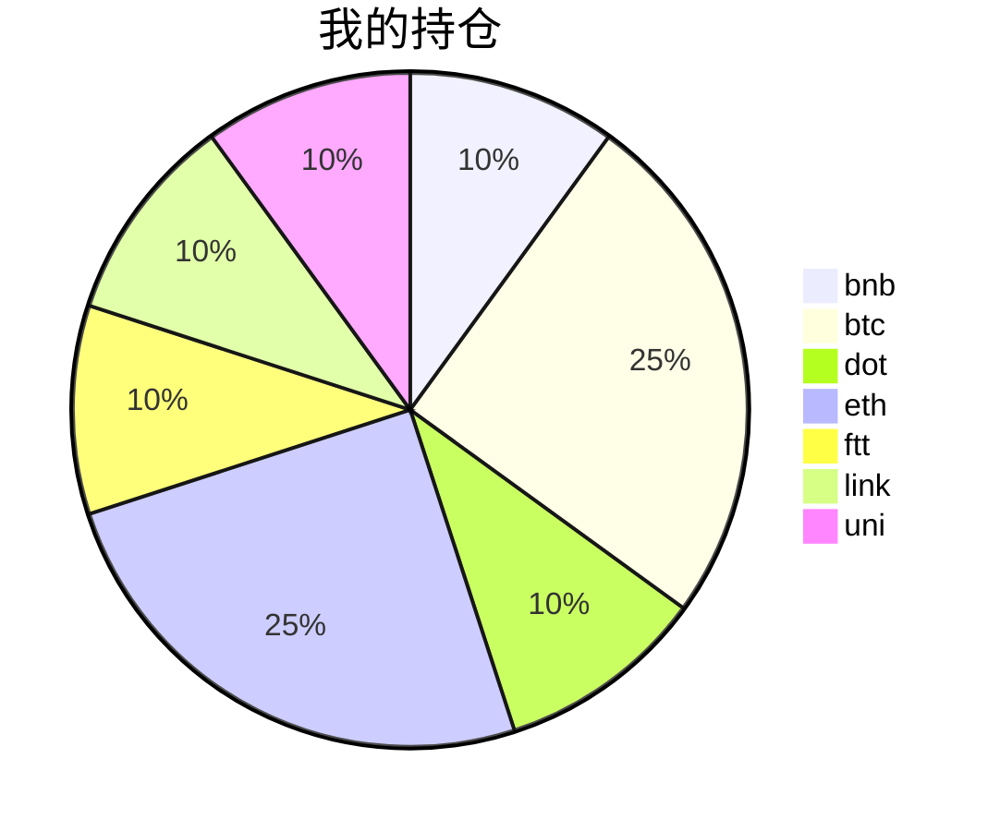

{
  "title":"2021-09-05 数字货币定投日记，收益率：19.89%",
  "tags":[
    "invest",
    "cryptocurrency"
  ],
  "date":"2021-09-05",
  "lastmod":"2021-09-05",
  "draft":"false",
  "author":"kingram"
}

##  📊 今日行情
### 截止 **2021-09-05 21:29:06**
- 🍖 全球加密市场总市值为： **2288983385247** USDT，24h内变化： **0.16%**

- 🍤 24h总交易量为： **116920525144** USDT，24h内变化： **-10.58%**

## 🎨 我的持仓占比

## 📋 我的定投策略
📎 我的定投策略制定于 **2021-08-19**，今天是我开始定投的第 **17** 天

由于我在币圈总是被割韭菜，深知自己XJB投资的策略有很大问题，在这个24小时不停盘的d场，我自认为抵制不住人性的贪婪和恐惧；我摊牌了，不装了，我认怂。
所以我制定了自己的定投策略，看策略就知道我这个定投计划还是非常非常保守的。我将以月为单位，每月定投 <strong> 400 </strong> USDT(根据行情不同可能有波动，各项波动不超过50%)，一年内暂不考虑卖出。看看一年后会有什么样的市场行情。

- 🥇 当月市值最高的币种 100USDT
- 🥈 当月市值第2高的币种 100USDT
- 🥉 当月市值前20选4个币种，合计 160USDT
- 🏅 (可选，不选这个就投1个第3项的币种)感兴趣(被CX)或者社区治理优秀(SB多)的1～2个币种，合计40USDT

## ⏰ 24小时收益情况
📌 过去的24小时我的持仓总收益为：**-3.0613757099999996** USDT

👉 每个币种的详细数据如下：
<table>
    <thead><tr bgcolor="#d0d0d0" ><th>币种</th><th>排名</th><th>市值(USDT)</th><th>24h交易量(USDT)</th><th>24h%</th><th>7d%</th><th>24h收益</th></tr></thead>
    <tbody>
    <tr>
        <td bgcolor=#FFECEC>bnb</td>
        <td bgcolor=#FFECEC>4</td>
        <td bgcolor=#FFECEC>83182123136</td>
        <td bgcolor=#FFECEC>1982340924</td>
        <td bgcolor=#FFECEC>-2.69%</td>
        <td bgcolor=#FFECEC>1.61%</td>
        <td bgcolor=#FFECEC><strong>-1.3072182</strong></td>
    </tr>
    <tr>
        <td bgcolor=#FFECEC>btc</td>
        <td bgcolor=#FFECEC>1</td>
        <td bgcolor=#FFECEC>942437033008</td>
        <td bgcolor=#FFECEC>30680577461</td>
        <td bgcolor=#FFECEC>-0.22%</td>
        <td bgcolor=#FFECEC>3.19%</td>
        <td bgcolor=#FFECEC><strong>-0.23631239</strong></td>
    </tr>
    <tr>
        <td bgcolor=#FFECEC>dot</td>
        <td bgcolor=#FFECEC>9</td>
        <td bgcolor=#FFECEC>32639643403</td>
        <td bgcolor=#FFECEC>1368137032</td>
        <td bgcolor=#FFECEC>-0.50%</td>
        <td bgcolor=#FFECEC>26.82%</td>
        <td bgcolor=#FFECEC><strong>-0.25952472</strong></td>
    </tr>
    <tr>
        <td bgcolor=#F0FFF0>eth</td>
        <td bgcolor=#F0FFF0>2</td>
        <td bgcolor=#F0FFF0>460833045617</td>
        <td bgcolor=#F0FFF0>18706353720</td>
        <td bgcolor=#F0FFF0>0.31%</td>
        <td bgcolor=#F0FFF0>22.52%</td>
        <td bgcolor=#F0FFF0><strong>0.39991493</strong></td>
    </tr>
    <tr>
        <td bgcolor=#FFECEC>ftt</td>
        <td bgcolor=#FFECEC>28</td>
        <td bgcolor=#FFECEC>5836711514</td>
        <td bgcolor=#FFECEC>695600650</td>
        <td bgcolor=#FFECEC>-2.78%</td>
        <td bgcolor=#FFECEC>26.86%</td>
        <td bgcolor=#FFECEC><strong>-1.4872184</strong></td>
    </tr>
    <tr>
        <td bgcolor=#FFECEC>link</td>
        <td bgcolor=#FFECEC>13</td>
        <td bgcolor=#FFECEC>13796093085</td>
        <td bgcolor=#FFECEC>1057671331</td>
        <td bgcolor=#FFECEC>-0.47%</td>
        <td bgcolor=#FFECEC>19.00%</td>
        <td bgcolor=#FFECEC><strong>-0.22124922</strong></td>
    </tr>
    <tr>
        <td bgcolor=#F0FFF0>uni</td>
        <td bgcolor=#F0FFF0>11</td>
        <td bgcolor=#F0FFF0>17841868172</td>
        <td bgcolor=#F0FFF0>451444162</td>
        <td bgcolor=#F0FFF0>0.12%</td>
        <td bgcolor=#F0FFF0>9.50%</td>
        <td bgcolor=#F0FFF0><strong>0.05023229</strong></td>
    </tr>
    </tbody>
</table>

## 🎯 持仓整体收益数据

🔒 我的持仓总成本为：**400** USDT，截止 **2021-09-05 21:29:06**，总价值为：**479.54248073** USDT

💰 利润： **79.54248073** USDT，收益率：**19.89%**

👉 每个币种的详细收益数据如下：

<table>
    <thead><tr bgcolor="#d0d0d0" ><th>币种</th><th>持有数量(个)</th><th>现价(USDT)</th><th>总金额(USDT)</th><th>持仓均价(USDT)</th><th>成本(USDT)</th><th>利润(USDT)</th><th>收益率</th></tr></thead>
    <tbody>
    <tr>
        <td bgcolor=#F0FFF0>bnb</td>
        <td bgcolor=#F0FFF0>0.095403</td>
        <td bgcolor=#F0FFF0>494.7281403</td>
        <td bgcolor=#F0FFF0>47.19854877</td>
        <td bgcolor=#F0FFF0>419.27402702</td>
        <td bgcolor=#F0FFF0>40</td>
        <td bgcolor=#F0FFF0>7.19854877</td>
        <td bgcolor=#F0FFF0><strong>18.00%</strong></td>
    </tr>
    <tr>
        <td bgcolor=#F0FFF0>btc</td>
        <td bgcolor=#F0FFF0>0.002185</td>
        <td bgcolor=#F0FFF0>50110.45683468</td>
        <td bgcolor=#F0FFF0>109.49134818</td>
        <td bgcolor=#F0FFF0>45766.59038902</td>
        <td bgcolor=#F0FFF0>100</td>
        <td bgcolor=#F0FFF0>9.49134818</td>
        <td bgcolor=#F0FFF0><strong>9.49%</strong></td>
    </tr>
    <tr>
        <td bgcolor=#F0FFF0>dot</td>
        <td bgcolor=#F0FFF0>1.559096</td>
        <td bgcolor=#F0FFF0>33.05014889</td>
        <td bgcolor=#F0FFF0>51.52835493</td>
        <td bgcolor=#F0FFF0>25.6558929</td>
        <td bgcolor=#F0FFF0>40</td>
        <td bgcolor=#F0FFF0>11.52835493</td>
        <td bgcolor=#F0FFF0><strong>28.82%</strong></td>
    </tr>
    <tr>
        <td bgcolor=#F0FFF0>eth</td>
        <td bgcolor=#F0FFF0>0.032844</td>
        <td bgcolor=#F0FFF0>3925.36989217</td>
        <td bgcolor=#F0FFF0>128.92484874</td>
        <td bgcolor=#F0FFF0>3044.69613933</td>
        <td bgcolor=#F0FFF0>100</td>
        <td bgcolor=#F0FFF0>28.92484874</td>
        <td bgcolor=#F0FFF0><strong>28.92%</strong></td>
    </tr>
    <tr>
        <td bgcolor=#F0FFF0>ftt</td>
        <td bgcolor=#F0FFF0>0.840243</td>
        <td bgcolor=#F0FFF0>61.86433211</td>
        <td bgcolor=#F0FFF0>51.98107201</td>
        <td bgcolor=#F0FFF0>47.60527609</td>
        <td bgcolor=#F0FFF0>40</td>
        <td bgcolor=#F0FFF0>11.98107201</td>
        <td bgcolor=#F0FFF0><strong>29.95%</strong></td>
    </tr>
    <tr>
        <td bgcolor=#F0FFF0>link</td>
        <td bgcolor=#F0FFF0>1.526624</td>
        <td bgcolor=#F0FFF0>30.62330857</td>
        <td bgcolor=#F0FFF0>46.75027782</td>
        <td bgcolor=#F0FFF0>26.20160563</td>
        <td bgcolor=#F0FFF0>40</td>
        <td bgcolor=#F0FFF0>6.75027782</td>
        <td bgcolor=#F0FFF0><strong>16.88%</strong></td>
    </tr>
    <tr>
        <td bgcolor=#F0FFF0>uni</td>
        <td bgcolor=#F0FFF0>1.497</td>
        <td bgcolor=#F0FFF0>29.17036091</td>
        <td bgcolor=#F0FFF0>43.66803028</td>
        <td bgcolor=#F0FFF0>26.72010688</td>
        <td bgcolor=#F0FFF0>40</td>
        <td bgcolor=#F0FFF0>3.66803028</td>
        <td bgcolor=#F0FFF0><strong>9.17%</strong></td>
    </tr>
    </tbody>
</table>

## ⚠️ 风险友情提示
❤️ 本篇文章仅作为个人投资记录使用，区块链投资风险巨大，请管好你自己的钱袋子呦～ ❤️