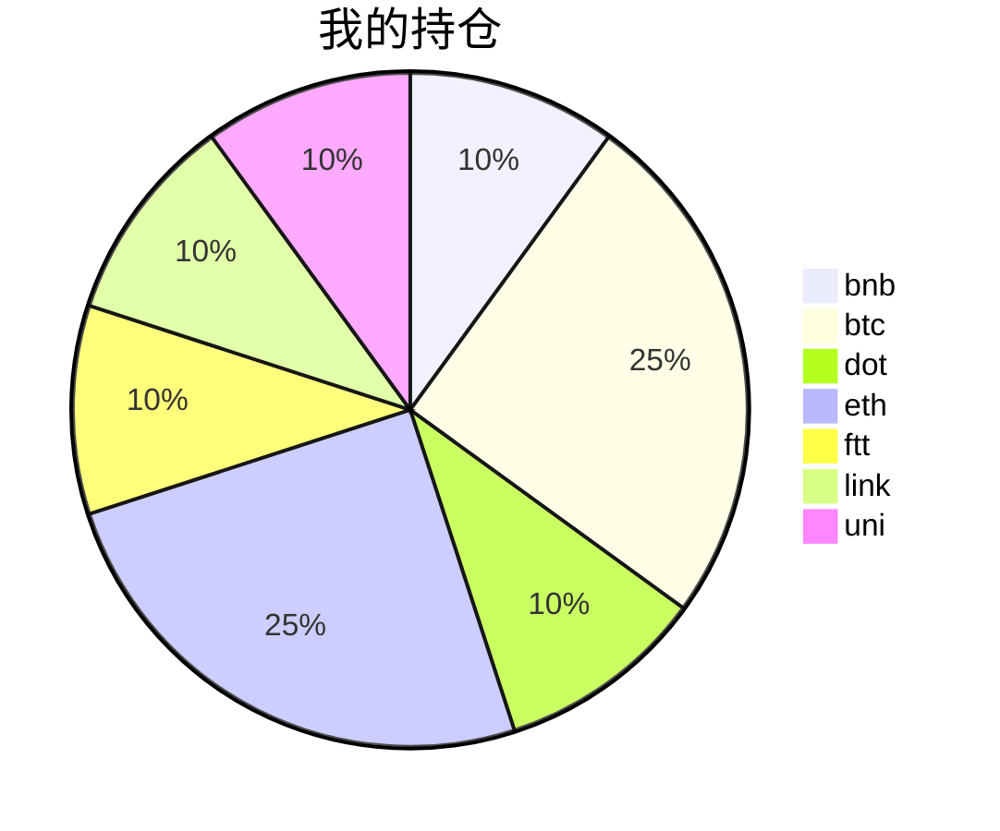

{
  "title":"2021-09-06 数字货币定投日记，收益率：26.70%",
  "tags":[
    "invest",
    "cryptocurrency"
  ],
  "date":"2021-09-06",
  "lastmod":"2021-09-06",
  "draft":"false",
  "author":"kingram"
}

##  📊 今日行情
### 截止 **2021-09-06 23:00:14**
- 🍖 全球加密市场总市值为： **2344134888995** USDT，24h内变化： **2.00%**

- 🍤 24h总交易量为： **137866621887** USDT，24h内变化： **16.98%**

## 🎨 我的持仓占比

## 📋 我的定投策略
📎 我的定投策略制定于 **2021-08-19**，今天是我开始定投的第 **18** 天

由于我在币圈总是被割韭菜，深知自己XJB投资的策略有很大问题，在这个24小时不停盘的d场，我自认为抵制不住人性的贪婪和恐惧；我摊牌了，不装了，我认怂。
所以我制定了自己的定投策略，看策略就知道我这个定投计划还是非常非常保守的。我将以月为单位，每月定投 <strong> 400 </strong> USDT(根据行情不同可能有波动，各项波动不超过50%)，一年内暂不考虑卖出。看看一年后会有什么样的市场行情。

- 🥇 当月市值最高的币种 100USDT
- 🥈 当月市值第2高的币种 100USDT
- 🥉 当月市值前20选4个币种，合计 160USDT
- 🏅 (可选，不选这个就投1个第3项的币种)感兴趣(被CX)或者社区治理优秀(SB多)的1～2个币种，合计40USDT

## ⏰ 24小时收益情况
📌 过去的24小时我的持仓总收益为：**25.19301306** USDT

👉 每个币种的详细数据如下：
<table>
    <thead><tr bgcolor="#d0d0d0" ><th>币种</th><th>排名</th><th>市值(USDT)</th><th>24h交易量(USDT)</th><th>24h%</th><th>7d%</th><th>24h收益</th></tr></thead>
    <tbody>
    <tr>
        <td bgcolor=#F0FFF0>bnb</td>
        <td bgcolor=#F0FFF0>4</td>
        <td bgcolor=#F0FFF0>83789569749</td>
        <td bgcolor=#F0FFF0>2232085291</td>
        <td bgcolor=#F0FFF0>0.57%</td>
        <td bgcolor=#F0FFF0>6.71%</td>
        <td bgcolor=#F0FFF0><strong>0.267217</strong></td>
    </tr>
    <tr>
        <td bgcolor=#F0FFF0>btc</td>
        <td bgcolor=#F0FFF0>1</td>
        <td bgcolor=#F0FFF0>971392544682</td>
        <td bgcolor=#F0FFF0>37018881520</td>
        <td bgcolor=#F0FFF0>2.87%</td>
        <td bgcolor=#F0FFF0>8.28%</td>
        <td bgcolor=#F0FFF0><strong>3.14832925</strong></td>
    </tr>
    <tr>
        <td bgcolor=#F0FFF0>dot</td>
        <td bgcolor=#F0FFF0>9</td>
        <td bgcolor=#F0FFF0>33906297097</td>
        <td bgcolor=#F0FFF0>2215575329</td>
        <td bgcolor=#F0FFF0>2.46%</td>
        <td bgcolor=#F0FFF0>39.46%</td>
        <td bgcolor=#F0FFF0><strong>1.28466548</strong></td>
    </tr>
    <tr>
        <td bgcolor=#F0FFF0>eth</td>
        <td bgcolor=#F0FFF0>2</td>
        <td bgcolor=#F0FFF0>462378649126</td>
        <td bgcolor=#F0FFF0>19667042641</td>
        <td bgcolor=#F0FFF0>0.54%</td>
        <td bgcolor=#F0FFF0>24.23%</td>
        <td bgcolor=#F0FFF0><strong>0.6948623</strong></td>
    </tr>
    <tr>
        <td bgcolor=#F0FFF0>ftt</td>
        <td bgcolor=#F0FFF0>27</td>
        <td bgcolor=#F0FFF0>7228491505</td>
        <td bgcolor=#F0FFF0>1809801204</td>
        <td bgcolor=#F0FFF0>21.24%</td>
        <td bgcolor=#F0FFF0>65.74%</td>
        <td bgcolor=#F0FFF0><strong>11.27924808</strong></td>
    </tr>
    <tr>
        <td bgcolor=#F0FFF0>link</td>
        <td bgcolor=#F0FFF0>12</td>
        <td bgcolor=#F0FFF0>16231040969</td>
        <td bgcolor=#F0FFF0>2743406779</td>
        <td bgcolor=#F0FFF0>17.15%</td>
        <td bgcolor=#F0FFF0>46.81%</td>
        <td bgcolor=#F0FFF0><strong>8.05054172</strong></td>
    </tr>
    <tr>
        <td bgcolor=#F0FFF0>uni</td>
        <td bgcolor=#F0FFF0>11</td>
        <td bgcolor=#F0FFF0>18036379873</td>
        <td bgcolor=#F0FFF0>667080109</td>
        <td bgcolor=#F0FFF0>1.07%</td>
        <td bgcolor=#F0FFF0>14.41%</td>
        <td bgcolor=#F0FFF0><strong>0.46814923</strong></td>
    </tr>
    </tbody>
</table>

## 🎯 持仓整体收益数据

🔒 我的持仓总成本为：**400** USDT，截止 **2021-09-06 23:00:14**，总价值为：**506.78284077** USDT

💰 利润： **106.78284077** USDT，收益率：**26.70%**

👉 每个币种的详细收益数据如下：

<table>
    <thead><tr bgcolor="#d0d0d0" ><th>币种</th><th>持有数量(个)</th><th>现价(USDT)</th><th>总金额(USDT)</th><th>持仓均价(USDT)</th><th>成本(USDT)</th><th>利润(USDT)</th><th>收益率</th></tr></thead>
    <tbody>
    <tr>
        <td bgcolor=#F0FFF0>bnb</td>
        <td bgcolor=#F0FFF0>0.095403</td>
        <td bgcolor=#F0FFF0>498.34094702</td>
        <td bgcolor=#F0FFF0>47.54322137</td>
        <td bgcolor=#F0FFF0>419.27402702</td>
        <td bgcolor=#F0FFF0>40</td>
        <td bgcolor=#F0FFF0>7.54322137</td>
        <td bgcolor=#F0FFF0><strong>18.86%</strong></td>
    </tr>
    <tr>
        <td bgcolor=#F0FFF0>btc</td>
        <td bgcolor=#F0FFF0>0.002185</td>
        <td bgcolor=#F0FFF0>51646.99812316</td>
        <td bgcolor=#F0FFF0>112.8486909</td>
        <td bgcolor=#F0FFF0>45766.59038902</td>
        <td bgcolor=#F0FFF0>100</td>
        <td bgcolor=#F0FFF0>12.8486909</td>
        <td bgcolor=#F0FFF0><strong>12.85%</strong></td>
    </tr>
    <tr>
        <td bgcolor=#F0FFF0>dot</td>
        <td bgcolor=#F0FFF0>1.559096</td>
        <td bgcolor=#F0FFF0>34.33273316</td>
        <td bgcolor=#F0FFF0>53.52802694</td>
        <td bgcolor=#F0FFF0>25.6558929</td>
        <td bgcolor=#F0FFF0>40</td>
        <td bgcolor=#F0FFF0>13.52802694</td>
        <td bgcolor=#F0FFF0><strong>33.82%</strong></td>
    </tr>
    <tr>
        <td bgcolor=#F0FFF0>eth</td>
        <td bgcolor=#F0FFF0>0.032844</td>
        <td bgcolor=#F0FFF0>3938.04686004</td>
        <td bgcolor=#F0FFF0>129.34121107</td>
        <td bgcolor=#F0FFF0>3044.69613933</td>
        <td bgcolor=#F0FFF0>100</td>
        <td bgcolor=#F0FFF0>29.34121107</td>
        <td bgcolor=#F0FFF0><strong>29.34%</strong></td>
    </tr>
    <tr>
        <td bgcolor=#F0FFF0>ftt</td>
        <td bgcolor=#F0FFF0>0.840243</td>
        <td bgcolor=#F0FFF0>76.61605307</td>
        <td bgcolor=#F0FFF0>64.37610228</td>
        <td bgcolor=#F0FFF0>47.60527609</td>
        <td bgcolor=#F0FFF0>40</td>
        <td bgcolor=#F0FFF0>24.37610228</td>
        <td bgcolor=#F0FFF0><strong>60.94%</strong></td>
    </tr>
    <tr>
        <td bgcolor=#F0FFF0>link</td>
        <td bgcolor=#F0FFF0>1.526624</td>
        <td bgcolor=#F0FFF0>36.0281837</td>
        <td bgcolor=#F0FFF0>55.00148991</td>
        <td bgcolor=#F0FFF0>26.20160563</td>
        <td bgcolor=#F0FFF0>40</td>
        <td bgcolor=#F0FFF0>15.00148991</td>
        <td bgcolor=#F0FFF0><strong>37.50%</strong></td>
    </tr>
    <tr>
        <td bgcolor=#F0FFF0>uni</td>
        <td bgcolor=#F0FFF0>1.497</td>
        <td bgcolor=#F0FFF0>29.48837562</td>
        <td bgcolor=#F0FFF0>44.1440983</td>
        <td bgcolor=#F0FFF0>26.72010688</td>
        <td bgcolor=#F0FFF0>40</td>
        <td bgcolor=#F0FFF0>4.1440983</td>
        <td bgcolor=#F0FFF0><strong>10.36%</strong></td>
    </tr>
    </tbody>
</table>

## ⚠️ 风险友情提示
❤️ 本篇文章仅作为个人投资记录使用，区块链投资风险巨大，请管好你自己的钱袋子呦～ ❤️