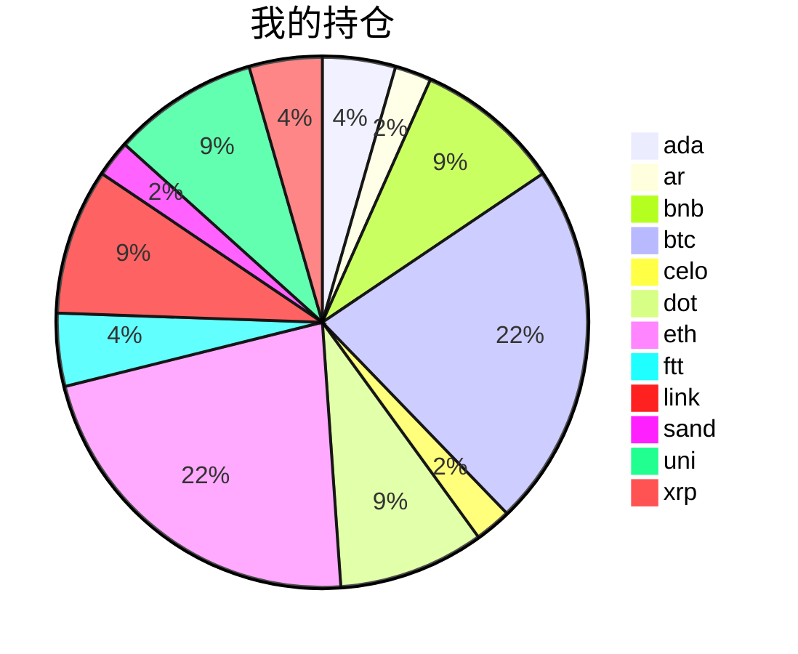

{
  "title":"2021-09-07 数字货币定投日记，收益率：-3.79%",
  "tags":[
    "invest",
    "cryptocurrency"
  ],
  "date":"2021-09-07",
  "lastmod":"2021-09-07",
  "draft":"false",
  "author":"kingram"
}

##  📊 今日行情
### 截止 **2021-09-07 23:42:42**
- 🍖 全球加密市场总市值为： **2053406958713** USDT，24h内变化： **-12.30%**

- 🍤 24h总交易量为： **188058449455** USDT，24h内变化： **37.94%**

## 🎨 我的持仓占比

## 📋 我的定投策略
📎 我的定投策略制定于 **2021-08-19**，今天是我开始定投的第 **19** 天

由于我在币圈总是被割韭菜，深知自己XJB投资的策略有很大问题，在这个24小时不停盘的d场，我自认为抵制不住人性的贪婪和恐惧；我摊牌了，不装了，我认怂。
所以我制定了自己的定投策略，看策略就知道我这个定投计划还是非常非常保守的。我将以月为单位，每月定投 <strong> 400 </strong> USDT(根据行情不同可能有波动，各项波动不超过50%)，一年内暂不考虑卖出。看看一年后会有什么样的市场行情。

- 🥇 当月市值最高的币种 100USDT
- 🥈 当月市值第2高的币种 100USDT
- 🥉 当月市值前20选4个币种，合计 160USDT
- 🏅 (可选，不选这个就投1个第3项的币种)感兴趣(被CX)或者社区治理优秀(SB多)的1～2个币种，合计40USDT

## ⏰ 24小时收益情况
📌 过去的24小时我的持仓总收益为：**-133.83465358** USDT

👉 每个币种的详细数据如下：
<table>
    <thead><tr bgcolor="#d0d0d0" ><th>币种</th><th>排名</th><th>市值(USDT)</th><th>24h交易量(USDT)</th><th>24h%</th><th>7d%</th><th>24h收益</th></tr></thead>
    <tbody>
    <tr>
        <td bgcolor=#FFECEC>ada</td>
        <td bgcolor=#FFECEC>3</td>
        <td bgcolor=#FFECEC>78141531544</td>
        <td bgcolor=#FFECEC>8755095198</td>
        <td bgcolor=#FFECEC>-14.28%</td>
        <td bgcolor=#FFECEC>-12.06%</td>
        <td bgcolor=#FFECEC><strong>-5.73239424</strong></td>
    </tr>
    <tr>
        <td bgcolor=#FFECEC>ar</td>
        <td bgcolor=#FFECEC>69</td>
        <td bgcolor=#FFECEC>1665286137</td>
        <td bgcolor=#FFECEC>139131591</td>
        <td bgcolor=#FFECEC>-12.42%</td>
        <td bgcolor=#FFECEC>-19.12%</td>
        <td bgcolor=#FFECEC><strong>-2.5448294</strong></td>
    </tr>
    <tr>
        <td bgcolor=#FFECEC>bnb</td>
        <td bgcolor=#FFECEC>4</td>
        <td bgcolor=#FFECEC>70874799012</td>
        <td bgcolor=#FFECEC>3239868718</td>
        <td bgcolor=#FFECEC>-15.41%</td>
        <td bgcolor=#FFECEC>-10.35%</td>
        <td bgcolor=#FFECEC><strong>-13.39361425</strong></td>
    </tr>
    <tr>
        <td bgcolor=#FFECEC>btc</td>
        <td bgcolor=#FFECEC>1</td>
        <td bgcolor=#FFECEC>890898591270</td>
        <td bgcolor=#FFECEC>56690829439</td>
        <td bgcolor=#FFECEC>-8.23%</td>
        <td bgcolor=#FFECEC>0.14%</td>
        <td bgcolor=#FFECEC><strong>-17.29915476</strong></td>
    </tr>
    <tr>
        <td bgcolor=#FFECEC>celo</td>
        <td bgcolor=#FFECEC>77</td>
        <td bgcolor=#FFECEC>1304851629</td>
        <td bgcolor=#FFECEC>189410453</td>
        <td bgcolor=#FFECEC>-17.87%</td>
        <td bgcolor=#FFECEC>-25.09%</td>
        <td bgcolor=#FFECEC><strong>-3.60971565</strong></td>
    </tr>
    <tr>
        <td bgcolor=#FFECEC>dot</td>
        <td bgcolor=#FFECEC>10</td>
        <td bgcolor=#FFECEC>28558652779</td>
        <td bgcolor=#FFECEC>3942319651</td>
        <td bgcolor=#FFECEC>-14.89%</td>
        <td bgcolor=#FFECEC>-2.46%</td>
        <td bgcolor=#FFECEC><strong>-13.80860102</strong></td>
    </tr>
    <tr>
        <td bgcolor=#FFECEC>eth</td>
        <td bgcolor=#FFECEC>2</td>
        <td bgcolor=#FFECEC>406989482332</td>
        <td bgcolor=#FFECEC>30495966492</td>
        <td bgcolor=#FFECEC>-11.77%</td>
        <td bgcolor=#FFECEC>2.72%</td>
        <td bgcolor=#FFECEC><strong>-26.93591403</strong></td>
    </tr>
    <tr>
        <td bgcolor=#FFECEC>ftt</td>
        <td bgcolor=#FFECEC>27</td>
        <td bgcolor=#FFECEC>6376290946</td>
        <td bgcolor=#FFECEC>3003999991</td>
        <td bgcolor=#FFECEC>-9.29%</td>
        <td bgcolor=#FFECEC>37.28%</td>
        <td bgcolor=#FFECEC><strong>-5.81658347</strong></td>
    </tr>
    <tr>
        <td bgcolor=#FFECEC>link</td>
        <td bgcolor=#FFECEC>12</td>
        <td bgcolor=#FFECEC>12785560456</td>
        <td bgcolor=#FFECEC>3100894463</td>
        <td bgcolor=#FFECEC>-19.83%</td>
        <td bgcolor=#FFECEC>5.72%</td>
        <td bgcolor=#FFECEC><strong>-18.71973634</strong></td>
    </tr>
    <tr>
        <td bgcolor=#FFECEC>sand</td>
        <td bgcolor=#FFECEC>114</td>
        <td bgcolor=#FFECEC>664246982</td>
        <td bgcolor=#FFECEC>446659127</td>
        <td bgcolor=#FFECEC>-20.65%</td>
        <td bgcolor=#FFECEC>-18.70%</td>
        <td bgcolor=#FFECEC><strong>-4.09881828</strong></td>
    </tr>
    <tr>
        <td bgcolor=#FFECEC>uni</td>
        <td bgcolor=#FFECEC>11</td>
        <td bgcolor=#FFECEC>14487509019</td>
        <td bgcolor=#FFECEC>1059613415</td>
        <td bgcolor=#FFECEC>-19.07%</td>
        <td bgcolor=#FFECEC>-17.19%</td>
        <td bgcolor=#FFECEC><strong>-16.00215264</strong></td>
    </tr>
    <tr>
        <td bgcolor=#FFECEC>xrp</td>
        <td bgcolor=#FFECEC>6</td>
        <td bgcolor=#FFECEC>53806187583</td>
        <td bgcolor=#FFECEC>8856602601</td>
        <td bgcolor=#FFECEC>-14.91%</td>
        <td bgcolor=#FFECEC>1.42%</td>
        <td bgcolor=#FFECEC><strong>-5.8731395</strong></td>
    </tr>
    </tbody>
</table>

## 🎯 持仓整体收益数据

🔒 我的持仓总成本为：**900** USDT，截止 **2021-09-07 23:42:42**，总价值为：**865.90992462** USDT

💰 利润： **-34.09007538** USDT，收益率：**-3.79%**

👉 每个币种的详细收益数据如下：

<table>
    <thead><tr bgcolor="#d0d0d0" ><th>币种</th><th>持有数量(个)</th><th>现价(USDT)</th><th>总金额(USDT)</th><th>持仓均价(USDT)</th><th>成本(USDT)</th><th>利润(USDT)</th><th>收益率</th></tr></thead>
    <tbody>
    <tr>
        <td bgcolor=#FFECEC>ada</td>
        <td bgcolor=#FFECEC>14.1</td>
        <td bgcolor=#FFECEC>2.43991522</td>
        <td bgcolor=#FFECEC>34.4028046</td>
        <td bgcolor=#FFECEC>2.83687943</td>
        <td bgcolor=#FFECEC>40</td>
        <td bgcolor=#FFECEC>-5.5971954</td>
        <td bgcolor=#FFECEC><strong>-13.99%</strong></td>
    </tr>
    <tr>
        <td bgcolor=#FFECEC>ar</td>
        <td bgcolor=#FFECEC>0.36</td>
        <td bgcolor=#FFECEC>49.86677788</td>
        <td bgcolor=#FFECEC>17.95204004</td>
        <td bgcolor=#FFECEC>55.55555556</td>
        <td bgcolor=#FFECEC>20</td>
        <td bgcolor=#FFECEC>-2.04795996</td>
        <td bgcolor=#FFECEC><strong>-10.24%</strong></td>
    </tr>
    <tr>
        <td bgcolor=#FFECEC>bnb</td>
        <td bgcolor=#FFECEC>0.174403</td>
        <td bgcolor=#FFECEC>421.52996567</td>
        <td bgcolor=#FFECEC>73.5160906</td>
        <td bgcolor=#FFECEC>458.70770572</td>
        <td bgcolor=#FFECEC>80</td>
        <td bgcolor=#FFECEC>-6.4839094</td>
        <td bgcolor=#FFECEC><strong>-8.10%</strong></td>
    </tr>
    <tr>
        <td bgcolor=#FFECEC>btc</td>
        <td bgcolor=#FFECEC>0.004075</td>
        <td bgcolor=#FFECEC>47364.71442127</td>
        <td bgcolor=#FFECEC>193.01121127</td>
        <td bgcolor=#FFECEC>49079.75460123</td>
        <td bgcolor=#FFECEC>200</td>
        <td bgcolor=#FFECEC>-6.98878873</td>
        <td bgcolor=#FFECEC><strong>-3.49%</strong></td>
    </tr>
    <tr>
        <td bgcolor=#FFECEC>celo</td>
        <td bgcolor=#FFECEC>3.9</td>
        <td bgcolor=#FFECEC>4.25283406</td>
        <td bgcolor=#FFECEC>16.58605283</td>
        <td bgcolor=#FFECEC>5.12820513</td>
        <td bgcolor=#FFECEC>20</td>
        <td bgcolor=#FFECEC>-3.41394717</td>
        <td bgcolor=#FFECEC><strong>-17.07%</strong></td>
    </tr>
    <tr>
        <td bgcolor=#FFECEC>dot</td>
        <td bgcolor=#FFECEC>2.729096</td>
        <td bgcolor=#FFECEC>28.91783206</td>
        <td bgcolor=#FFECEC>78.9195398</td>
        <td bgcolor=#FFECEC>29.31373612</td>
        <td bgcolor=#FFECEC>80</td>
        <td bgcolor=#FFECEC>-1.0804602</td>
        <td bgcolor=#FFECEC><strong>-1.35%</strong></td>
    </tr>
    <tr>
        <td bgcolor=#F0FFF0>eth</td>
        <td bgcolor=#F0FFF0>0.058244</td>
        <td bgcolor=#F0FFF0>3465.90236409</td>
        <td bgcolor=#F0FFF0>201.86801729</td>
        <td bgcolor=#F0FFF0>3433.83009409</td>
        <td bgcolor=#F0FFF0>200</td>
        <td bgcolor=#F0FFF0>1.86801729</td>
        <td bgcolor=#F0FFF0><strong>0.93%</strong></td>
    </tr>
    <tr>
        <td bgcolor=#F0FFF0>ftt</td>
        <td bgcolor=#F0FFF0>0.840243</td>
        <td bgcolor=#F0FFF0>67.58342943</td>
        <td bgcolor=#F0FFF0>56.78650349</td>
        <td bgcolor=#F0FFF0>47.60527609</td>
        <td bgcolor=#F0FFF0>40</td>
        <td bgcolor=#F0FFF0>16.78650349</td>
        <td bgcolor=#F0FFF0><strong>41.97%</strong></td>
    </tr>
    <tr>
        <td bgcolor=#FFECEC>link</td>
        <td bgcolor=#FFECEC>2.666624</td>
        <td bgcolor=#FFECEC>28.38022045</td>
        <td bgcolor=#FFECEC>75.67937698</td>
        <td bgcolor=#FFECEC>30.00048001</td>
        <td bgcolor=#FFECEC>80</td>
        <td bgcolor=#FFECEC>-4.32062302</td>
        <td bgcolor=#FFECEC><strong>-5.40%</strong></td>
    </tr>
    <tr>
        <td bgcolor=#FFECEC>sand</td>
        <td bgcolor=#FFECEC>21</td>
        <td bgcolor=#FFECEC>0.75018864</td>
        <td bgcolor=#FFECEC>15.75396144</td>
        <td bgcolor=#FFECEC>0.95238095</td>
        <td bgcolor=#FFECEC>20</td>
        <td bgcolor=#FFECEC>-4.24603856</td>
        <td bgcolor=#FFECEC><strong>-21.23%</strong></td>
    </tr>
    <tr>
        <td bgcolor=#FFECEC>uni</td>
        <td bgcolor=#FFECEC>2.867</td>
        <td bgcolor=#FFECEC>23.68618929</td>
        <td bgcolor=#FFECEC>67.90830469</td>
        <td bgcolor=#FFECEC>27.90373212</td>
        <td bgcolor=#FFECEC>80</td>
        <td bgcolor=#FFECEC>-12.09169531</td>
        <td bgcolor=#FFECEC><strong>-15.11%</strong></td>
    </tr>
    <tr>
        <td bgcolor=#FFECEC>xrp</td>
        <td bgcolor=#FFECEC>29</td>
        <td bgcolor=#FFECEC>1.15606971</td>
        <td bgcolor=#FFECEC>33.52602159</td>
        <td bgcolor=#FFECEC>1.37931034</td>
        <td bgcolor=#FFECEC>40</td>
        <td bgcolor=#FFECEC>-6.47397841</td>
        <td bgcolor=#FFECEC><strong>-16.18%</strong></td>
    </tr>
    </tbody>
</table>

## ⚠️ 风险友情提示
❤️ 本篇文章仅作为个人投资记录使用，区块链投资风险巨大，请管好你自己的钱袋子呦～ ❤️