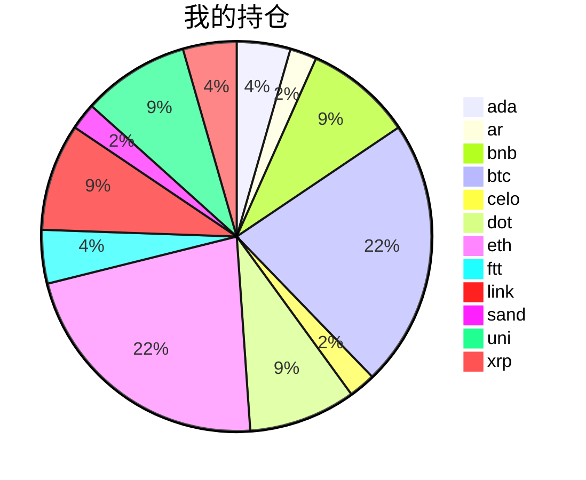

{
  "title":"2021-09-08 数字货币定投日记，收益率：-4.44%",
  "tags":[
    "invest",
    "cryptocurrency"
  ],
  "date":"2021-09-08",
  "lastmod":"2021-09-08",
  "draft":"false",
  "author":"kingram"
}

##  📊 今日行情
### 截止 **2021-09-08 20:44:32**
- 🍖 全球加密市场总市值为： **2073061801739** USDT，24h内变化： **-8.37%**

- 🍤 24h总交易量为： **245335829132** USDT，24h内变化： **53.33%**

## 🎨 我的持仓占比

## 📋 我的定投策略
📎 我的定投策略制定于 **2021-08-19**，今天是我开始定投的第 **20** 天

由于我在币圈总是被割韭菜，深知自己XJB投资的策略有很大问题，在这个24小时不停盘的d场，我自认为抵制不住人性的贪婪和恐惧；我摊牌了，不装了，我认怂。
所以我制定了自己的定投策略，看策略就知道我这个定投计划还是非常非常保守的。我将以月为单位，每月定投 <strong> 400 </strong> USDT(根据行情不同可能有波动，各项波动不超过50%)，一年内暂不考虑卖出。看看一年后会有什么样的市场行情。

- 🥇 当月市值最高的币种 100USDT
- 🥈 当月市值第2高的币种 100USDT
- 🥉 当月市值前20选4个币种，合计 160USDT
- 🏅 (可选，不选这个就投1个第3项的币种)感兴趣(被CX)或者社区治理优秀(SB多)的1～2个币种，合计40USDT

## ⏰ 24小时收益情况
📌 过去的24小时我的持仓总收益为：**-91.66011561000002** USDT

👉 每个币种的详细数据如下：
<table>
    <thead><tr bgcolor="#d0d0d0" ><th>币种</th><th>排名</th><th>市值(USDT)</th><th>24h交易量(USDT)</th><th>24h%</th><th>7d%</th><th>24h收益</th></tr></thead>
    <tbody>
    <tr>
        <td bgcolor=#FFECEC>ada</td>
        <td bgcolor=#FFECEC>3</td>
        <td bgcolor=#FFECEC>78261651017</td>
        <td bgcolor=#FFECEC>11579824034</td>
        <td bgcolor=#FFECEC>-7.13%</td>
        <td bgcolor=#FFECEC>-13.99%</td>
        <td bgcolor=#FFECEC><strong>-2.64701256</strong></td>
    </tr>
    <tr>
        <td bgcolor=#FFECEC>ar</td>
        <td bgcolor=#FFECEC>67</td>
        <td bgcolor=#FFECEC>1734595976</td>
        <td bgcolor=#FFECEC>191037529</td>
        <td bgcolor=#FFECEC>-3.79%</td>
        <td bgcolor=#FFECEC>-13.20%</td>
        <td bgcolor=#FFECEC><strong>-0.73627882</strong></td>
    </tr>
    <tr>
        <td bgcolor=#FFECEC>bnb</td>
        <td bgcolor=#FFECEC>4</td>
        <td bgcolor=#FFECEC>69844271251</td>
        <td bgcolor=#FFECEC>4766961669</td>
        <td bgcolor=#FFECEC>-11.56%</td>
        <td bgcolor=#FFECEC>-13.91%</td>
        <td bgcolor=#FFECEC><strong>-9.46911595</strong></td>
    </tr>
    <tr>
        <td bgcolor=#FFECEC>btc</td>
        <td bgcolor=#FFECEC>1</td>
        <td bgcolor=#FFECEC>878326359036</td>
        <td bgcolor=#FFECEC>66178546752</td>
        <td bgcolor=#FFECEC>-8.27%</td>
        <td bgcolor=#FFECEC>-2.21%</td>
        <td bgcolor=#FFECEC><strong>-17.15845124</strong></td>
    </tr>
    <tr>
        <td bgcolor=#FFECEC>celo</td>
        <td bgcolor=#FFECEC>80</td>
        <td bgcolor=#FFECEC>1260660926</td>
        <td bgcolor=#FFECEC>180129801</td>
        <td bgcolor=#FFECEC>-16.34%</td>
        <td bgcolor=#FFECEC>-25.91%</td>
        <td bgcolor=#FFECEC><strong>-3.13088413</strong></td>
    </tr>
    <tr>
        <td bgcolor=#FFECEC>dot</td>
        <td bgcolor=#FFECEC>10</td>
        <td bgcolor=#FFECEC>28118879047</td>
        <td bgcolor=#FFECEC>5678708329</td>
        <td bgcolor=#FFECEC>-11.57%</td>
        <td bgcolor=#FFECEC>-5.74%</td>
        <td bgcolor=#FFECEC><strong>-10.16291032</strong></td>
    </tr>
    <tr>
        <td bgcolor=#FFECEC>eth</td>
        <td bgcolor=#FFECEC>2</td>
        <td bgcolor=#FFECEC>405509958805</td>
        <td bgcolor=#FFECEC>42135470817</td>
        <td bgcolor=#FFECEC>-7.65%</td>
        <td bgcolor=#FFECEC>-2.45%</td>
        <td bgcolor=#FFECEC><strong>-16.67000844</strong></td>
    </tr>
    <tr>
        <td bgcolor=#FFECEC>ftt</td>
        <td bgcolor=#FFECEC>26</td>
        <td bgcolor=#FFECEC>6752391317</td>
        <td bgcolor=#FFECEC>3454700832</td>
        <td bgcolor=#FFECEC>-3.74%</td>
        <td bgcolor=#FFECEC>25.99%</td>
        <td bgcolor=#FFECEC><strong>-2.33481533</strong></td>
    </tr>
    <tr>
        <td bgcolor=#FFECEC>link</td>
        <td bgcolor=#FFECEC>14</td>
        <td bgcolor=#FFECEC>12450064760</td>
        <td bgcolor=#FFECEC>4137881614</td>
        <td bgcolor=#FFECEC>-15.06%</td>
        <td bgcolor=#FFECEC>-1.53%</td>
        <td bgcolor=#FFECEC><strong>-13.06297335</strong></td>
    </tr>
    <tr>
        <td bgcolor=#FFECEC>sand</td>
        <td bgcolor=#FFECEC>112</td>
        <td bgcolor=#FFECEC>697157512</td>
        <td bgcolor=#FFECEC>864719037</td>
        <td bgcolor=#FFECEC>-9.58%</td>
        <td bgcolor=#FFECEC>-21.39%</td>
        <td bgcolor=#FFECEC><strong>-1.75176989</strong></td>
    </tr>
    <tr>
        <td bgcolor=#FFECEC>uni</td>
        <td bgcolor=#FFECEC>11</td>
        <td bgcolor=#FFECEC>14223181792</td>
        <td bgcolor=#FFECEC>1344472218</td>
        <td bgcolor=#FFECEC>-12.52%</td>
        <td bgcolor=#FFECEC>-22.53%</td>
        <td bgcolor=#FFECEC><strong>-9.54241552</strong></td>
    </tr>
    <tr>
        <td bgcolor=#FFECEC>xrp</td>
        <td bgcolor=#FFECEC>6</td>
        <td bgcolor=#FFECEC>51792163726</td>
        <td bgcolor=#FFECEC>12289897579</td>
        <td bgcolor=#FFECEC>-13.40%</td>
        <td bgcolor=#FFECEC>-8.21%</td>
        <td bgcolor=#FFECEC><strong>-4.99348006</strong></td>
    </tr>
    </tbody>
</table>

## 🎯 持仓整体收益数据

🔒 我的持仓总成本为：**900** USDT，截止 **2021-09-08 20:44:32**，总价值为：**860.0279818** USDT

💰 利润： **-39.9720182** USDT，收益率：**-4.44%**

👉 每个币种的详细收益数据如下：

<table>
    <thead><tr bgcolor="#d0d0d0" ><th>币种</th><th>持有数量(个)</th><th>现价(USDT)</th><th>总金额(USDT)</th><th>持仓均价(USDT)</th><th>成本(USDT)</th><th>利润(USDT)</th><th>收益率</th></tr></thead>
    <tbody>
    <tr>
        <td bgcolor=#FFECEC>ada</td>
        <td bgcolor=#FFECEC>14.1</td>
        <td bgcolor=#FFECEC>2.4437004</td>
        <td bgcolor=#FFECEC>34.45617564</td>
        <td bgcolor=#FFECEC>2.83687943</td>
        <td bgcolor=#FFECEC>40</td>
        <td bgcolor=#FFECEC>-5.54382436</td>
        <td bgcolor=#FFECEC><strong>-13.86%</strong></td>
    </tr>
    <tr>
        <td bgcolor=#FFECEC>ar</td>
        <td bgcolor=#FFECEC>0.36</td>
        <td bgcolor=#FFECEC>51.94225202</td>
        <td bgcolor=#FFECEC>18.69921073</td>
        <td bgcolor=#FFECEC>55.55555556</td>
        <td bgcolor=#FFECEC>20</td>
        <td bgcolor=#FFECEC>-1.30078927</td>
        <td bgcolor=#FFECEC><strong>-6.50%</strong></td>
    </tr>
    <tr>
        <td bgcolor=#FFECEC>bnb</td>
        <td bgcolor=#FFECEC>0.174403</td>
        <td bgcolor=#FFECEC>415.40087129</td>
        <td bgcolor=#FFECEC>72.44715816</td>
        <td bgcolor=#FFECEC>458.70770572</td>
        <td bgcolor=#FFECEC>80</td>
        <td bgcolor=#FFECEC>-7.55284184</td>
        <td bgcolor=#FFECEC><strong>-9.44%</strong></td>
    </tr>
    <tr>
        <td bgcolor=#FFECEC>btc</td>
        <td bgcolor=#FFECEC>0.004075</td>
        <td bgcolor=#FFECEC>46694.35667741</td>
        <td bgcolor=#FFECEC>190.27950346</td>
        <td bgcolor=#FFECEC>49079.75460123</td>
        <td bgcolor=#FFECEC>200</td>
        <td bgcolor=#FFECEC>-9.72049654</td>
        <td bgcolor=#FFECEC><strong>-4.86%</strong></td>
    </tr>
    <tr>
        <td bgcolor=#FFECEC>celo</td>
        <td bgcolor=#FFECEC>3.9</td>
        <td bgcolor=#FFECEC>4.10880563</td>
        <td bgcolor=#FFECEC>16.02434196</td>
        <td bgcolor=#FFECEC>5.12820513</td>
        <td bgcolor=#FFECEC>20</td>
        <td bgcolor=#FFECEC>-3.97565804</td>
        <td bgcolor=#FFECEC><strong>-19.88%</strong></td>
    </tr>
    <tr>
        <td bgcolor=#FFECEC>dot</td>
        <td bgcolor=#FFECEC>2.729096</td>
        <td bgcolor=#FFECEC>28.47252734</td>
        <td bgcolor=#FFECEC>77.70426047</td>
        <td bgcolor=#FFECEC>29.31373612</td>
        <td bgcolor=#FFECEC>80</td>
        <td bgcolor=#FFECEC>-2.29573953</td>
        <td bgcolor=#FFECEC><strong>-2.87%</strong></td>
    </tr>
    <tr>
        <td bgcolor=#F0FFF0>eth</td>
        <td bgcolor=#F0FFF0>0.058244</td>
        <td bgcolor=#F0FFF0>3452.93719789</td>
        <td bgcolor=#F0FFF0>201.11287415</td>
        <td bgcolor=#F0FFF0>3433.83009409</td>
        <td bgcolor=#F0FFF0>200</td>
        <td bgcolor=#F0FFF0>1.11287415</td>
        <td bgcolor=#F0FFF0><strong>0.56%</strong></td>
    </tr>
    <tr>
        <td bgcolor=#F0FFF0>ftt</td>
        <td bgcolor=#F0FFF0>0.840243</td>
        <td bgcolor=#F0FFF0>71.56978343</td>
        <td bgcolor=#F0FFF0>60.13600954</td>
        <td bgcolor=#F0FFF0>47.60527609</td>
        <td bgcolor=#F0FFF0>40</td>
        <td bgcolor=#F0FFF0>20.13600954</td>
        <td bgcolor=#F0FFF0><strong>50.34%</strong></td>
    </tr>
    <tr>
        <td bgcolor=#FFECEC>link</td>
        <td bgcolor=#FFECEC>2.666624</td>
        <td bgcolor=#FFECEC>27.63551772</td>
        <td bgcolor=#FFECEC>73.6935348</td>
        <td bgcolor=#FFECEC>30.00048001</td>
        <td bgcolor=#FFECEC>80</td>
        <td bgcolor=#FFECEC>-6.3064652</td>
        <td bgcolor=#FFECEC><strong>-7.88%</strong></td>
    </tr>
    <tr>
        <td bgcolor=#FFECEC>sand</td>
        <td bgcolor=#FFECEC>21</td>
        <td bgcolor=#FFECEC>0.7873572</td>
        <td bgcolor=#FFECEC>16.5345012</td>
        <td bgcolor=#FFECEC>0.95238095</td>
        <td bgcolor=#FFECEC>20</td>
        <td bgcolor=#FFECEC>-3.4654988</td>
        <td bgcolor=#FFECEC><strong>-17.33%</strong></td>
    </tr>
    <tr>
        <td bgcolor=#FFECEC>uni</td>
        <td bgcolor=#FFECEC>2.867</td>
        <td bgcolor=#FFECEC>23.25403047</td>
        <td bgcolor=#FFECEC>66.66930536</td>
        <td bgcolor=#FFECEC>27.90373212</td>
        <td bgcolor=#FFECEC>80</td>
        <td bgcolor=#FFECEC>-13.33069464</td>
        <td bgcolor=#FFECEC><strong>-16.66%</strong></td>
    </tr>
    <tr>
        <td bgcolor=#FFECEC>xrp</td>
        <td bgcolor=#FFECEC>29</td>
        <td bgcolor=#FFECEC>1.11279677</td>
        <td bgcolor=#FFECEC>32.27110633</td>
        <td bgcolor=#FFECEC>1.37931034</td>
        <td bgcolor=#FFECEC>40</td>
        <td bgcolor=#FFECEC>-7.72889367</td>
        <td bgcolor=#FFECEC><strong>-19.32%</strong></td>
    </tr>
    </tbody>
</table>

## ⚠️ 风险友情提示
❤️ 本篇文章仅作为个人投资记录使用，区块链投资风险巨大，请管好你自己的钱袋子呦～ ❤️