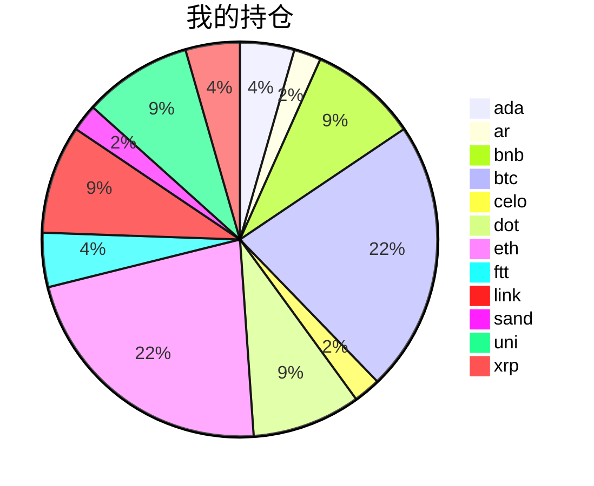

{
  "title":"2021-09-10 数字货币定投日记，收益率：-7.07%",
  "tags":[
    "invest",
    "cryptocurrency"
  ],
  "date":"2021-09-10",
  "lastmod":"2021-09-10",
  "draft":"false",
  "author":"kingram"
}

##  📊 今日行情
### 截止 **2021-09-10 22:42:24**
- 🍖 全球加密市场总市值为： **2036999517986** USDT，24h内变化： **-5.06%**

- 🍤 24h总交易量为： **129848875494** USDT，24h内变化： **-21.64%**

## 🎨 我的持仓占比

## 📋 我的定投策略
 ✏️ 我的定投策略制定于 **2021-08-19**，今天是我开始定投的第 **22** 天

由于我在币圈总是被割韭菜，深知自己XJB投资的策略有很大问题，在这个24小时不停盘的d场，我自认为抵制不住人性的贪婪和恐惧；我摊牌了，不装了，我认怂。
所以我制定了自己的定投策略，看策略就知道我这个定投计划还是非常非常保守的。我将以月为单位，每月定投 <strong> 500 </strong> USDT(根据行情不同可能会有调整，比如某个月大跌会投两到三次也有可能)，一年内暂不考虑卖出。看看一年后会有什么样的市场行情。

- 🥇 当月市值最高的币种 100USDT
- 🥈 当月市值第2高的币种 100USDT
- 🥉 当月市值前20选6个币种，合计 240USDT
- 🏅 感兴趣(被CX)或者社区治理优秀(SB多)的3个币种，合计60USDT

## ⏰ 24小时收益情况
📌 过去的24小时我的持仓总收益为：**-60.512966629999994** USDT

👉 每个币种的详细数据如下：
<table>
    <thead><tr bgcolor="#d0d0d0" ><th>币种</th><th>排名</th><th>市值(USDT)</th><th>24h交易量(USDT)</th><th>24h%</th><th>7d%</th><th>24h收益</th></tr></thead>
    <tbody>
    <tr>
        <td bgcolor=#FFECEC>ada</td>
        <td bgcolor=#FFECEC>3</td>
        <td bgcolor=#FFECEC>75010808336</td>
        <td bgcolor=#FFECEC>5173148551</td>
        <td bgcolor=#FFECEC>-9.50%</td>
        <td bgcolor=#FFECEC>-21.48%</td>
        <td bgcolor=#FFECEC><strong>-3.4670783</strong></td>
    </tr>
    <tr>
        <td bgcolor=#FFECEC>ar</td>
        <td bgcolor=#FFECEC>60</td>
        <td bgcolor=#FFECEC>2033481131</td>
        <td bgcolor=#FFECEC>291228728</td>
        <td bgcolor=#FFECEC>-1.48%</td>
        <td bgcolor=#FFECEC>2.50%</td>
        <td bgcolor=#FFECEC><strong>-0.32975837</strong></td>
    </tr>
    <tr>
        <td bgcolor=#FFECEC>bnb</td>
        <td bgcolor=#FFECEC>5</td>
        <td bgcolor=#FFECEC>67081447760</td>
        <td bgcolor=#FFECEC>2300504618</td>
        <td bgcolor=#FFECEC>-4.56%</td>
        <td bgcolor=#FFECEC>-19.06%</td>
        <td bgcolor=#FFECEC><strong>-3.32567633</strong></td>
    </tr>
    <tr>
        <td bgcolor=#FFECEC>btc</td>
        <td bgcolor=#FFECEC>1</td>
        <td bgcolor=#FFECEC>852391484560</td>
        <td bgcolor=#FFECEC>35014194055</td>
        <td bgcolor=#FFECEC>-3.69%</td>
        <td bgcolor=#FFECEC>-10.44%</td>
        <td bgcolor=#FFECEC><strong>-7.07784191</strong></td>
    </tr>
    <tr>
        <td bgcolor=#FFECEC>celo</td>
        <td bgcolor=#FFECEC>74</td>
        <td bgcolor=#FFECEC>1492119047</td>
        <td bgcolor=#FFECEC>447898815</td>
        <td bgcolor=#FFECEC>-9.82%</td>
        <td bgcolor=#FFECEC>-12.23%</td>
        <td bgcolor=#FFECEC><strong>-2.06615183</strong></td>
    </tr>
    <tr>
        <td bgcolor=#FFECEC>dot</td>
        <td bgcolor=#FFECEC>10</td>
        <td bgcolor=#FFECEC>28484343707</td>
        <td bgcolor=#FFECEC>3777510660</td>
        <td bgcolor=#FFECEC>-2.88%</td>
        <td bgcolor=#FFECEC>-12.18%</td>
        <td bgcolor=#FFECEC><strong>-2.33209595</strong></td>
    </tr>
    <tr>
        <td bgcolor=#FFECEC>eth</td>
        <td bgcolor=#FFECEC>2</td>
        <td bgcolor=#FFECEC>382581507258</td>
        <td bgcolor=#FFECEC>20151410575</td>
        <td bgcolor=#FFECEC>-7.88%</td>
        <td bgcolor=#FFECEC>-18.14%</td>
        <td bgcolor=#FFECEC><strong>-16.22174611</strong></td>
    </tr>
    <tr>
        <td bgcolor=#FFECEC>ftt</td>
        <td bgcolor=#FFECEC>21</td>
        <td bgcolor=#FFECEC>8751406248</td>
        <td bgcolor=#FFECEC>2596369809</td>
        <td bgcolor=#FFECEC>-13.74%</td>
        <td bgcolor=#FFECEC>13.24%</td>
        <td bgcolor=#FFECEC><strong>-9.69199841</strong></td>
    </tr>
    <tr>
        <td bgcolor=#FFECEC>link</td>
        <td bgcolor=#FFECEC>15</td>
        <td bgcolor=#FFECEC>11775780192</td>
        <td bgcolor=#FFECEC>2031655989</td>
        <td bgcolor=#FFECEC>-8.52%</td>
        <td bgcolor=#FFECEC>-16.38%</td>
        <td bgcolor=#FFECEC><strong>-6.47369918</strong></td>
    </tr>
    <tr>
        <td bgcolor=#FFECEC>sand</td>
        <td bgcolor=#FFECEC>113</td>
        <td bgcolor=#FFECEC>685880794</td>
        <td bgcolor=#FFECEC>324948733</td>
        <td bgcolor=#FFECEC>-6.80%</td>
        <td bgcolor=#FFECEC>-21.91%</td>
        <td bgcolor=#FFECEC><strong>-1.18699254</strong></td>
    </tr>
    <tr>
        <td bgcolor=#FFECEC>uni</td>
        <td bgcolor=#FFECEC>12</td>
        <td bgcolor=#FFECEC>13308389618</td>
        <td bgcolor=#FFECEC>505650550</td>
        <td bgcolor=#FFECEC>-9.72%</td>
        <td bgcolor=#FFECEC>-24.72%</td>
        <td bgcolor=#FFECEC><strong>-6.71558971</strong></td>
    </tr>
    <tr>
        <td bgcolor=#FFECEC>xrp</td>
        <td bgcolor=#FFECEC>7</td>
        <td bgcolor=#FFECEC>49402741109</td>
        <td bgcolor=#FFECEC>7570601054</td>
        <td bgcolor=#FFECEC>-5.02%</td>
        <td bgcolor=#FFECEC>-16.77%</td>
        <td bgcolor=#FFECEC><strong>-1.62433799</strong></td>
    </tr>
    </tbody>
</table>

## 🎯 持仓整体收益数据

🔒 我的持仓总成本为：**900** USDT，截止 **2021-09-10 22:42:24**，总价值为：**836.33410676** USDT

💰 利润： **-63.66589324** USDT，收益率：**-7.07%**

👉 每个币种的详细收益数据如下：

<table>
    <thead><tr bgcolor="#d0d0d0" ><th>币种</th><th>持有数量(个)</th><th>现价(USDT)</th><th>总金额(USDT)</th><th>持仓均价(USDT)</th><th>成本(USDT)</th><th>利润(USDT)</th><th>收益率</th></tr></thead>
    <tbody>
    <tr>
        <td bgcolor=#FFECEC>ada</td>
        <td bgcolor=#FFECEC>14.1</td>
        <td bgcolor=#FFECEC>2.34219831</td>
        <td bgcolor=#FFECEC>33.02499617</td>
        <td bgcolor=#FFECEC>2.83687943</td>
        <td bgcolor=#FFECEC>40</td>
        <td bgcolor=#FFECEC>-6.97500383</td>
        <td bgcolor=#FFECEC><strong>-17.44%</strong></td>
    </tr>
    <tr>
        <td bgcolor=#F0FFF0>ar</td>
        <td bgcolor=#F0FFF0>0.36</td>
        <td bgcolor=#F0FFF0>60.89232933</td>
        <td bgcolor=#F0FFF0>21.92123856</td>
        <td bgcolor=#F0FFF0>55.55555556</td>
        <td bgcolor=#F0FFF0>20</td>
        <td bgcolor=#F0FFF0>1.92123856</td>
        <td bgcolor=#F0FFF0><strong>9.61%</strong></td>
    </tr>
    <tr>
        <td bgcolor=#FFECEC>bnb</td>
        <td bgcolor=#FFECEC>0.174403</td>
        <td bgcolor=#FFECEC>398.96889678</td>
        <td bgcolor=#FFECEC>69.58137251</td>
        <td bgcolor=#FFECEC>458.70770572</td>
        <td bgcolor=#FFECEC>80</td>
        <td bgcolor=#FFECEC>-10.41862749</td>
        <td bgcolor=#FFECEC><strong>-13.02%</strong></td>
    </tr>
    <tr>
        <td bgcolor=#FFECEC>btc</td>
        <td bgcolor=#FFECEC>0.004075</td>
        <td bgcolor=#FFECEC>45311.15661553</td>
        <td bgcolor=#FFECEC>184.64296321</td>
        <td bgcolor=#FFECEC>49079.75460123</td>
        <td bgcolor=#FFECEC>200</td>
        <td bgcolor=#FFECEC>-15.35703679</td>
        <td bgcolor=#FFECEC><strong>-7.68%</strong></td>
    </tr>
    <tr>
        <td bgcolor=#FFECEC>celo</td>
        <td bgcolor=#FFECEC>3.9</td>
        <td bgcolor=#FFECEC>4.86318487</td>
        <td bgcolor=#FFECEC>18.96642099</td>
        <td bgcolor=#FFECEC>5.12820513</td>
        <td bgcolor=#FFECEC>20</td>
        <td bgcolor=#FFECEC>-1.03357901</td>
        <td bgcolor=#FFECEC><strong>-5.17%</strong></td>
    </tr>
    <tr>
        <td bgcolor=#FFECEC>dot</td>
        <td bgcolor=#FFECEC>2.729096</td>
        <td bgcolor=#FFECEC>28.84258841</td>
        <td bgcolor=#FFECEC>78.71419266</td>
        <td bgcolor=#FFECEC>29.31373612</td>
        <td bgcolor=#FFECEC>80</td>
        <td bgcolor=#FFECEC>-1.28580734</td>
        <td bgcolor=#FFECEC><strong>-1.61%</strong></td>
    </tr>
    <tr>
        <td bgcolor=#FFECEC>eth</td>
        <td bgcolor=#FFECEC>0.058244</td>
        <td bgcolor=#FFECEC>3256.92100632</td>
        <td bgcolor=#FFECEC>189.69610709</td>
        <td bgcolor=#FFECEC>3433.83009409</td>
        <td bgcolor=#FFECEC>200</td>
        <td bgcolor=#FFECEC>-10.30389291</td>
        <td bgcolor=#FFECEC><strong>-5.15%</strong></td>
    </tr>
    <tr>
        <td bgcolor=#F0FFF0>ftt</td>
        <td bgcolor=#F0FFF0>0.840243</td>
        <td bgcolor=#F0FFF0>72.40350505</td>
        <td bgcolor=#F0FFF0>60.83653829</td>
        <td bgcolor=#F0FFF0>47.60527609</td>
        <td bgcolor=#F0FFF0>40</td>
        <td bgcolor=#F0FFF0>20.83653829</td>
        <td bgcolor=#F0FFF0><strong>52.09%</strong></td>
    </tr>
    <tr>
        <td bgcolor=#FFECEC>link</td>
        <td bgcolor=#FFECEC>2.666624</td>
        <td bgcolor=#FFECEC>26.08091034</td>
        <td bgcolor=#FFECEC>69.54798145</td>
        <td bgcolor=#FFECEC>30.00048001</td>
        <td bgcolor=#FFECEC>80</td>
        <td bgcolor=#FFECEC>-10.45201855</td>
        <td bgcolor=#FFECEC><strong>-13.07%</strong></td>
    </tr>
    <tr>
        <td bgcolor=#FFECEC>sand</td>
        <td bgcolor=#FFECEC>21</td>
        <td bgcolor=#FFECEC>0.77462148</td>
        <td bgcolor=#FFECEC>16.26705108</td>
        <td bgcolor=#FFECEC>0.95238095</td>
        <td bgcolor=#FFECEC>20</td>
        <td bgcolor=#FFECEC>-3.73294892</td>
        <td bgcolor=#FFECEC><strong>-18.66%</strong></td>
    </tr>
    <tr>
        <td bgcolor=#FFECEC>uni</td>
        <td bgcolor=#FFECEC>2.867</td>
        <td bgcolor=#FFECEC>21.75840134</td>
        <td bgcolor=#FFECEC>62.38133664</td>
        <td bgcolor=#FFECEC>27.90373212</td>
        <td bgcolor=#FFECEC>80</td>
        <td bgcolor=#FFECEC>-17.61866336</td>
        <td bgcolor=#FFECEC><strong>-22.02%</strong></td>
    </tr>
    <tr>
        <td bgcolor=#FFECEC>xrp</td>
        <td bgcolor=#FFECEC>29</td>
        <td bgcolor=#FFECEC>1.06047959</td>
        <td bgcolor=#FFECEC>30.75390811</td>
        <td bgcolor=#FFECEC>1.37931034</td>
        <td bgcolor=#FFECEC>40</td>
        <td bgcolor=#FFECEC>-9.24609189</td>
        <td bgcolor=#FFECEC><strong>-23.12%</strong></td>
    </tr>
    </tbody>
</table>

## ⚠️ 风险友情提示
❤️ 本篇文章仅作为个人投资记录使用，区块链投资风险巨大，请管好你自己的钱袋子呦～ ❤️