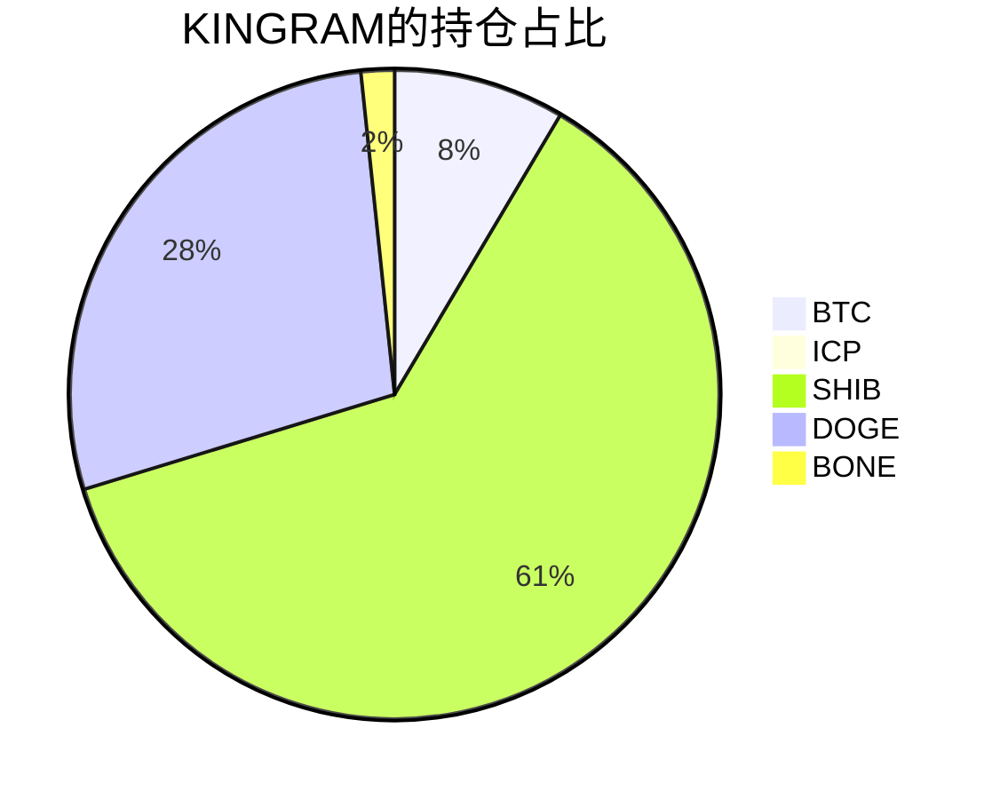

写篇博客更新下自己的数字货币持仓情况吧，记录下4月底开始从懵懂小白一步步走过来成为韭菜的心路历程（┭┮﹏┭┮），从狗狗币入坑，到屎币疯狂，当新韭菜的时候每天盯盘看图，涨跌非常影响自己的情绪、生活和工作。加了各种群聊，也加入了HTMOON大家庭持有家人币((┭┮﹏┭┮))，到后来519暴跌，把SHIB提到钱包然后现在在ShibSwap质押挖BONE，亲眼见证BONE从5美元涨到70美元再跌到现在的3美元，鄙人有幸在最高点75美金左右买了1个BONE，(韭菜就是韭菜鸭┭┮﹏┭┮，真想给自己两巴掌)，现在没有别的选择了，只能佛系躺平观望，涨跌也不再那么关注了，群聊都退了，毕竟自己是亏损状态，短时间回本也看起来遥不可及，交易所只能保存3-4个月内的交易记录，后面可能会记不太清楚自己到底做了哪些脑瘫操作，所以我把每笔交易都记录下来，为慢慢成长为老韭菜积攒经验!!!∑(ﾟДﾟノ)ノ

## 截止2021年7月19日19:46持仓

| 币种 | 单价       | 持币总量     | 总价值(USDT)   | 状态                |
| ---- | ---------- | ------------ | -------------- | ------------------- |
| BTC  | 31280.13   | 0.01329703   | 415.9328       | 现货                |
| ICP  | 31.44      | 0.71826060   | 22.582         | 现货                |
| SHIB | 0.00000634 | 474615086.73 | 3009.05964     | 质押                |
| DOGE | 0.17577    | 7761.6963    | 1367.23        | 现货                |
| BONE | 3.5433     | 23.04162     | 81.64337       | 质押                |
| 合计 |            |              | **4896.44781** | **亏损：7175.259 ** |

## 买入操作汇总

| 币种 | 操作 | 时间                | 价格(USDT) | 成交数量     | 手续费       | 总量(USDT)      |
| ---- | ---- | ------------------- | ---------- | ------------ | ------------ | --------------- |
| DOGE | 买入 | 2021-04-29 22:25:07 | 0.30871    | 49.4         | 0.0494       | 15.250274       |
| DOGE | 买入 | 2021-04-29 23:09:20 | 0.31567    | 435.9        | 0.4359       | 137.600553      |
| SLP  | 买入 | 2021-04-30 23:55:43 | 0.268      | 100.0        | 0.1          | 26.8            |
| TKO  | 买入 | 2021-05-01 01:14:56 | 3.4828     | 5.00         | 0.005        | 17.414          |
| BAKE | 买入 | 2021-05-02 17:48:07 | 7.6925     | 20.00        | 0.02         | 153.85          |
| DOGE | 买入 | 2021-05-02 17:52:22 | 0.37388    | 199.7        | 0.1997       | 74.663836       |
| DOGE | 买入 | 2021-05-02 17:52:22 | 0.3739     | 90.30        | 0.0903       | 33.76317        |
| DOGE | 买入 | 2021-05-04 21:40:31 | 0.57903    | 253.30       | 0.2533       | 146.668299      |
| DOGE | 买入 | 2021-05-04 21:40:48 | 0.57598    | 45.6         | 0.0456       | 26.264688       |
| WIN  | 买入 | 2021-05-05 22:43:44 | 0.0012521  | 10000        | 10.00        | 12.521          |
| LSK  | 买入 | 2021-05-07 21:11:40 | 9.6        | 30.42        | 0.03042      | 292.032         |
| QTUM | 买入 | 2021-05-07 21:57:31 | 30.5       | 9.954        | 0.00995      | 303.597         |
| ETC  | 买入 | 2021-05-08 13:34:26 | 119.905    | 7.627        | 0.00762      | 914.525435      |
| SHIB | 买入 | 2021-05-08 19:30:26 | 0.00000776 | 18676228.86  | 37352.457    | 144.92753599    |
| SHIB | 买入 | 2021-05-08 22:06:26 | 0.00000980 | 154607297.44 | 309214.59488 | 1515.15151491   |
| DOGE | 买入 | 2021-05-09 01:52:31 | 0.66161    | 1348.30      | 1.3483       | 892.048763      |
| DOGE | 买入 | 2021-05-09 13:09:55 | 0.5378     | 518.10       | 0.5181       | 278.63418       |
| DOGE | 买入 | 2021-05-09 13:42:51 | 0.56449    | 2685.60      | 2.6856       | 1515.994344     |
| SHIB | 买入 | 2021-05-10 17:42:51 | 0.00002770 | 27817985.07  | 54635.97014  | 756.70818643    |
| SHIB | 买入 | 2021-05-10 19:01:00 | 0.00002980 | 102721383.68 | 205442.76    | 3061.09723366   |
| SHIB | 买入 | 2021-05-10 19:01:00 | 0.00002980 | 101238285.00 | 202476.57    | 3016.90089300   |
| HT   | 买入 | 2021-05-11 10:03:00 | 28.863     | 0.5453       | 0.0010906    | 15.73899390     |
| HT   | 买入 | 2021-05-11 10:03:00 | 28.8667    | 9.6090       | 0.019218     | 277.38012030    |
| ICP  | 买入 | 2021-05-11 10:24:00 | 400.00     | 0.7197       | 0.0014394    | 287.88          |
| SOL  | 买入 | 2021-05-21 01:15:00 | 50.8795    | 14.85        | 0.0297       | 755.560575      |
| BNB  | 买入 | 2021-05-13 16:10:46 | 620.78     | 0.1233       | 0.00009      | 76.542174       |
| BTC  | 买入 | 2021-05-21 12:33:00 | 40000      | 0.017984     | 0.00003596   | 719.36          |
| ETH  | 买入 | 2021-05-22 00:30:00 | 2476.07    | 0.3091       | 0.0006182    | 765.35323700    |
| SHIB | 买入 | 2021-06-08 04:50:00 | 0.00000800 | 101997975.89 | 203995.95178 | 815.98380712    |
| SHIB | 买入 | 2021-06-12 04:50:00 | 0.00000650 | 48379293.54  | 96758.58708  | 314.26540801    |
| SHIB | 买入 | 2021-06-12 09:35:00 | 0.00000600 | 52328623.66  | 104657.24732 | 313.97174196    |
| SHIB | 买入 | 2021-06-13 00:02:00 | 0.00000598 | 10398252.48  | 20796.50496  | 62.18154983     |
| SHIB | 买入 | 2021-06-13 00:02:00 | 0.00000598 | 15725049.36  | 31450.09872  | 94.03579517     |
| DOGE | 买入 | 2021-06-18 20:40:18 | 0.2985     | 2627.60      | 2.6276       | 784.3386        |
| ETH  | 买入 | 2021-07-06 15:53:18 | 2328083    | 0.0027       | 0.0000054    | 6.28784100      |
| ETH  | 买入 | 2021-07-06 15:53:18 | 2337.26    | 0.0026       | 0.0000052    | 6.07687600      |
| ETH  | 买入 | 2021-07-06 16:02:18 | 2338.38    | 0.0640       | 0.000128     | 149.65632       |
| 合计 |      |                     |            |              |              | **18781.02595** |

## 卖出操作汇总

| 币种 | 操作 | 时间                 | 价格(USDT) | 成交数量     | 手续费     | 总量(USDT)      |
| ---- | ---- | -------------------- | ---------- | ------------ | ---------- | --------------- |
| DOGE | 卖出 | 2021-05-01  01:35:36 | 0.32014    | 484.8        | 0.1552     | 155.203872      |
| TKO  | 卖出 | 2021-05-04  21:39:36 | 3.9023     | 4.99         | 0.0194     | 19.472477       |
| BAKE | 卖出 | 2021-05-04  21:40:17 | 6.3413     | 19.90        | 0.1261     | 126.19187       |
| SLP  | 卖出 | 2021-05-04  21:41:52 | 0.2647     | 99.0         | 0.0262     | 26.2053         |
| LSK  | 卖出 | 2021-05-07  21:26:34 | 10.00      | 30.38        | 0.3038     | 303.80          |
| ETC  | 卖出 | 2021-05-09  01:52:22 | 117.00     | 7.62         | 0.89154    | 891.54          |
| QTUM | 卖出 | 2021-05-09  13:08:58 | 28.00      | 9.945        | 0.00032    | 278.46          |
| SHIB | 卖出 | 2021-05-09  00:27:00 | 0.00001800 | 103435108.01 | 3.72366388 | 1861.83194418   |
| SHIB | 卖出 | 2021-05-10  16:17:00 | 0.00002200 | 6256398.74   | 0.27528154 | 137.64077244    |
| SHIB | 卖出 | 2021-05-10  16:17:00 | 0.00002200 | 28581621.92  | 1.25759136 | 628.79568229    |
| SHIB | 卖出 | 2021-05-11  10:01:00 | 0.00003500 | 16634018.10  | 1.16438126 | 582.19063350    |
| SOL  | 卖出 | 2021-05-21  01:48:00 | 48.5000    | 14.82        | 1.43754    | 718.77          |
| ETH  | 卖出 | 2021-06-04  23:29:00 | 2650.00    | 0.3084       | 1.63452    | 817.26          |
| BTC  | 卖出 | 2021-07-06  15:53:00 | 34779.25   | 0.000172     | 0.01196406 | 5.98203100      |
| BTC  | 卖出 | 2021-07-06  16:01:00 | 34835.88   | 0.000172     | 0.1198354  | 5.99177136      |
| BTC  | 卖出 | 2021-07-06  16:13:00 | 34822.95   | 0.004307     | 0.29996489 | 149.98244565    |
| 合计 |      |                      |            |              |            | **6709.318799** |