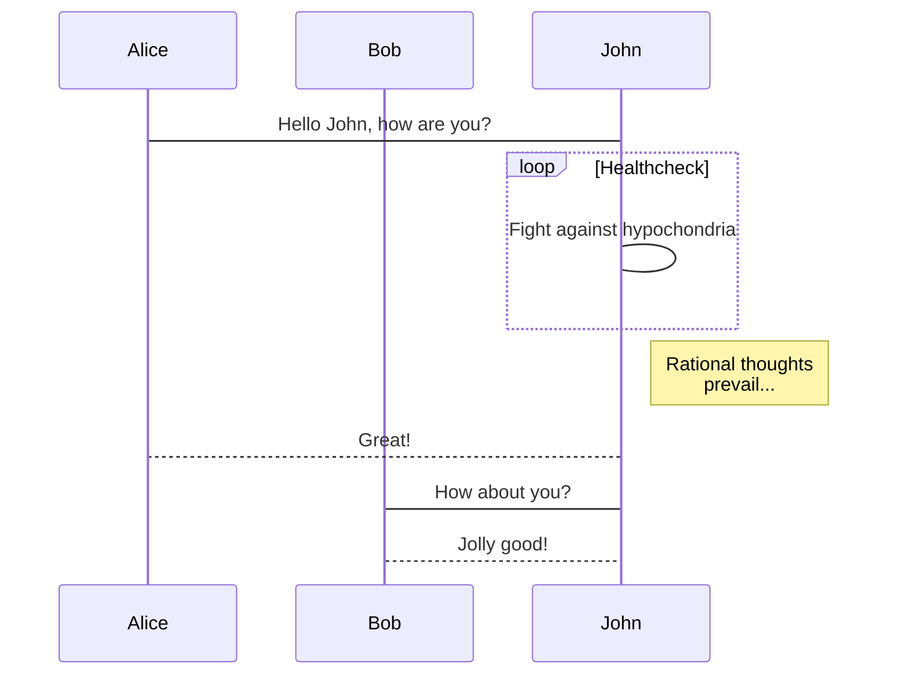
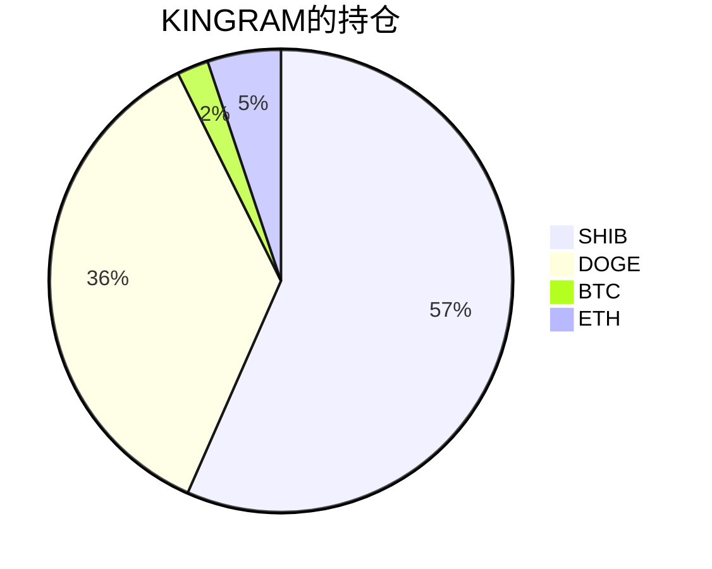

{
  "title":"Hugo的MarkDown语法测试",
  "description":"test",
  "tags":[
    "开发工具"
  ],
  "date":"2021-08-11",
  "lastmod":"2021-08-11",
  "draft":"false",
  "author":"kingram"
}

## 测试图片

图片1

图片2

## 😄测试emoj

⌚️ 📱 📲 💻 ⌨️ 🖥 🖨 🖱 🖲 🕹 🗜 💽 💾 💿 📀 📼 📷 📸 📹 🎥 📽 🎞 📞 ☎️ 📟 📠 📺 📻 🎙 🎚 🎛 🧭 ⏱ ⏲ ⏰ 🕰 ⌛️ ⏳ 📡 🔋 🔌 💡 🔦 🕯 🪔 🧯 🛢 💸 💵 💴 💶 💷 🪙 💰 💳 💎 ⚖️ 🪜 🧰 🪛 🔧 🔨 ⚒ 🛠 ⛏ 🪚 🔩 ⚙️ 🪤 🧱 ⛓ 🧲 🔫 💣 🧨 🪓 🔪 🗡 ⚔️ 🛡 🚬 ⚰️ 🪦 ⚱️ 🏺 🔮 📿 🧿 💈 ⚗️ 🔭 🔬 🕳 🩹 🩺 💊 💉 🩸 🧬 🦠 🧫 🧪 🌡 🧹 🪠 🧺 🧻 🚽 🚰 🚿 🛁 🛀 🧼 🪥 🪒 🧽 🪣 🧴 🛎 🔑 🗝 🚪 🪑 🛋 🛏 🛌 🧸 🪆 🖼 🪞 🪟 🛍 🛒 🎁 🎈 🎏 🎀 🪄 🪅 🎊 🎉 🎎 🏮 🎐 🧧 ✉️ 📩 📨 📧 💌 📥 📤 📦 🏷 🪧 📪 📫 📬 📭 📮 📯 📜 📃 📄 📑 🧾 📊 📈 📉 🗒 🗓 📆 📅 🗑 📇 🗃 🗳 🗄 📋 📁 📂 🗂 🗞 📰 📓 📔 📒 📕 📗 📘 📙 📚 📖 🔖 🧷 🔗 📎 🖇 📐 📏 🧮 📌 📍 ✂️ 🖊 🖋 ✒️ 🖌 🖍 📝 ✏️ 🔍 🔎 🔏 🔐 🔒 🔓

🍏 🍎 🍐 🍊 🍋 🍌 🍉 🍇 🍓 🫐 🍈 🍒 🍑 🥭 🍍 🥥 🥝 🍅 🍆 🥑 🥦 🥬 🥒 🌶 🫑 🌽 🥕 🫒 🧄 🧅 🥔 🍠 🥐 🥯 🍞 🥖 🥨 🧀 🥚 🍳 🧈 🥞 🧇 🥓 🥩 🍗 🍖 🦴 🌭 🍔 🍟 🍕 🫓 🥪 🥙 🧆 🌮 🌯 🫔 🥗 🥘 🫕 🥫 🍝 🍜 🍲 🍛 🍣 🍱 🥟 🦪 🍤 🍙 🍚 🍘 🍥 🥠 🥮 🍢 🍡 🍧 🍨 🍦 🥧 🧁 🍰 🎂 🍮 🍭 🍬 🍫 🍿 🍩 🍪 🌰 🥜 🍯 🥛 🍼 🫖 ☕️ 🍵 🧃 🥤 🧋 🍶 🍺 🍻 🥂 🍷 🥃 🍸 🍹 🧉 🍾 🧊 🥄 🍴 🍽 🥣 🥡 🥢 🧂

👋 🤚 🖐 ✋ 🖖 👌 🤌 🤏 ✌️ 🤞 🤟 🤘 🤙 👈 👉 👆 🖕 👇 ☝️ 👍 👎 ✊ 👊 🤛 🤜 👏 🙌 👐 🤲 🤝 🙏 ✍️ 💅 🤳 💪 🦾 🦵 🦿 🦶 👣 👂 🦻 👃 🫀 🫁 🧠 🦷 🦴 👀 👁 👅 👄 💋 🩸

😀 😃 😄 😁 😆 😅 😂 🤣 🥲 ☺️ 😊 😇 🙂 🙃 😉 😌 😍 🥰 😘 😗 😙 😚 😋 😛 😝 😜 🤪 🤨 🧐 🤓 😎 🥸 🤩 🥳 😏 😒 😞 😔 😟 😕 🙁 ☹️ 😣 😖 😫 😩 🥺 😢 😭 😤 😠 😡 🤬 🤯 😳 🥵 🥶 😱 😨 😰 😥 😓 🤗 🤔 🤭 🤫 🤥 😶 😐 😑 😬 🙄 😯 😦 😧 😮 😲 🥱 😴 🤤 😪 😵 🤐 🥴 🤢 🤮 🤧 😷 🤒 🤕 🤑 🤠 😈 👿 👹 👺 🤡 💩 👻 💀 ☠️ 👽 👾 🤖 🎃 😺 😸 😹 😻 😼 😽 🙀 😿 😾

⚽️ 🏀 🏈 ⚾️ 🥎 🎾 🏐 🏉 🥏 🎱 🪀 🏓 🏸 🏒 🏑 🥍 🏏 🪃 🥅 ⛳️ 🪁 🏹 🎣 🤿 🥊 🥋 🎽 🛹 🛼 🛷 ⛸ 🥌 🎿 ⛷ 🏂 🪂 🏋️‍♀️ 🏋️ 🏋️‍♂️ 🤼‍♀️ 🤼 🤼‍♂️ 🤸‍♀️ 🤸 🤸‍♂️ ⛹️‍♀️ ⛹️ ⛹️‍♂️ 🤺 🤾‍♀️ 🤾 🤾‍♂️ 🏌️‍♀️ 🏌️ 🏌️‍♂️ 🏇 🧘‍♀️ 🧘 🧘‍♂️ 🏄‍♀️ 🏄 🏄‍♂️ 🏊‍♀️ 🏊 🏊‍♂️ 🤽‍♀️ 🤽 🤽‍♂️ 🚣‍♀️ 🚣 🚣‍♂️ 🧗‍♀️ 🧗 🧗‍♂️ 🚵‍♀️ 🚵 🚵‍♂️ 🚴‍♀️ 🚴 🚴‍♂️ 🏆 🥇 🥈 🥉 🏅 🎖 🏵 🎗 🎫 🎟 🎪 🤹 🤹‍♂️ 🤹‍♀️ 🎭 🩰 🎨 🎬 🎤 🎧 🎼 🎹 🥁 🪘 🎷 🎺 🪗 🎸 🪕 🎻 🎲 ♟ 🎯 🎳 🎮 🎰 🧩

## 测试文字颜色

| 酒紅色 | 紅色   |
| --------------------------------- | --------------------------------- |
| 橘色   | 金色   |
| 黃色   | 綠色   |
| 墨綠色 | 青色   |
| 深藍色 | 粉紅色 |
| 紫色   | 灰色   |

## mermaid

## 🎨 我的的持仓占比

## video

## 🎯 我的持仓收益数据

💸 我的持仓总成本为：**3027.03** USDT，截止 **2021-08-18 19:29:26**，总价值为：**3062.24** USDT

💰 利润： **35.21** USDT，收益率：**1.16%**

每个币种详细的收益数据如下：

<table>
<thead><tr bgcolor="#d0d0d0" ><th>币种</th><th>持有数量(个)</th><th>现价(USDT)</th><th>总金额(USDT)</</th><th>持仓均价(USDT)</</th><th>成本(USDT)</</th><th>利润(USDT)</</th><th>收益率</th></tr></thead>
<tbody>
<tr >
<td bgcolor="#FFECEC">btc</td>
<td bgcolor="#FFECEC">0.013343</td>
<td bgcolor="#FFECEC">45151.31872812</td>
<td bgcolor="#FFECEC">602.45</td>
<td bgcolor="#FFECEC">41737.24050064</td>
<td bgcolor="#FFECEC">556.90</td>
<td bgcolor="#FFECEC">45.55</td>
<td bgcolor="#FFECEC"><strong>-8.18%</strong></td>
</tr>
<tr >
<td bgcolor="#F0FFF0">doge</td>
<td bgcolor="#F0FFF0">8058.726300</td>
<td bgcolor="#F0FFF0">0.29592937</td>
<td bgcolor="#F0FFF0">2384.81</td>
<td bgcolor="#F0FFF0">0.29714994</td>
<td bgcolor="#F0FFF0">2394.65</td>
<td bgcolor="#F0FFF0">-9.84</td>
<td bgcolor="#F0FFF0"><strong>-0.41%</strong></td>
</tr>
</tbody>
</table>
